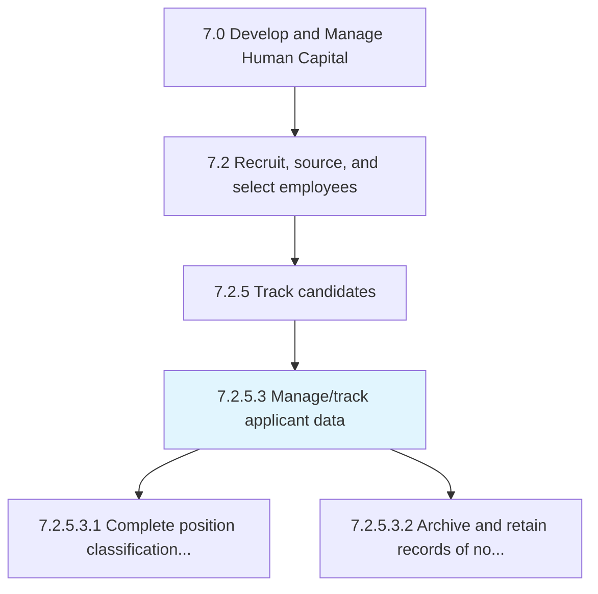
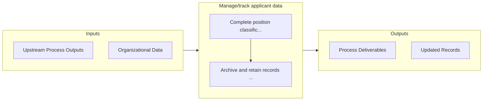

# Manage/track applicant data

> Keeping track of all the information about the candidates who apply for jobs.

## Overview

Activity 7.2.5.3 is an activity within the Develop and Manage Human Capital framework. 

Keeping track of all the information about the candidates who apply for jobs. Use applicant-tracking systems that can be accessed online as a central location and database for recruitment efforts.

## Process Hierarchy



## Key Statistics

| Metric | Value |
|--------|-------|
| APQC Code | 10467 |
| Hierarchy ID | 7.2.5.3 |
| Level | Activity |
| Parent | [7.2.5](../) |
| Sub-Processes | 2 |


## GraphDL Semantic Structure

```
manage/track.ApplicantData
```

| Component | Value | Description |
|-----------|-------|-------------|
| Verb | `manage/track` | Primary action |
| Object | `applicant data` | Direct object |


## Process Flow



## Sub-Processes

| Process | Hierarchy ID | Description |
|---------|-------------|-------------|
| [Complete position classification and level of experience](./CompletePositionClassificationAndLevelOfExperience) | 7.2.5.3.1 | Identifying the requirements for the position to be filled |
| [Archive and retain records of non-hires](./ArchiveAndRetainRecordsOfNonhires) | 7.2.5.3.2 | Retaining and storing the records of the candidates who were rejected and not hired to ensure future |


## Related Concepts

- [ApplicantData](/concepts/ApplicantData)
- [ApplicantData](/concepts/ApplicantData)


---

*Source: APQC PCF 10467 (7.2.5.3) - APQC*
