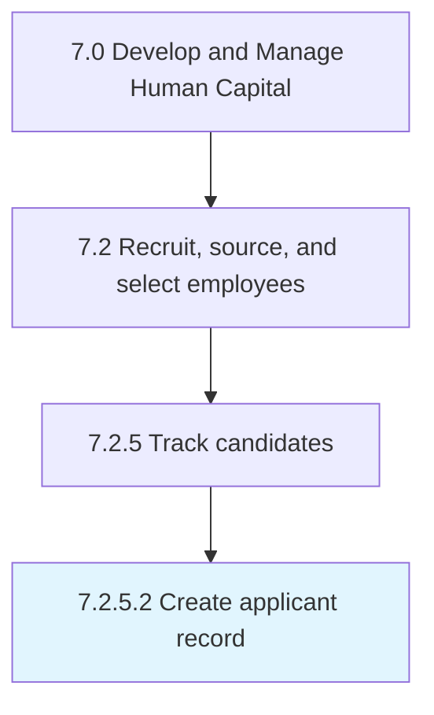

# Create applicant record

> Creating and documenting the records of all applicants.

## Overview

Activity 7.2.5.2 is an activity within the Develop and Manage Human Capital framework. 

Creating and documenting the records of all applicants. Manage all individual applicants, including hires and non-hires. Maintain records to avoid any duplication and promote efficiency.

## Process Hierarchy



## Key Statistics

| Metric | Value |
|--------|-------|
| APQC Code | 10466 |
| Hierarchy ID | 7.2.5.2 |
| Level | Activity |
| Parent | [7.2.5](../) |
| Sub-Processes | 0 |


## GraphDL Semantic Structure

```
create.ApplicantRecord
```

| Component | Value | Description |
|-----------|-------|-------------|
| Verb | `create` | Primary action |
| Object | `applicant record` | Direct object |


## Related Concepts

- [ApplicantRecord](/concepts/ApplicantRecord)


---

*Source: APQC PCF 10466 (7.2.5.2) - APQC*
