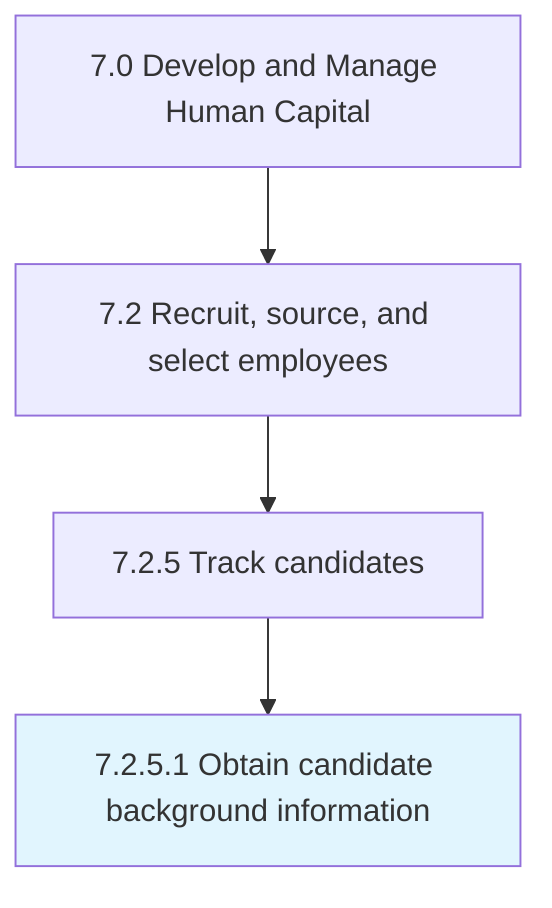

# Obtain candidate background information

> Conducting a background investigation on the candidates with the objective of looking up and compiling criminal, commercial, and financial records.

## Overview

Activity 7.2.5.1 is an activity within the Develop and Manage Human Capital framework. 

Conducting a background investigation on the candidates with the objective of looking up and compiling criminal, commercial, and financial records.

## Process Hierarchy



## Key Statistics

| Metric | Value |
|--------|-------|
| APQC Code | 10460 |
| Hierarchy ID | 7.2.5.1 |
| Level | Activity |
| Parent | [7.2.5](../) |
| Sub-Processes | 0 |


## GraphDL Semantic Structure

```
obtain.CandidateBackgroundInformation
```

| Component | Value | Description |
|-----------|-------|-------------|
| Verb | `obtain` | Primary action |
| Object | `candidate background information` | Direct object |


## Related Concepts

- CandidateBackgroundInformation


---

*Source: APQC PCF 10460 (7.2.5.1) - APQC*
