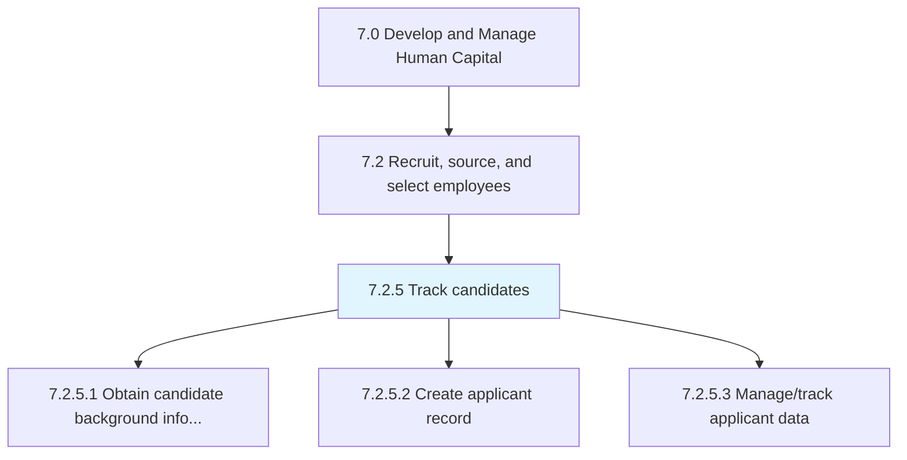
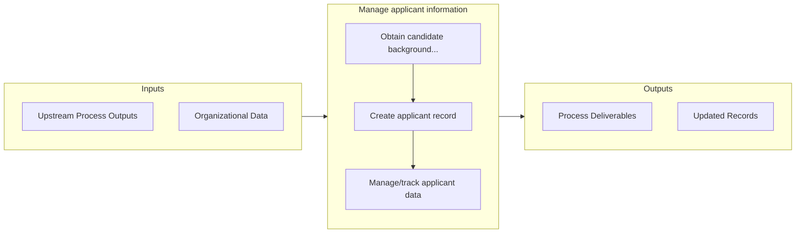

# Manage applicant information

> Creating and maintaining a system for managing the information of applicants.

## Overview

Process 7.2.5 is a core process that defines the specific procedures for manage applicant information. 

Creating and maintaining a system for managing the information of applicants. Create records for all candidates who apply. Maintain and track information through the use applicant-tracking systems.

## Process Hierarchy



## Key Statistics

| Metric | Value |
|--------|-------|
| APQC Code | 10444 |
| Hierarchy ID | 7.2.5 |
| Level | Process |
| Parent | [7.2](../) |
| Sub-Processes | 3 |


## GraphDL Semantic Structure

```
manage.ApplicantInformation
```

| Component | Value | Description |
|-----------|-------|-------------|
| Verb | `manage` | Primary action |
| Object | `applicant information` | Direct object |


## Process Flow



## Sub-Processes

| Process | Hierarchy ID | Description |
|---------|-------------|-------------|
| [Obtain candidate background information](./ObtainCandidateBackgroundInformation) | 7.2.5.1 | Conducting a background investigation on the candidates with the objective of looking up and compili |
| [Create applicant record](./CreateApplicantRecord) | 7.2.5.2 | Creating and documenting the records of all applicants |
| [Manage/track applicant data](./7.2.5.3-ManagetrackApplicantData/) | 7.2.5.3 | Keeping track of all the information about the candidates who apply for jobs |


---

*Source: APQC PCF 10444 (7.2.5) - APQC*
