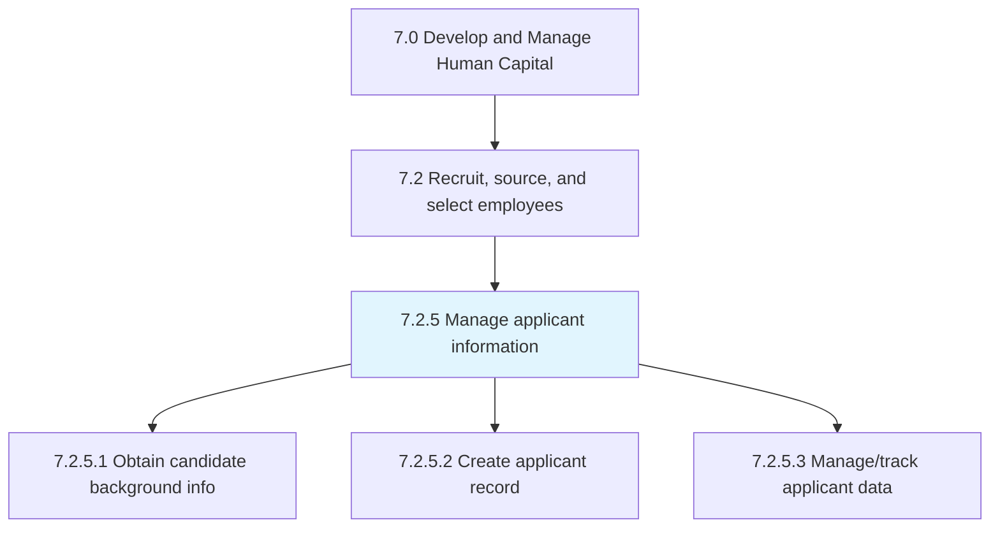
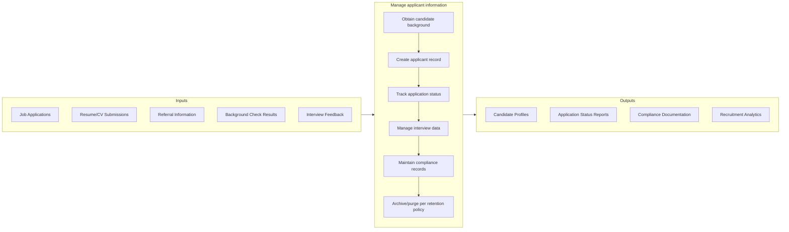

# Manage applicant information

> Creating and maintaining a system for managing the information of applicants.

## Overview

Process 7.2.5 is a core process within [Recruit, Source, and Select Employees](../) that ensures comprehensive tracking and management of candidate data throughout the hiring lifecycle. This process provides the foundation for efficient, compliant, and data-driven talent acquisition.

Effective applicant information management requires robust Applicant Tracking Systems (ATS) that capture candidate data from multiple sources, enable collaboration among hiring stakeholders, ensure regulatory compliance (EEO, GDPR, data privacy), and provide analytics to optimize recruitment effectiveness. This process also supports candidate experience by maintaining accurate records and enabling timely communications.

## Process Hierarchy



## Key Statistics

| Metric | Value |
|--------|-------|
| APQC Code | 10444 |
| Hierarchy ID | 7.2.5 |
| Level | Process |
| Parent | [7.2](../) |
| Sub-Processes | 3 |

## GraphDL Semantic Structure

```graphdl
manage.ApplicantInformation
```

| Component | Value | Description |
|-----------|-------|-------------|
| Verb | `manage` | Primary action of maintaining and organizing |
| Object | `ApplicantInformation` | Candidate data and records |

## Process Flow



## Sub-Processes

| Process | Hierarchy ID | Description |
|---------|-------------|-------------|
| [Obtain candidate background information](./ObtainCandidateBackgroundInformation) | 7.2.5.1 | Conducting background investigations including employment verification, education, and references |
| [Create applicant record](./CreateApplicantRecord) | 7.2.5.2 | Creating and documenting comprehensive records for all applicants in the ATS |
| [Manage/track applicant data](./7.2.5.3-ManagetrackApplicantData/) | 7.2.5.3 | Maintaining and tracking all candidate information through the hiring process |

## RACI Matrix

| Activity | Responsible | Accountable | Consulted | Informed |
|----------|-------------|-------------|-----------|----------|
| Configure ATS system | HR Technology | HR Director | IT, Recruiting | Management |
| Create applicant records | Recruiters | Recruiting Manager | Hiring Managers | Candidates |
| Conduct background checks | Background Vendor | HR Operations | Legal, Candidates | Hiring Manager |
| Maintain data accuracy | Recruiting Coordinators | Recruiting Manager | Recruiters | Compliance |
| Ensure data privacy | HR Operations | Legal/Compliance | IT Security | Candidates |
| Generate analytics | HR Analytics | Recruiting Director | Leadership | Business Units |

## Key Stakeholders

- **Recruiters**: Primary users creating and updating applicant records
- **Hiring Managers**: Access candidate information for evaluation
- **HR Operations**: Ensures data integrity and compliance
- **Legal/Compliance**: Oversees data privacy and retention policies
- **IT**: Maintains ATS infrastructure and integrations
- **Candidates**: Subject of data with privacy rights

## Metrics and KPIs

| Metric | Description | Target |
|--------|-------------|--------|
| Data Completeness | Percentage of required fields populated | >95% |
| Record Accuracy | Audit pass rate for applicant data | >98% |
| System Utilization | Active users as % of licensed users | >85% |
| Time to Record Creation | Hours from application to ATS entry | <4 hours |
| Compliance Score | EEO/OFCCP audit readiness | 100% |
| Data Retention Compliance | Records purged per policy | 100% |
| Candidate Experience Score | Applicant satisfaction with process | >4.0/5.0 |
| Source Attribution Accuracy | Applications with accurate source data | >90% |

## Related Departments

- [Human Resources](/departments/HumanResources) - Talent acquisition oversight
- [Information Technology](/departments/IT) - ATS system management
- [Legal](/departments/Legal) - Data privacy and compliance
- [Operations](/departments/Operations) - Hiring manager access

## Related Occupations

- [Human Resources Specialists](/occupations/Business/HumanResourcesSpecialists) - Recruiter operations
- [Human Resources Managers](/occupations/Management/HumanResourcesManagers) - Process oversight
- [Computer Systems Analysts](/occupations/Computer/ComputerSystemsAnalysts) - ATS administration

## Related Concepts

- ApplicantTrackingSystem
- CandidateExperience
- DataPrivacy
- RecruitmentAnalytics
- BackgroundVerification
- ComplianceManagement

---

*Source: APQC PCF 10444 (7.2.5) - APQC*
