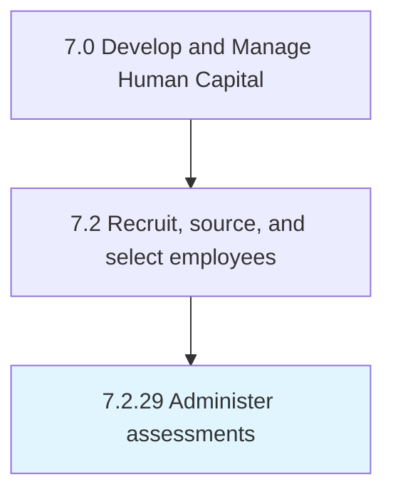

# Administer assessments

## Overview

Process 7.2.29 is a core process that defines the specific procedures for administer assessments. 

## Process Hierarchy



## Key Statistics

| Metric | Value |
|--------|-------|
| APQC Code | 20512 |
| Hierarchy ID | 7.2.29 |
| Level | Process |
| Parent | [7.2](../) |
| Sub-Processes | 0 |


## GraphDL Semantic Structure

```
administer.Assessments
```

| Component | Value | Description |
|-----------|-------|-------------|
| Verb | `administer` | Primary action |
| Object | `assessments` | Direct object |


---

*Source: APQC PCF 20512 (7.2.29) - APQC*
