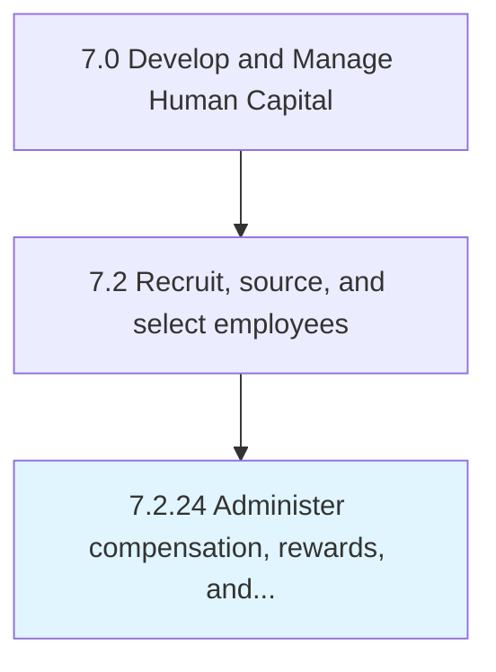
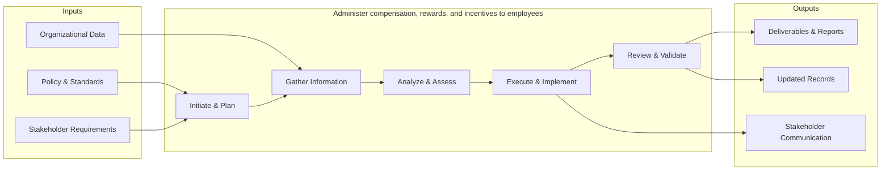

# Administer compensation, rewards, and incentives to employees

## Overview

Process 7.2.24 is a core process that defines the specific procedures for administer compensation, rewards, and incentives to employees. 

This process handles the administration of compensation rewards and incentives.to. employees across the organization. It includes processing transactions, maintaining records, ensuring policy compliance, managing exceptions, and providing support to stakeholders throughout the administrative lifecycle.

## Process Hierarchy



## Key Statistics

| Metric | Value |
|--------|-------|
| APQC Code | 10502 |
| Hierarchy ID | 7.2.24 |
| Level | Process |
| Parent | [7.2](../) |
| Sub-Processes | 0 |


## GraphDL Semantic Structure

```graphdl
administer.CompensationRewardsAndIncentives.to.Employees
```

| Component | Value | Description |
|-----------|-------|-------------|
| Verb | `administer` | Primary action |
| Object | `compensation, rewards, and incentives` | Direct object |
| Preposition | `to` | Relationship |
| PrepObject | `employees` | Indirect object |


## Process Flow



## RACI Matrix

| Activity | Responsible | Accountable | Consulted | Informed |
|----------|------------|-------------|-----------|----------|
| Create job requisition | Hiring Manager | Department Head | HR Business Partner | Recruiting Team |
| Screen candidates | Recruiter | Talent Acquisition Lead | Hiring Manager | HR Director |
| Extend job offer | Recruiter | Hiring Manager | Compensation Team | CHRO |

## Related Occupations

- [Human Resources Specialists](/occupations/Business/Operations/HumanResourcesSpecialists)
- [Human Resources Managers](/occupations/Management/HumanResourcesManagers)
- [Recruiting Coordinators](/occupations/Business/Operations/HumanResourcesSpecialists)
- [Training and Development Specialists](/occupations/Business/TrainingAndDevelopmentSpecialists)
- [Compensation and Benefits Managers](/occupations/Management/CompensationAndBenefitsManagers)

## Related Departments

- Human Resources
- Hiring Department
- Legal

## Industry Variations

### Healthcare

Requires credential verification, licensure validation, background checks for patient-facing roles, and compliance with Joint Commission standards.

### Technology

Emphasizes technical assessments, coding challenges, cultural fit interviews, and competitive offer packages with equity components.

### Retail

Focuses on high-volume seasonal hiring, part-time workforce management, quick turnaround screening, and multi-location coordination.

## KPIs & Metrics

| Metric | Description | Target |
|--------|-------------|--------|
| Time to Fill | Average days from requisition to accepted offer | < 45 days |
| Cost per Hire | Total recruitment cost divided by number of hires | < $4,500 |
| Quality of Hire | New hire performance rating after 12 months | > 3.5/5.0 |
| Offer Acceptance Rate | Percentage of offers accepted by candidates | > 85% |

---

*Source: APQC PCF 10502 (7.2.24) - APQC*
