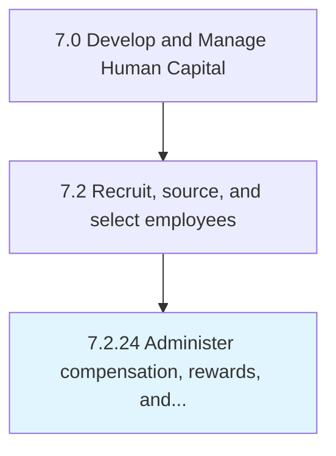

# Administer compensation, rewards, and incentives to employees

## Overview

Process 7.2.24 is a core process that defines the specific procedures for administer compensation, rewards, and incentives to employees. 

## Process Hierarchy



## Key Statistics

| Metric | Value |
|--------|-------|
| APQC Code | 10502 |
| Hierarchy ID | 7.2.24 |
| Level | Process |
| Parent | [7.2](../) |
| Sub-Processes | 0 |


## GraphDL Semantic Structure

```
administer.CompensationRewardsAndIncentives.to.Employees
```

| Component | Value | Description |
|-----------|-------|-------------|
| Verb | `administer` | Primary action |
| Object | `compensation, rewards, and incentives` | Direct object |
| Preposition | `to` | Relationship |
| PrepObject | `employees` | Indirect object |


---

*Source: APQC PCF 10502 (7.2.24) - APQC*
