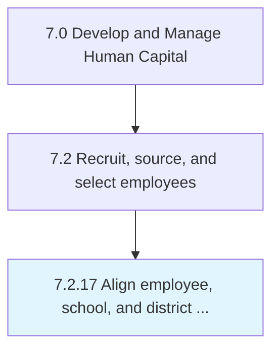

# Align employee, school, and district development needs

## Overview

Process 7.2.17 is a core process that defines the specific procedures for align employee, school, and district development needs. 

## Process Hierarchy



## Key Statistics

| Metric | Value |
|--------|-------|
| APQC Code | 10490 |
| Hierarchy ID | 7.2.17 |
| Level | Process |
| Parent | [7.2](../) |
| Sub-Processes | 0 |


## GraphDL Semantic Structure

```
align.EmployeeSchoolAndDistrictDevelopmentNeeds
```

| Component | Value | Description |
|-----------|-------|-------------|
| Verb | `align` | Primary action |
| Object | `employee, school, and district development needs` | Direct object |


---

*Source: APQC PCF 10490 (7.2.17) - APQC*
