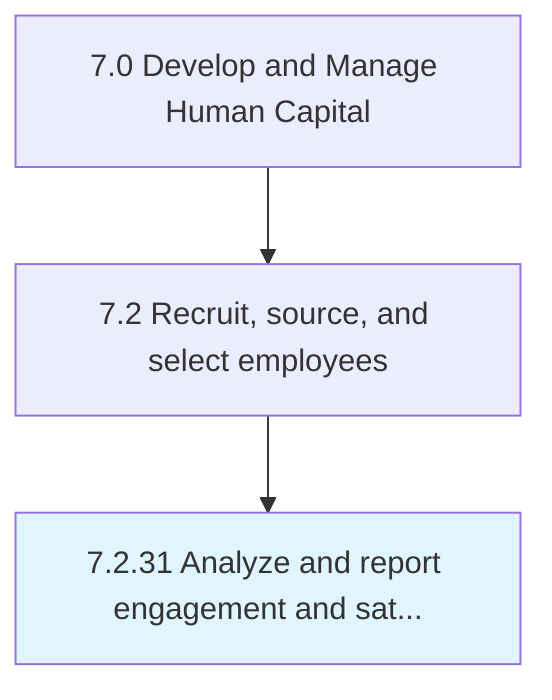

# Analyze and report engagement and satisfaction results

## Overview

Process 7.2.31 is a core process that defines the specific procedures for analyze and report engagement and satisfaction results. 

## Process Hierarchy



## Key Statistics

| Metric | Value |
|--------|-------|
| APQC Code | 20514 |
| Hierarchy ID | 7.2.31 |
| Level | Process |
| Parent | [7.2](../) |
| Sub-Processes | 0 |


## GraphDL Semantic Structure

```
analyze.AndReportEngagementAndSatisfactionResults
```

| Component | Value | Description |
|-----------|-------|-------------|
| Verb | `analyze` | Primary action |
| Object | `and report engagement and satisfaction results` | Direct object |


---

*Source: APQC PCF 20514 (7.2.31) - APQC*
