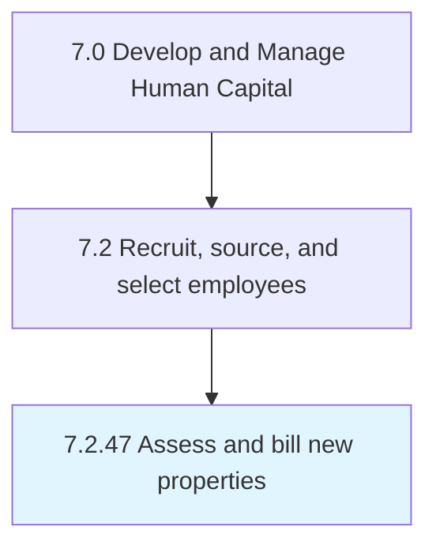

# Assess and bill new properties

## Overview

Process 7.2.47 is a core process that defines the specific procedures for assess and bill new properties. 

## Process Hierarchy



## Key Statistics

| Metric | Value |
|--------|-------|
| APQC Code | 20524 |
| Hierarchy ID | 7.2.47 |
| Level | Process |
| Parent | [7.2](../) |
| Sub-Processes | 0 |


## GraphDL Semantic Structure

```
assess.AndBillNewProperties
```

| Component | Value | Description |
|-----------|-------|-------------|
| Verb | `assess` | Primary action |
| Object | `and bill new properties` | Direct object |


---

*Source: APQC PCF 20524 (7.2.47) - APQC*
