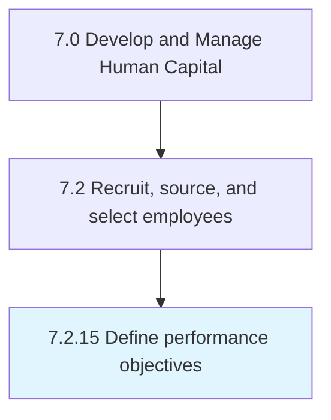

# Define performance objectives

## Overview

Process 7.2.15 is a core process that defines the specific procedures for define performance objectives. 

## Process Hierarchy



## Key Statistics

| Metric | Value |
|--------|-------|
| APQC Code | 10479 |
| Hierarchy ID | 7.2.15 |
| Level | Process |
| Parent | [7.2](../) |
| Sub-Processes | 0 |


## GraphDL Semantic Structure

```
define.PerformanceObjectives
```

| Component | Value | Description |
|-----------|-------|-------------|
| Verb | `define` | Primary action |
| Object | `performance objectives` | Direct object |


---

*Source: APQC PCF 10479 (7.2.15) - APQC*
