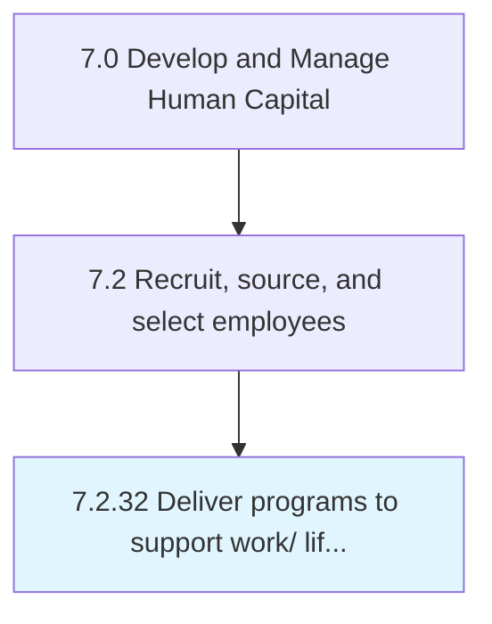

# Deliver programs to support work/ life balance for employees

## Overview

Process 7.2.32 is a core process that defines the specific procedures for deliver programs to support work/ life balance for employees. 

## Process Hierarchy



## Key Statistics

| Metric | Value |
|--------|-------|
| APQC Code | 10508 |
| Hierarchy ID | 7.2.32 |
| Level | Process |
| Parent | [7.2](../) |
| Sub-Processes | 0 |


## GraphDL Semantic Structure

```
deliver.Programs.to.SupportWorkLifeBalanceForEmployees
```

| Component | Value | Description |
|-----------|-------|-------------|
| Verb | `deliver` | Primary action |
| Object | `programs` | Direct object |
| Preposition | `to` | Relationship |
| PrepObject | `support work/ life balance for employees` | Indirect object |


---

*Source: APQC PCF 10508 (7.2.32) - APQC*
