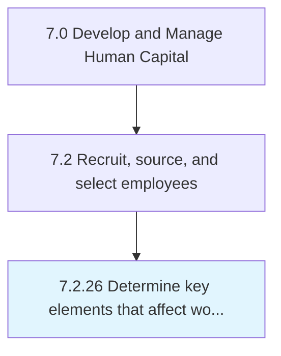

# Determine key elements that affect workforce engagement

## Overview

Process 7.2.26 is a core process that defines the specific procedures for determine key elements that affect workforce engagement. 

## Process Hierarchy



## Key Statistics

| Metric | Value |
|--------|-------|
| APQC Code | 20509 |
| Hierarchy ID | 7.2.26 |
| Level | Process |
| Parent | [7.2](../) |
| Sub-Processes | 0 |


## GraphDL Semantic Structure

```
determine.KeyElementsThatAffectWorkforceEngagement
```

| Component | Value | Description |
|-----------|-------|-------------|
| Verb | `determine` | Primary action |
| Object | `key elements that affect workforce engagement` | Direct object |


---

*Source: APQC PCF 20509 (7.2.26) - APQC*
