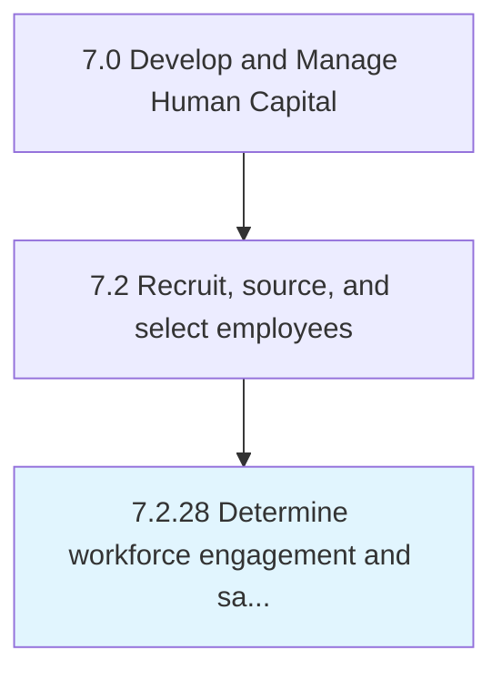

# Determine workforce engagement and satisfaction assessment methods

## Overview

Process 7.2.28 is a core process that defines the specific procedures for determine workforce engagement and satisfaction assessment methods. 

## Process Hierarchy



## Key Statistics

| Metric | Value |
|--------|-------|
| APQC Code | 20511 |
| Hierarchy ID | 7.2.28 |
| Level | Process |
| Parent | [7.2](../) |
| Sub-Processes | 0 |


## GraphDL Semantic Structure

```
determine.WorkforceEngagementAndSatisfactionAssessmentMethods
```

| Component | Value | Description |
|-----------|-------|-------------|
| Verb | `determine` | Primary action |
| Object | `workforce engagement and satisfaction assessment methods` | Direct object |


---

*Source: APQC PCF 20511 (7.2.28) - APQC*
