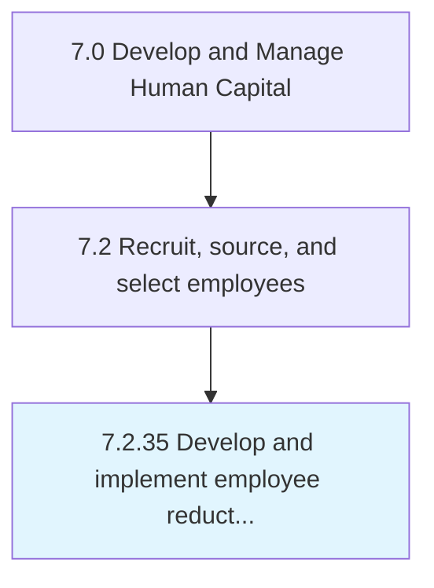

# Develop and implement employee reduction in force policies and regulations

## Overview

Process 7.2.35 is a core process that defines the specific procedures for develop and implement employee reduction in force policies and regulations. 

## Process Hierarchy



## Key Statistics

| Metric | Value |
|--------|-------|
| APQC Code | 10516 |
| Hierarchy ID | 7.2.35 |
| Level | Process |
| Parent | [7.2](../) |
| Sub-Processes | 0 |


## GraphDL Semantic Structure

```
develop.AndImplementEmployeeReduction.in.ForcePoliciesAndRegulations
```

| Component | Value | Description |
|-----------|-------|-------------|
| Verb | `develop` | Primary action |
| Object | `and implement employee reduction` | Direct object |
| Preposition | `in` | Relationship |
| PrepObject | `force policies and regulations` | Indirect object |


---

*Source: APQC PCF 10516 (7.2.35) - APQC*
