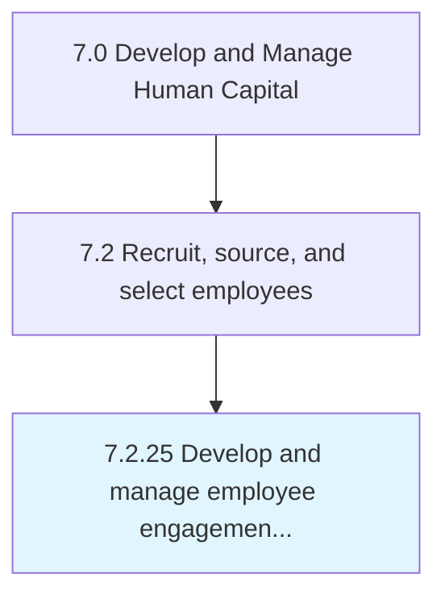

# Develop and manage employee engagement and satisfaction

## Overview

Process 7.2.25 is a core process that defines the specific procedures for develop and manage employee engagement and satisfaction. 

## Process Hierarchy



## Key Statistics

| Metric | Value |
|--------|-------|
| APQC Code | 20508 |
| Hierarchy ID | 7.2.25 |
| Level | Process |
| Parent | [7.2](../) |
| Sub-Processes | 0 |


## GraphDL Semantic Structure

```
develop.AndManageEmployeeEngagementAndSatisfaction
```

| Component | Value | Description |
|-----------|-------|-------------|
| Verb | `develop` | Primary action |
| Object | `and manage employee engagement and satisfaction` | Direct object |


---

*Source: APQC PCF 20508 (7.2.25) - APQC*
