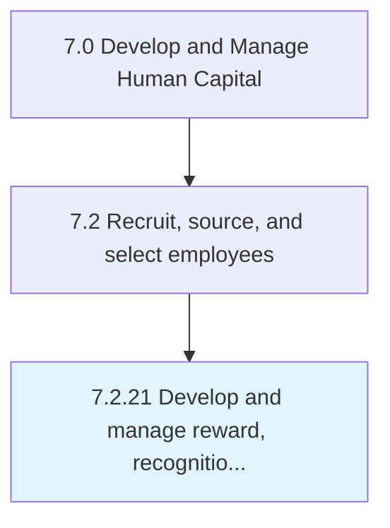

# Develop and manage reward, recognition, and incentive programs

## Overview

Process 7.2.21 is a core process that defines the specific procedures for develop and manage reward, recognition, and incentive programs. 

## Process Hierarchy



## Key Statistics

| Metric | Value |
|--------|-------|
| APQC Code | 10494 |
| Hierarchy ID | 7.2.21 |
| Level | Process |
| Parent | [7.2](../) |
| Sub-Processes | 0 |


## GraphDL Semantic Structure

```
develop.AndManageRewardRecognitionAndIncentivePrograms
```

| Component | Value | Description |
|-----------|-------|-------------|
| Verb | `develop` | Primary action |
| Object | `and manage reward, recognition, and incentive programs` | Direct object |


---

*Source: APQC PCF 10494 (7.2.21) - APQC*
