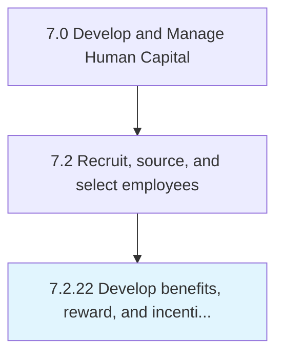

# Develop benefits, reward, and incentive plan

## Overview

Process 7.2.22 is a core process that defines the specific procedures for develop benefits, reward, and incentive plan. 

## Process Hierarchy



## Key Statistics

| Metric | Value |
|--------|-------|
| APQC Code | 10499 |
| Hierarchy ID | 7.2.22 |
| Level | Process |
| Parent | [7.2](../) |
| Sub-Processes | 0 |


## GraphDL Semantic Structure

```
develop.BenefitsRewardAndIncentivePlan
```

| Component | Value | Description |
|-----------|-------|-------------|
| Verb | `develop` | Primary action |
| Object | `benefits, reward, and incentive plan` | Direct object |


---

*Source: APQC PCF 10499 (7.2.22) - APQC*
