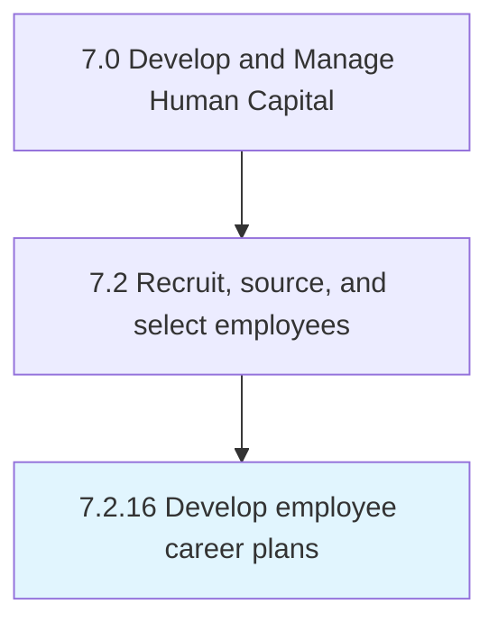

# Develop employee career plans

## Overview

Process 7.2.16 is a core process that defines the specific procedures for develop employee career plans. 

## Process Hierarchy



## Key Statistics

| Metric | Value |
|--------|-------|
| APQC Code | 10488 |
| Hierarchy ID | 7.2.16 |
| Level | Process |
| Parent | [7.2](../) |
| Sub-Processes | 0 |


## GraphDL Semantic Structure

```
develop.EmployeeCareerPlans
```

| Component | Value | Description |
|-----------|-------|-------------|
| Verb | `develop` | Primary action |
| Object | `employee career plans` | Direct object |


---

*Source: APQC PCF 10488 (7.2.16) - APQC*
