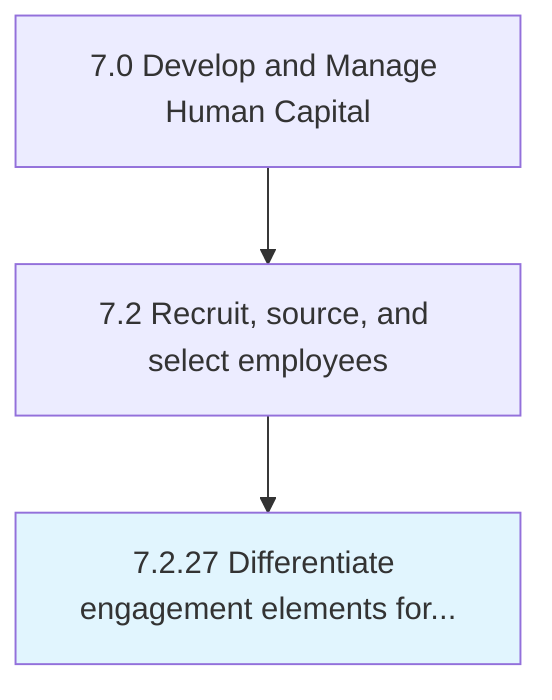

# Differentiate engagement elements for different workforce groups and segments

## Overview

Process 7.2.27 is a core process that defines the specific procedures for differentiate engagement elements for different workforce groups and segments. 

## Process Hierarchy



## Key Statistics

| Metric | Value |
|--------|-------|
| APQC Code | 20510 |
| Hierarchy ID | 7.2.27 |
| Level | Process |
| Parent | [7.2](../) |
| Sub-Processes | 0 |


## GraphDL Semantic Structure

```
differentiate.EngagementElements.for.DifferentWorkforceGroupsAndSegments
```

| Component | Value | Description |
|-----------|-------|-------------|
| Verb | `differentiate` | Primary action |
| Object | `engagement elements` | Direct object |
| Preposition | `for` | Relationship |
| PrepObject | `different workforce groups and segments` | Indirect object |


---

*Source: APQC PCF 20510 (7.2.27) - APQC*
