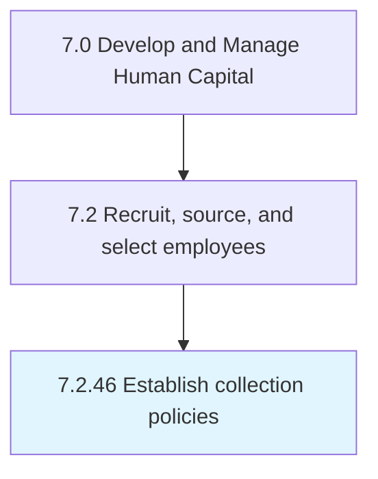

# Establish collection policies

## Overview

Process 7.2.46 is a core process that defines the specific procedures for establish collection policies. 

## Process Hierarchy



## Key Statistics

| Metric | Value |
|--------|-------|
| APQC Code | 20523 |
| Hierarchy ID | 7.2.46 |
| Level | Process |
| Parent | [7.2](../) |
| Sub-Processes | 0 |


## GraphDL Semantic Structure

```
establish.CollectionPolicies
```

| Component | Value | Description |
|-----------|-------|-------------|
| Verb | `establish` | Primary action |
| Object | `collection policies` | Direct object |


---

*Source: APQC PCF 20523 (7.2.46) - APQC*
