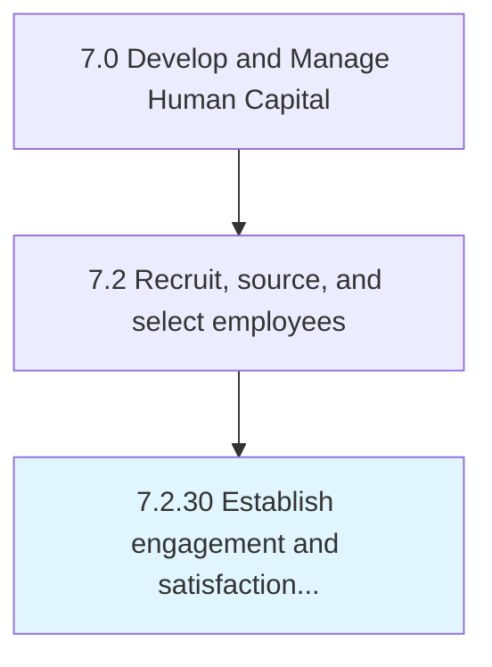

# Establish engagement and satisfaction performance measures

## Overview

Process 7.2.30 is a core process that defines the specific procedures for establish engagement and satisfaction performance measures. 

## Process Hierarchy



## Key Statistics

| Metric | Value |
|--------|-------|
| APQC Code | 20513 |
| Hierarchy ID | 7.2.30 |
| Level | Process |
| Parent | [7.2](../) |
| Sub-Processes | 0 |


## GraphDL Semantic Structure

```
establish.EngagementAndSatisfactionPerformanceMeasures
```

| Component | Value | Description |
|-----------|-------|-------------|
| Verb | `establish` | Primary action |
| Object | `engagement and satisfaction performance measures` | Direct object |


---

*Source: APQC PCF 20513 (7.2.30) - APQC*
