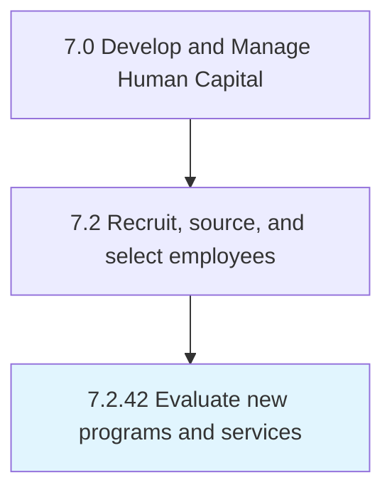

# Evaluate new programs and services

## Overview

Process 7.2.42 is a core process that defines the specific procedures for evaluate new programs and services. 

## Process Hierarchy



## Key Statistics

| Metric | Value |
|--------|-------|
| APQC Code | 10783 |
| Hierarchy ID | 7.2.42 |
| Level | Process |
| Parent | [7.2](../) |
| Sub-Processes | 0 |


## GraphDL Semantic Structure

```
evaluate.NewProgramsAndServices
```

| Component | Value | Description |
|-----------|-------|-------------|
| Verb | `evaluate` | Primary action |
| Object | `new programs and services` | Direct object |


---

*Source: APQC PCF 10783 (7.2.42) - APQC*
