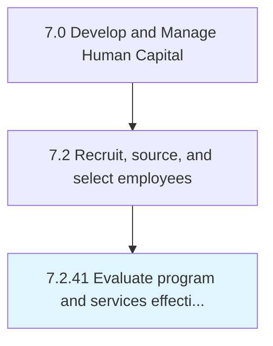

# Evaluate program and services effectiveness

## Overview

Process 7.2.41 is a core process that defines the specific procedures for evaluate program and services effectiveness. 

## Process Hierarchy



## Key Statistics

| Metric | Value |
|--------|-------|
| APQC Code | 10782 |
| Hierarchy ID | 7.2.41 |
| Level | Process |
| Parent | [7.2](../) |
| Sub-Processes | 0 |


## GraphDL Semantic Structure

```
evaluate.ProgramAndServicesEffectiveness
```

| Component | Value | Description |
|-----------|-------|-------------|
| Verb | `evaluate` | Primary action |
| Object | `program and services effectiveness` | Direct object |


---

*Source: APQC PCF 10782 (7.2.41) - APQC*
