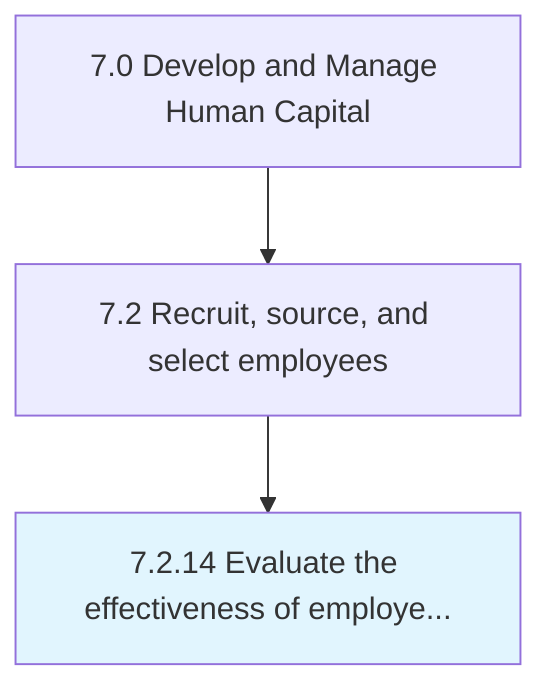

# Evaluate the effectiveness of employee on-boarding program

## Overview

Process 7.2.14 is a core process that defines the specific procedures for evaluate the effectiveness of employee on-boarding program. 

## Process Hierarchy



## Key Statistics

| Metric | Value |
|--------|-------|
| APQC Code | 11243 |
| Hierarchy ID | 7.2.14 |
| Level | Process |
| Parent | [7.2](../) |
| Sub-Processes | 0 |


## GraphDL Semantic Structure

```
evaluate.TheEffectiveness.of.EmployeeOnboardingProgram
```

| Component | Value | Description |
|-----------|-------|-------------|
| Verb | `evaluate` | Primary action |
| Object | `the effectiveness` | Direct object |
| Preposition | `of` | Relationship |
| PrepObject | `employee on-boarding program` | Indirect object |


---

*Source: APQC PCF 11243 (7.2.14) - APQC*
