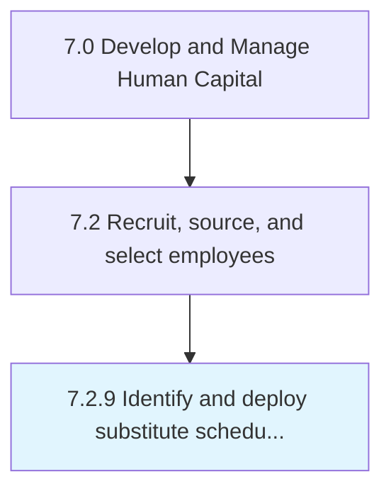

# Identify and deploy substitute scheduling and tracking tools

## Overview

Process 7.2.9 is a core process that defines the specific procedures for identify and deploy substitute scheduling and tracking tools. 

## Process Hierarchy



## Key Statistics

| Metric | Value |
|--------|-------|
| APQC Code | 20501 |
| Hierarchy ID | 7.2.9 |
| Level | Process |
| Parent | [7.2](../) |
| Sub-Processes | 0 |


## GraphDL Semantic Structure

```
identify.AndDeploySubstituteSchedulingAndTrackingTools
```

| Component | Value | Description |
|-----------|-------|-------------|
| Verb | `identify` | Primary action |
| Object | `and deploy substitute scheduling and tracking tools` | Direct object |


---

*Source: APQC PCF 20501 (7.2.9) - APQC*
