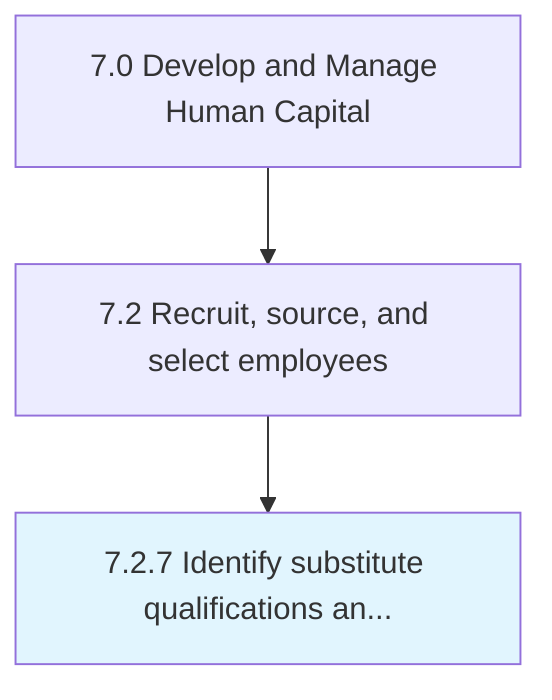

# Identify substitute qualifications and requirements

## Overview

Process 7.2.7 is a core process that defines the specific procedures for identify substitute qualifications and requirements. 

## Process Hierarchy



## Key Statistics

| Metric | Value |
|--------|-------|
| APQC Code | 20499 |
| Hierarchy ID | 7.2.7 |
| Level | Process |
| Parent | [7.2](../) |
| Sub-Processes | 0 |


## GraphDL Semantic Structure

```
identify.SubstituteQualificationsAndRequirements
```

| Component | Value | Description |
|-----------|-------|-------------|
| Verb | `identify` | Primary action |
| Object | `substitute qualifications and requirements` | Direct object |


---

*Source: APQC PCF 20499 (7.2.7) - APQC*
