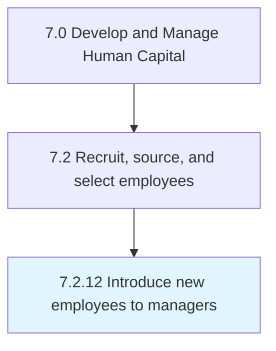

# Introduce new employees to managers

## Overview

Process 7.2.12 is a core process that defines the specific procedures for introduce new employees to managers. 

## Process Hierarchy



## Key Statistics

| Metric | Value |
|--------|-------|
| APQC Code | 20503 |
| Hierarchy ID | 7.2.12 |
| Level | Process |
| Parent | [7.2](../) |
| Sub-Processes | 0 |


## GraphDL Semantic Structure

```
introduce.NewEmployees.to.Managers
```

| Component | Value | Description |
|-----------|-------|-------------|
| Verb | `introduce` | Primary action |
| Object | `new employees` | Direct object |
| Preposition | `to` | Relationship |
| PrepObject | `managers` | Indirect object |


---

*Source: APQC PCF 20503 (7.2.12) - APQC*
