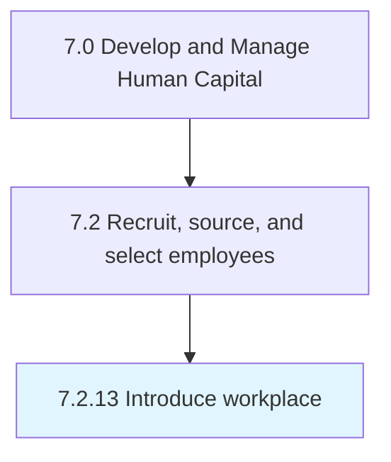

# Introduce workplace

## Overview

Process 7.2.13 is a core process that defines the specific procedures for introduce workplace. 

## Process Hierarchy



## Key Statistics

| Metric | Value |
|--------|-------|
| APQC Code | 20504 |
| Hierarchy ID | 7.2.13 |
| Level | Process |
| Parent | [7.2](../) |
| Sub-Processes | 0 |


## GraphDL Semantic Structure

```
introduce.Workplace
```

| Component | Value | Description |
|-----------|-------|-------------|
| Verb | `introduce` | Primary action |
| Object | `workplace` | Direct object |


---

*Source: APQC PCF 20504 (7.2.13) - APQC*
