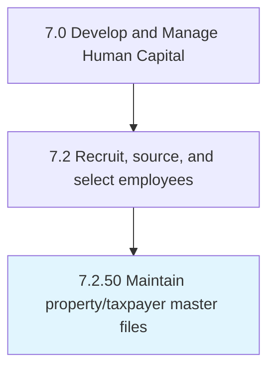

# Maintain property/taxpayer master files

## Overview

Process 7.2.50 is a core process that defines the specific procedures for maintain property/taxpayer master files. 

## Process Hierarchy



## Key Statistics

| Metric | Value |
|--------|-------|
| APQC Code | 10794 |
| Hierarchy ID | 7.2.50 |
| Level | Process |
| Parent | [7.2](../) |
| Sub-Processes | 0 |


## GraphDL Semantic Structure

```
maintain.PropertytaxpayerMasterFiles
```

| Component | Value | Description |
|-----------|-------|-------------|
| Verb | `maintain` | Primary action |
| Object | `property/taxpayer master files` | Direct object |


---

*Source: APQC PCF 10794 (7.2.50) - APQC*
