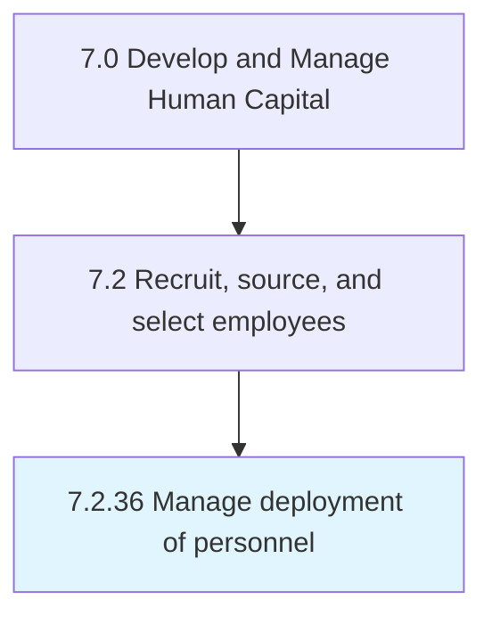

# Manage deployment of personnel

## Overview

Process 7.2.36 is a core process that defines the specific procedures for manage deployment of personnel. 

## Process Hierarchy



## Key Statistics

| Metric | Value |
|--------|-------|
| APQC Code | 10517 |
| Hierarchy ID | 7.2.36 |
| Level | Process |
| Parent | [7.2](../) |
| Sub-Processes | 0 |


## GraphDL Semantic Structure

```
manage.Deployment.of.Personnel
```

| Component | Value | Description |
|-----------|-------|-------------|
| Verb | `manage` | Primary action |
| Object | `deployment` | Direct object |
| Preposition | `of` | Relationship |
| PrepObject | `personnel` | Indirect object |


---

*Source: APQC PCF 10517 (7.2.36) - APQC*
