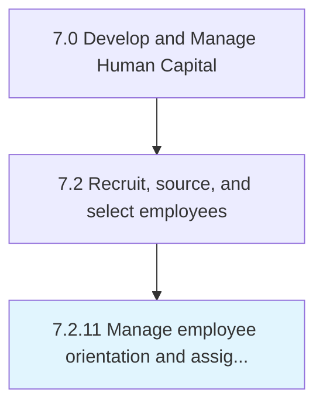

# Manage employee orientation and assignment

## Overview

Process 7.2.11 is a core process that defines the specific procedures for manage employee orientation and assignment. 

## Process Hierarchy



## Key Statistics

| Metric | Value |
|--------|-------|
| APQC Code | 10469 |
| Hierarchy ID | 7.2.11 |
| Level | Process |
| Parent | [7.2](../) |
| Sub-Processes | 0 |


## GraphDL Semantic Structure

```
manage.EmployeeOrientationAndAssignment
```

| Component | Value | Description |
|-----------|-------|-------------|
| Verb | `manage` | Primary action |
| Object | `employee orientation and assignment` | Direct object |


---

*Source: APQC PCF 10469 (7.2.11) - APQC*
