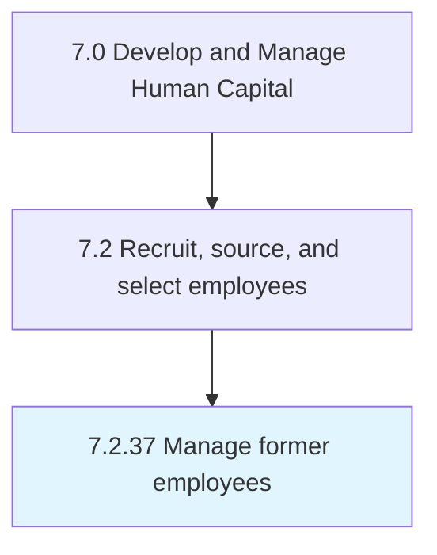

# Manage former employees

## Overview

Process 7.2.37 is a core process that defines the specific procedures for manage former employees. 

## Process Hierarchy



## Key Statistics

| Metric | Value |
|--------|-------|
| APQC Code | 20515 |
| Hierarchy ID | 7.2.37 |
| Level | Process |
| Parent | [7.2](../) |
| Sub-Processes | 0 |


## GraphDL Semantic Structure

```
manage.FormerEmployees
```

| Component | Value | Description |
|-----------|-------|-------------|
| Verb | `manage` | Primary action |
| Object | `former employees` | Direct object |


---

*Source: APQC PCF 20515 (7.2.37) - APQC*
