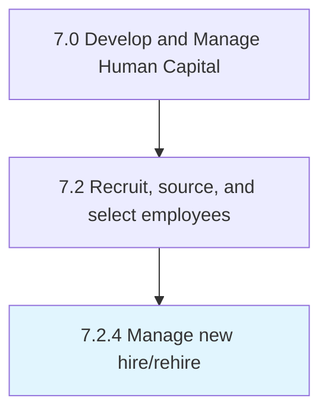

# Manage new hire/rehire

## Overview

Process 7.2.4 is a core process that defines the specific procedures for manage new hire/rehire. 

## Process Hierarchy



## Key Statistics

| Metric | Value |
|--------|-------|
| APQC Code | 10443 |
| Hierarchy ID | 7.2.4 |
| Level | Process |
| Parent | [7.2](../) |
| Sub-Processes | 0 |


## GraphDL Semantic Structure

```
manage.NewHirerehire
```

| Component | Value | Description |
|-----------|-------|-------------|
| Verb | `manage` | Primary action |
| Object | `new hire/rehire` | Direct object |


## Related Concepts

- [NewHire](/concepts/NewHire)
- [NewReHire](/concepts/NewReHire)


---

*Source: APQC PCF 10443 (7.2.4) - APQC*
