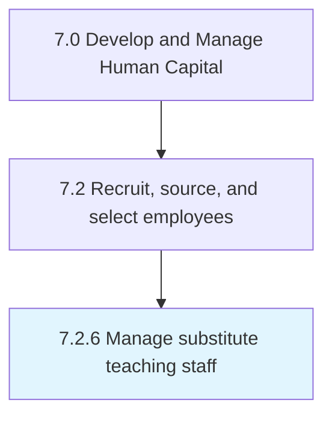

# Manage substitute teaching staff

## Overview

Process 7.2.6 is a core process that defines the specific procedures for manage substitute teaching staff. 

## Process Hierarchy



## Key Statistics

| Metric | Value |
|--------|-------|
| APQC Code | 20498 |
| Hierarchy ID | 7.2.6 |
| Level | Process |
| Parent | [7.2](../) |
| Sub-Processes | 0 |


## GraphDL Semantic Structure

```
manage.SubstituteTeachingStaff
```

| Component | Value | Description |
|-----------|-------|-------------|
| Verb | `manage` | Primary action |
| Object | `substitute teaching staff` | Direct object |


---

*Source: APQC PCF 20498 (7.2.6) - APQC*
