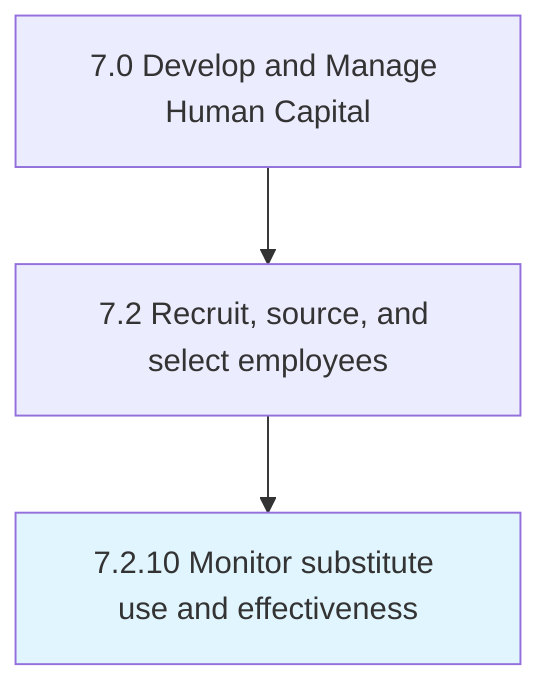

# Monitor substitute use and effectiveness

## Overview

Process 7.2.10 is a core process that defines the specific procedures for monitor substitute use and effectiveness. 

## Process Hierarchy



## Key Statistics

| Metric | Value |
|--------|-------|
| APQC Code | 20502 |
| Hierarchy ID | 7.2.10 |
| Level | Process |
| Parent | [7.2](../) |
| Sub-Processes | 0 |


## GraphDL Semantic Structure

```
monitor.SubstituteUseAndEffectiveness
```

| Component | Value | Description |
|-----------|-------|-------------|
| Verb | `monitor` | Primary action |
| Object | `substitute use and effectiveness` | Direct object |


---

*Source: APQC PCF 20502 (7.2.10) - APQC*
