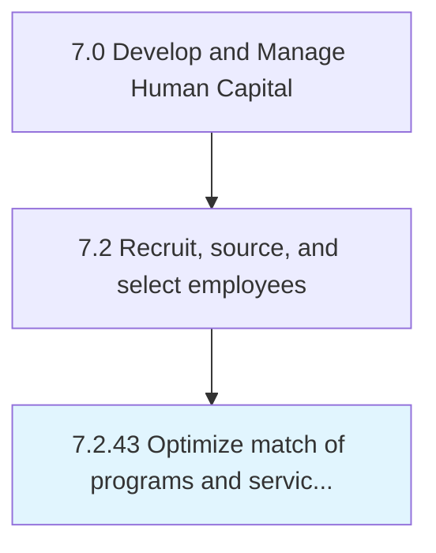

# Optimize match of programs and services to student needs

## Overview

Process 7.2.43 is a core process that defines the specific procedures for optimize match of programs and services to student needs. 

## Process Hierarchy



## Key Statistics

| Metric | Value |
|--------|-------|
| APQC Code | 10785 |
| Hierarchy ID | 7.2.43 |
| Level | Process |
| Parent | [7.2](../) |
| Sub-Processes | 0 |


## GraphDL Semantic Structure

```
optimize.Match.of.ProgramsAndServicesToStudentNeeds
```

| Component | Value | Description |
|-----------|-------|-------------|
| Verb | `optimize` | Primary action |
| Object | `match` | Direct object |
| Preposition | `of` | Relationship |
| PrepObject | `programs and services to student needs` | Indirect object |


---

*Source: APQC PCF 10785 (7.2.43) - APQC*
