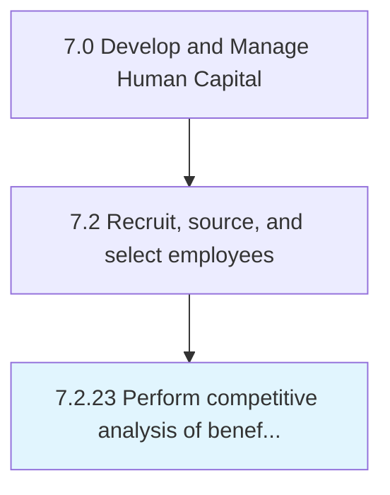

# Perform competitive analysis of benefit, rewards, and incentives

## Overview

Process 7.2.23 is a core process that defines the specific procedures for perform competitive analysis of benefit, rewards, and incentives. 

## Process Hierarchy



## Key Statistics

| Metric | Value |
|--------|-------|
| APQC Code | 10500 |
| Hierarchy ID | 7.2.23 |
| Level | Process |
| Parent | [7.2](../) |
| Sub-Processes | 0 |


## GraphDL Semantic Structure

```
perform.CompetitiveAnalysis.of.BenefitRewardsAndIncentives
```

| Component | Value | Description |
|-----------|-------|-------------|
| Verb | `perform` | Primary action |
| Object | `competitive analysis` | Direct object |
| Preposition | `of` | Relationship |
| PrepObject | `benefit, rewards, and incentives` | Indirect object |


---

*Source: APQC PCF 10500 (7.2.23) - APQC*
