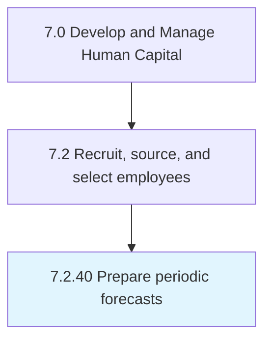

# Prepare periodic forecasts

## Overview

Process 7.2.40 is a core process that defines the specific procedures for prepare periodic forecasts. 

## Process Hierarchy



## Key Statistics

| Metric | Value |
|--------|-------|
| APQC Code | 10773 |
| Hierarchy ID | 7.2.40 |
| Level | Process |
| Parent | [7.2](../) |
| Sub-Processes | 0 |


## GraphDL Semantic Structure

```
prepare.PeriodicForecasts
```

| Component | Value | Description |
|-----------|-------|-------------|
| Verb | `prepare` | Primary action |
| Object | `periodic forecasts` | Direct object |


---

*Source: APQC PCF 10773 (7.2.40) - APQC*
