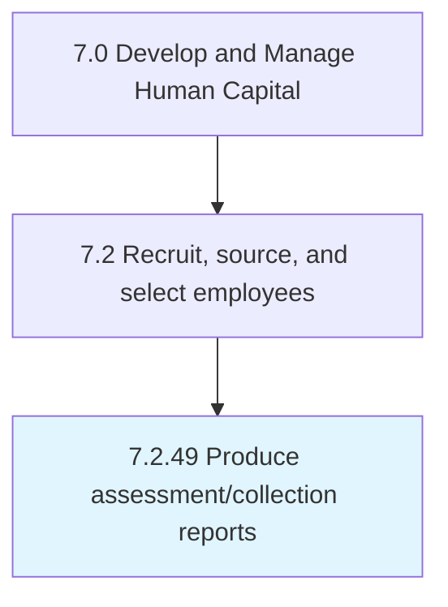

# Produce assessment/collection reports

## Overview

Process 7.2.49 is a core process that defines the specific procedures for produce assessment/collection reports. 

## Process Hierarchy



## Key Statistics

| Metric | Value |
|--------|-------|
| APQC Code | 20526 |
| Hierarchy ID | 7.2.49 |
| Level | Process |
| Parent | [7.2](../) |
| Sub-Processes | 0 |


## GraphDL Semantic Structure

```
produce.AssessmentcollectionReports
```

| Component | Value | Description |
|-----------|-------|-------------|
| Verb | `produce` | Primary action |
| Object | `assessment/collection reports` | Direct object |


---

*Source: APQC PCF 20526 (7.2.49) - APQC*
