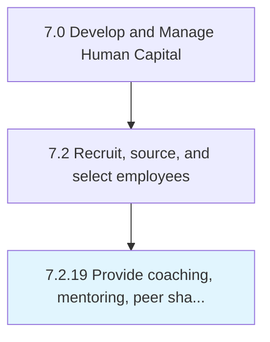

# Provide coaching, mentoring, peer sharing

## Overview

Process 7.2.19 is a core process that defines the specific procedures for provide coaching, mentoring, peer sharing. 

## Process Hierarchy



## Key Statistics

| Metric | Value |
|--------|-------|
| APQC Code | 20507 |
| Hierarchy ID | 7.2.19 |
| Level | Process |
| Parent | [7.2](../) |
| Sub-Processes | 0 |


## GraphDL Semantic Structure

```
provide.CoachingMentoringPeerSharing
```

| Component | Value | Description |
|-----------|-------|-------------|
| Verb | `provide` | Primary action |
| Object | `coaching, mentoring, peer sharing` | Direct object |


---

*Source: APQC PCF 20507 (7.2.19) - APQC*
