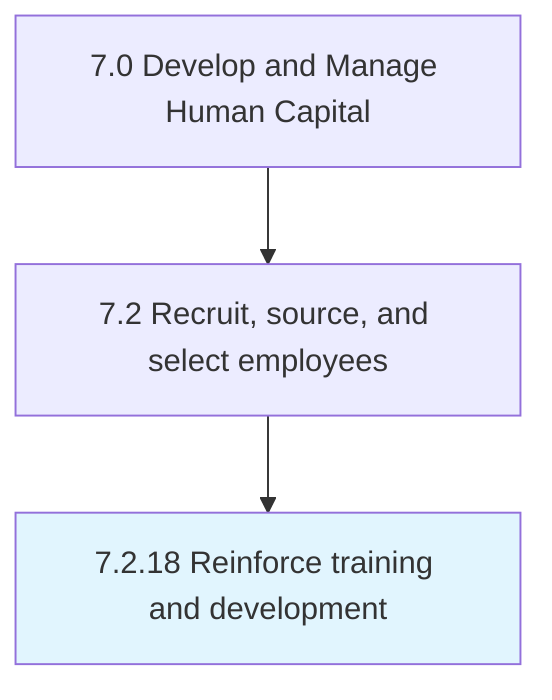

# Reinforce training and development

## Overview

Process 7.2.18 is a core process that defines the specific procedures for reinforce training and development. 

## Process Hierarchy



## Key Statistics

| Metric | Value |
|--------|-------|
| APQC Code | 20506 |
| Hierarchy ID | 7.2.18 |
| Level | Process |
| Parent | [7.2](../) |
| Sub-Processes | 0 |


## GraphDL Semantic Structure

```
reinforce.TrainingAndDevelopment
```

| Component | Value | Description |
|-----------|-------|-------------|
| Verb | `reinforce` | Primary action |
| Object | `training and development` | Direct object |


---

*Source: APQC PCF 20506 (7.2.18) - APQC*
