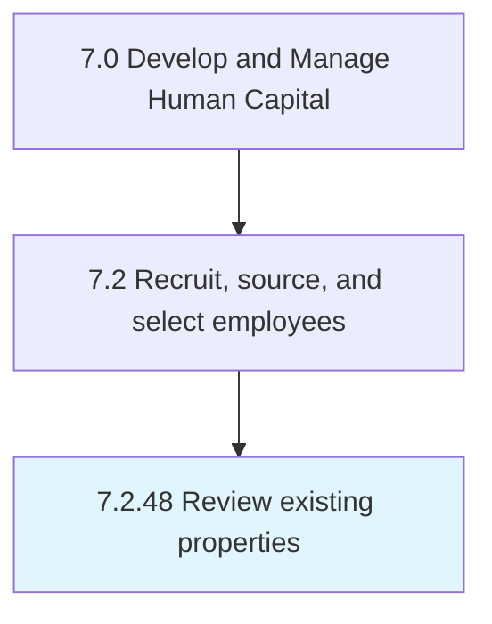

# Review existing properties

## Overview

Process 7.2.48 is a core process that defines the specific procedures for review existing properties. 

## Process Hierarchy



## Key Statistics

| Metric | Value |
|--------|-------|
| APQC Code | 20525 |
| Hierarchy ID | 7.2.48 |
| Level | Process |
| Parent | [7.2](../) |
| Sub-Processes | 0 |


## GraphDL Semantic Structure

```
review.ExistingProperties
```

| Component | Value | Description |
|-----------|-------|-------------|
| Verb | `review` | Primary action |
| Object | `existing properties` | Direct object |


---

*Source: APQC PCF 20525 (7.2.48) - APQC*
