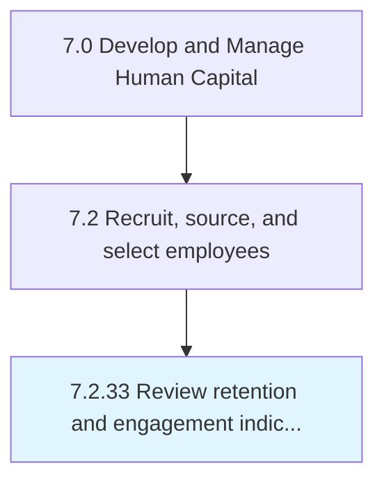

# Review retention and engagement indicators

## Overview

Process 7.2.33 is a core process that defines the specific procedures for review retention and engagement indicators. 

## Process Hierarchy



## Key Statistics

| Metric | Value |
|--------|-------|
| APQC Code | 10510 |
| Hierarchy ID | 7.2.33 |
| Level | Process |
| Parent | [7.2](../) |
| Sub-Processes | 0 |


## GraphDL Semantic Structure

```
review.RetentionAndEngagementIndicators
```

| Component | Value | Description |
|-----------|-------|-------------|
| Verb | `review` | Primary action |
| Object | `retention and engagement indicators` | Direct object |


---

*Source: APQC PCF 10510 (7.2.33) - APQC*
