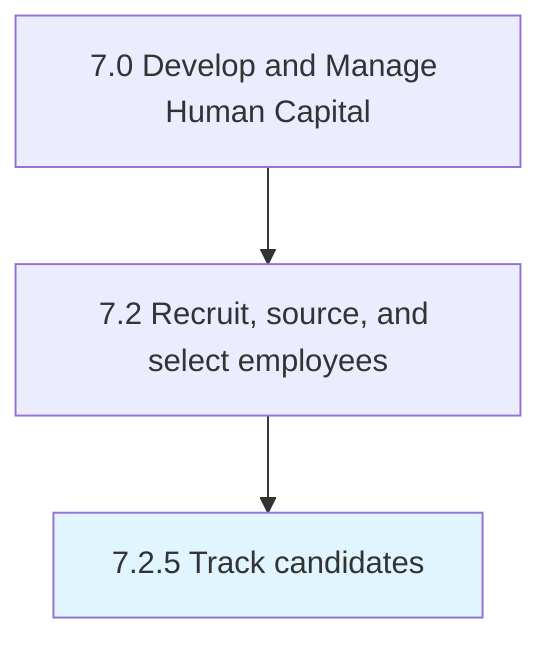

# Track candidates

## Overview

Process 7.2.5 is a core process that defines the specific procedures for track candidates. 

## Process Hierarchy



## Key Statistics

| Metric | Value |
|--------|-------|
| APQC Code | 20497 |
| Hierarchy ID | 7.2.5 |
| Level | Process |
| Parent | [7.2](../) |
| Sub-Processes | 0 |


## GraphDL Semantic Structure

```
track.Candidates
```

| Component | Value | Description |
|-----------|-------|-------------|
| Verb | `track` | Primary action |
| Object | `candidates` | Direct object |


---

*Source: APQC PCF 20497 (7.2.5) - APQC*
