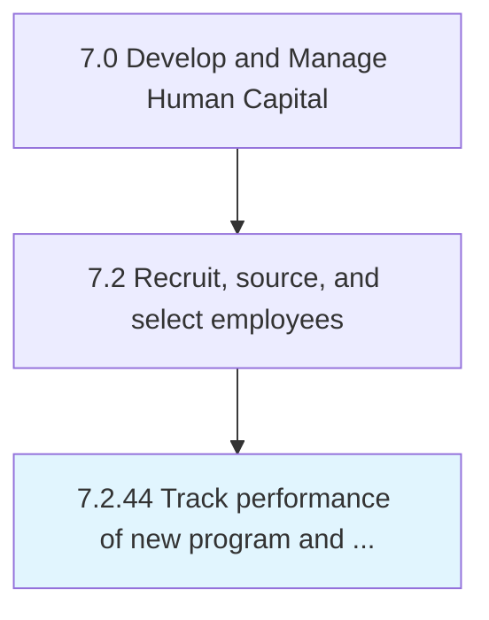

# Track performance of new program and services strategies

## Overview

Process 7.2.44 is a core process that defines the specific procedures for track performance of new program and services strategies. 

## Process Hierarchy



## Key Statistics

| Metric | Value |
|--------|-------|
| APQC Code | 10786 |
| Hierarchy ID | 7.2.44 |
| Level | Process |
| Parent | [7.2](../) |
| Sub-Processes | 0 |


## GraphDL Semantic Structure

```
track.Performance.of.NewProgramAndServicesStrategies
```

| Component | Value | Description |
|-----------|-------|-------------|
| Verb | `track` | Primary action |
| Object | `performance` | Direct object |
| Preposition | `of` | Relationship |
| PrepObject | `new program and services strategies` | Indirect object |


---

*Source: APQC PCF 10786 (7.2.44) - APQC*
