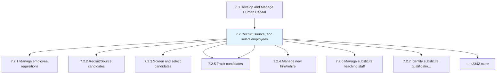
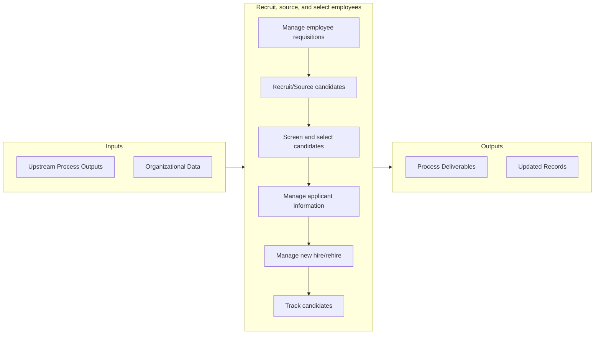

# Recruit, source, and select employees

> Determining and handling employee requirements.

## Overview

Group 7.2 is a process group within APQC Category 7.0 (Develop and Manage Human Capital). 

Determining and handling employee requirements. Recruit or source the candidates as per the requirements. Screen and select the most appropriate candidates. Take care of the newly hired and re-hired employees. Maintain records of information for all applicants.

## Process Hierarchy



## Key Statistics

| Metric | Value |
|--------|-------|
| APQC Code | 10410 |
| Hierarchy ID | 7.2 |
| Level | Group |
| Parent | [7](../) |
| Sub-Processes | 2350 |


## GraphDL Semantic Structure

```graphdl
recruit,.SourceAndSelectEmployees
```

| Component | Value | Description |
|-----------|-------|-------------|
| Verb | `recruit,` | Primary action |
| Object | `source, and select employees` | Direct object |


## Process Flow



## Sub-Processes

| Process | Hierarchy ID | Description |
|---------|-------------|-------------|
| [Manage employee requisitions](./7.2.1-ManageEmployeeRequisitions/) | 7.2.1 | Handling the requirements for new employees |
| [Recruit/Source candidates](./7.2.2-RecruitSourceCandidates/) | 7.2.2 | Recruiting new candidates for deployment across various functional areas inside the organization |
| [Screen and select candidates](./7.2.3-ScreenSelectCandidates/) | 7.2.3 | Evaluating and selecting potential employees through interviews, tests, etc |
| [Manage applicant information](./7.2.5-ManageApplicantInformation/) | 7.2.5 | Creating and maintaining a system for managing the information of applicants |
| [Manage new hire/rehire](./ManageNewHirerehire) | 7.2.4 | Manage new hire/rehire |
| [Track candidates](./TrackCandidates) | 7.2.5 | Track candidates |
| [Manage substitute teaching staff](./ManageSubstituteTeachingStaff) | 7.2.6 | Manage substitute teaching staff |
| [Identify substitute qualifications and requirements](./IdentifySubstituteQualificationsAndRequirements) | 7.2.7 | Identify substitute qualifications and requirements |
| [Develop substitute hiring methods](./DevelopSubstituteHiringMethods) | 7.2.8 | Develop substitute hiring methods |
| [Identify and deploy substitute scheduling and tracking tools](./IdentifyAndDeploySubstituteSchedulingAndTrackingTools) | 7.2.9 | Identify and deploy substitute scheduling and tracking tools |
| [Monitor substitute use and effectiveness](./MonitorSubstituteUseAndEffectiveness) | 7.2.10 | Monitor substitute use and effectiveness |
| [Manage employee orientation and assignment](./ManageEmployeeOrientationAndAssignment) | 7.2.11 | Manage employee orientation and assignment |
| [Introduce new employees to managers](./IntroduceNewEmployeesToManagers) | 7.2.12 | Introduce new employees to managers |
| [Introduce workplace](./IntroduceWorkplace) | 7.2.13 | Introduce workplace |
| [Evaluate the effectiveness of employee on-boarding program](./EvaluateTheEffectivenessOfEmployeeOnboardingProgram) | 7.2.14 | Evaluate the effectiveness of employee on-boarding program |
| [Define performance objectives](./DefinePerformanceObjectives) | 7.2.15 | Define performance objectives |
| [Develop employee career plans](./DevelopEmployeeCareerPlans) | 7.2.16 | Develop employee career plans |
| [Align employee, school, and district development needs](./AlignEmployeeSchoolAndDistrictDevelopmentNeeds) | 7.2.17 | Align employee, school, and district development needs |
| [Reinforce training and development](./ReinforceTrainingAndDevelopment) | 7.2.18 | Reinforce training and development |
| [Provide coaching, mentoring, peer sharing](./ProvideCoachingMentoringPeerSharing) | 7.2.19 | Provide coaching, mentoring, peer sharing |
| [Manage health and safety](./ManageHealthAndSafety) | 7.2.20 | Manage health and safety |
| [Develop and manage reward, recognition, and incentive programs](./DevelopAndManageRewardRecognitionAndIncentivePrograms) | 7.2.21 | Develop and manage reward, recognition, and incentive programs |
| [Develop benefits, reward, and incentive plan](./DevelopBenefitsRewardAndIncentivePlan) | 7.2.22 | Develop benefits, reward, and incentive plan |
| [Perform competitive analysis of benefit, rewards, and incentives](./PerformCompetitiveAnalysisOfBenefitRewardsAndIncentives) | 7.2.23 | Perform competitive analysis of benefit, rewards, and incentives |
| [Administer compensation, rewards, and incentives to employees](./AdministerCompensationRewardsAndIncentivesToEmployees) | 7.2.24 | Administer compensation, rewards, and incentives to employees |
| [Develop and manage employee engagement and satisfaction](./DevelopAndManageEmployeeEngagementAndSatisfaction) | 7.2.25 | Develop and manage employee engagement and satisfaction |
| [Determine key elements that affect workforce engagement](./DetermineKeyElementsThatAffectWorkforceEngagement) | 7.2.26 | Determine key elements that affect workforce engagement |
| [Differentiate engagement elements for different workforce groups and segments](./DifferentiateEngagementElementsForDifferentWorkforceGroupsAndSegments) | 7.2.27 | Differentiate engagement elements for different workforce groups and segments |
| [Determine workforce engagement and satisfaction assessment methods](./DetermineWorkforceEngagementAndSatisfactionAssessmentMethods) | 7.2.28 | Determine workforce engagement and satisfaction assessment methods |
| [Administer assessments](./AdministerAssessments) | 7.2.29 | Administer assessments |
| [Establish engagement and satisfaction performance measures](./EstablishEngagementAndSatisfactionPerformanceMeasures) | 7.2.30 | Establish engagement and satisfaction performance measures |
| [Analyze and report engagement and satisfaction results](./AnalyzeAndReportEngagementAndSatisfactionResults) | 7.2.31 | Analyze and report engagement and satisfaction results |
| [Deliver programs to support work/ life balance for employees](./DeliverProgramsToSupportWorkLifeBalanceForEmployees) | 7.2.32 | Deliver programs to support work/ life balance for employees |
| [Review retention and engagement indicators](./ReviewRetentionAndEngagementIndicators) | 7.2.33 | Review retention and engagement indicators |
| [Manage leave of absence, sabbatical](./ManageLeaveOfAbsenceSabbatical) | 7.2.34 | Manage leave of absence, sabbatical |
| [Develop and implement employee reduction in force policies and regulations](./DevelopAndImplementEmployeeReductionInForcePoliciesAndRegulations) | 7.2.35 | Develop and implement employee reduction in force policies and regulations |
| [Manage deployment of personnel](./ManageDeploymentOfPersonnel) | 7.2.36 | Manage deployment of personnel |
| [Manage former employees](./ManageFormerEmployees) | 7.2.37 | Manage former employees |
| [Manage employee relocation process](./ManageEmployeeRelocationProcess) | 7.2.38 | Manage employee relocation process |
| [Manage employee information](./ManageEmployeeInformation) | 7.2.39 | Manage employee information |
| [Prepare periodic forecasts](./PreparePeriodicForecasts) | 7.2.40 | Prepare periodic forecasts |
| [Evaluate program and services effectiveness](./EvaluateProgramAndServicesEffectiveness) | 7.2.41 | Evaluate program and services effectiveness |
| [Evaluate new programs and services](./EvaluateNewProgramsAndServices) | 7.2.42 | Evaluate new programs and services |
| [Optimize match of programs and services to student needs](./OptimizeMatchOfProgramsAndServicesToStudentNeeds) | 7.2.43 | Optimize match of programs and services to student needs |
| [Track performance of new program and services strategies](./TrackPerformanceOfNewProgramAndServicesStrategies) | 7.2.44 | Track performance of new program and services strategies |
| [Process taxpayer accounts](./ProcessTaxpayerAccounts) | 7.2.45 | Process taxpayer accounts |
| [Establish collection policies](./EstablishCollectionPolicies) | 7.2.46 | Establish collection policies |
| [Assess and bill new properties](./AssessAndBillNewProperties) | 7.2.47 | Assess and bill new properties |
| [Review existing properties](./ReviewExistingProperties) | 7.2.48 | Review existing properties |
| [Produce assessment/collection reports](./ProduceAssessmentcollectionReports) | 7.2.49 | Produce assessment/collection reports |
| [Maintain property/taxpayer master files](./MaintainPropertytaxpayerMasterFiles) | 7.2.50 | Maintain property/taxpayer master files |
| [Generate taxpayer billing data](./GenerateTaxpayerBillingData) | 7.2.51 | Generate taxpayer billing data |
| [Transmit billing data to taxpayers](./TransmitBillingDataToTaxpayers) | 7.2.52 | Transmit billing data to taxpayers |
| [Resolve customer assessment inquiries 18](./ResolveCustomerAssessmentInquiries18) | 7.2.53 | Resolve customer assessment inquiries 18 |
| [Receive/Deposit payments](./ReceiveDepositPayments) | 7.2.54 | Receive/Deposit payments |
| [Manage and process adjustments/ deductions](./ManageAndProcessAdjustmentsDeductions) | 7.2.55 | Manage and process adjustments/ deductions |
| [Correspond/Negotiate with taxpayer](./CorrespondNegotiateWithTaxpayer) | 7.2.56 | Correspond/Negotiate with taxpayer |
| [Prepare assessment adjustments](./PrepareAssessmentAdjustments) | 7.2.57 | Prepare assessment adjustments |
| [Set up and enforce approval limits](./SetUpAndEnforceApprovalLimits) | 7.2.58 | Set up and enforce approval limits |
| [Process period-end adjustments (e.g., accruals and currency conversions, etc.)](./ProcessPeriodendAdjustmentsEgAccrualsAndCurrencyConversionsEtc) | 7.2.59 | Process period-end adjustments (e.g., accruals and currency conversions, etc.) |
| [Post and reconcile interagency transactions](./PostAndReconcileInteragencyTransactions) | 7.2.60 | Post and reconcile interagency transactions |
| [Perform fixed asset accounting (facilities)](./PerformFixedAssetAccountingFacilities) | 7.2.61 | Perform fixed asset accounting (facilities) |
| [Prepare departmental financial statements](./PrepareDepartmentalFinancialStatements) | 7.2.62 | Prepare departmental financial statements |
| [Perform departmental reporting/ review management reports](./PerformDepartmentalReportingReviewManagementReports) | 7.2.63 | Perform departmental reporting/ review management reports |
| [Perform consolidated reporting/ review of cost management reports](./PerformConsolidatedReportingReviewOfCostManagementReports) | 7.2.64 | Perform consolidated reporting/ review of cost management reports |
| [Prepare statements for board](./PrepareStatementsForBoard) | 7.2.65 | Prepare statements for board |
| [Produce quarterly/annual filings and public reports](./ProduceQuarterlyannualFilingsAndPublicReports) | 7.2.66 | Produce quarterly/annual filings and public reports |
| [Manage fixed assets budgets](./ManageFixedAssetsBudgets) | 7.2.67 | Manage fixed assets budgets |
| [Perform justification for bond/ project approval](./PerformJustificationForBondProjectApproval) | 7.2.68 | Perform justification for bond/ project approval |
| [Measure variance in budgeted and actual expenditure on completed capital projects](./MeasureVarianceInBudgetedAndActualExpenditureOnCompletedCapitalProjects) | 7.2.69 | Measure variance in budgeted and actual expenditure on completed capital projects |
| [Collect and record employee time information](./CollectAndRecordEmployeeTimeInformation) | 7.2.70 | Collect and record employee time information |
| [Enter employee time into payroll system](./EnterEmployeeTimeIntoPayrollSystem) | 7.2.71 | Enter employee time into payroll system |
| [Process end-of-period adjustments](./ProcessEndofperiodAdjustments) | 7.2.72 | Process end-of-period adjustments |
| [Process payroll taxes](./ProcessPayrollTaxes) | 7.2.73 | Process payroll taxes |
| [Audit invoices and key data into AP system](./AuditInvoicesAndKeyDataIntoAPSystem) | 7.2.74 | Audit invoices and key data into AP system |
| [Process payable taxes](./ProcessPayableTaxes) | 7.2.75 | Process payable taxes |
| [Manage personal accounts](./ManagePersonalAccounts) | 7.2.76 | Manage personal accounts |
| [Monitor and execute risk](./MonitorAndExecuteRisk) | 7.2.77 | Monitor and execute risk |
| [Establish board audit committee](./EstablishBoardAuditCommittee) | 7.2.78 | Establish board audit committee |
| [Report to third parties (e.g., board)](./ReportToThirdPartiesEgBoard) | 7.2.79 | Report to third parties (e.g., board) |
| [Manage grants](./ManageGrants) | 7.2.80 | Manage grants |
| [Develop grant application and management procedures](./DevelopGrantApplicationAndManagementProcedures) | 7.2.81 | Develop grant application and management procedures |
| [Collaborate across educational and operation functions to determine funding needs](./CollaborateAcrossEducationalAndOperationFunctionsToDetermineFundingNeeds) | 7.2.82 | Collaborate across educational and operation functions to determine funding needs |
| [Identify qualified grants](./IdentifyQualifiedGrants) | 7.2.83 | Identify qualified grants |
| [Submit grant proposal](./SubmitGrantProposal) | 7.2.84 | Submit grant proposal |
| [Establish grant budget](./EstablishGrantBudget) | 7.2.85 | Establish grant budget |
| [Monitor grant requirements](./MonitorGrantRequirements) | 7.2.86 | Monitor grant requirements |
| [Evaluate grant effectiveness](./EvaluateGrantEffectiveness) | 7.2.87 | Evaluate grant effectiveness |
| [Acquire, Construct, and Manage Facilities](./AcquireConstructAndManageFacilities) | 7.2.88 | Acquire, Construct, and Manage Facilities |
| [Design and construct/acquire capital assets](./DesignAndConstructacquireCapitalAssets) | 7.2.89 | Design and construct/acquire capital assets |
| [Develop capital improvement plan and long-term vision](./DevelopCapitalImprovementPlanAndLongtermVision) | 7.2.90 | Develop capital improvement plan and long-term vision |
| [Confirm alignment of property requirements with district strategy](./ConfirmAlignmentOfPropertyRequirementsWithDistrictStrategy) | 7.2.91 | Confirm alignment of property requirements with district strategy |
| [Make build-or-buy decision](./MakeBuildorbuyDecision) | 7.2.92 | Make build-or-buy decision |
| [Develop, construct, and modify sites](./DevelopConstructAndModifySites) | 7.2.93 | Develop, construct, and modify sites |
| [Conduct bid and contract selection for facility construction](./ConductBidAndContractSelectionForFacilityConstruction) | 7.2.94 | Conduct bid and contract selection for facility construction |
| [Provide facilities](./ProvideFacilities) | 7.2.95 | Provide facilities |
| [Acquire facilities and furnishings](./AcquireFacilitiesAndFurnishings) | 7.2.96 | Acquire facilities and furnishings |
| [Change fit/form/function of facilities and furnishings](./ChangeFitformfunctionOfFacilitiesAndFurnishings) | 7.2.97 | Change fit/form/function of facilities and furnishings |
| [Plan maintenance work](./PlanMaintenanceWork) | 7.2.98 | Plan maintenance work |
| [Develop a work order process](./DevelopAWorkOrderProcess) | 7.2.99 | Develop a work order process |
| [Collect data on work order cycle time and flow](./CollectDataOnWorkOrderCycleTimeAndFlow) | 7.2.100 | Collect data on work order cycle time and flow |
| [Monitor performance against industry standards](./MonitorPerformanceAgainstIndustryStandards) | 7.2.101 | Monitor performance against industry standards |
| [Perform routine maintenance](./PerformRoutineMaintenance) | 7.2.102 | Perform routine maintenance |
| [Overhaul or replace equipment](./OverhaulOrReplaceEquipment) | 7.2.103 | Overhaul or replace equipment |
| [Relocate materials, supplies, and furnishings](./RelocateMaterialsSuppliesAndFurnishings) | 7.2.104 | Relocate materials, supplies, and furnishings |
| [Obtain and install assets and equipment](./ObtainAndInstallAssetsAndEquipment) | 7.2.105 | Obtain and install assets and equipment |
| [Develop ongoing maintenance policies](./DevelopOngoingMaintenancePolicies) | 7.2.106 | Develop ongoing maintenance policies |
| [Develop approach to integrate preventive maintenance into production schedule](./DevelopApproachToIntegratePreventiveMaintenanceIntoProductionSchedule) | 7.2.107 | Develop approach to integrate preventive maintenance into production schedule |
| [Obtain and install equipment](./ObtainAndInstallEquipment) | 7.2.108 | Obtain and install equipment |
| [Dispose of facilities and assets](./DisposeOfFacilitiesAndAssets) | 7.2.109 | Dispose of facilities and assets |
| [Develop disposition strategy](./DevelopDispositionStrategy) | 7.2.110 | Develop disposition strategy |
| [Manage facility housekeeping](./ManageFacilityHousekeeping) | 7.2.111 | Manage facility housekeeping |
| [Identify cleaning needs, standards, and requirements](./IdentifyCleaningNeedsStandardsAndRequirements) | 7.2.112 | Identify cleaning needs, standards, and requirements |
| [Develop process cleaning guidelines](./DevelopProcessCleaningGuidelines) | 7.2.113 | Develop process cleaning guidelines |
| [Evaluate cleaning effectiveness](./EvaluateCleaningEffectiveness) | 7.2.114 | Evaluate cleaning effectiveness |
| [Maintain grounds](./MaintainGrounds) | 7.2.115 | Maintain grounds |
| [Plan and develop maintenance schedules](./PlanAndDevelopMaintenanceSchedules) | 7.2.116 | Plan and develop maintenance schedules |
| [Coordinate maintenance activities](./CoordinateMaintenanceActivities) | 7.2.117 | Coordinate maintenance activities |
| [Monitor quality of service](./MonitorQualityOfService) | 7.2.118 | Monitor quality of service |
| [Manage Enterprise Risk, Compliance, and Continuity of Operations (Resiliency)](./ManageEnterpriseRiskComplianceAndContinuityOfOperationsResiliency) | 7.2.119 | Manage Enterprise Risk, Compliance, and Continuity of Operations (Resiliency) |
| [Verify risk mitigation plans are implemented](./VerifyRiskMitigationPlansAreImplemented) | 7.2.120 | Verify risk mitigation plans are implemented |
| [Monitor risks and risk mitigation action](./MonitorRisksAndRiskMitigationAction) | 7.2.121 | Monitor risks and risk mitigation action |
| [Coordinate department/campus and functional risk management activities](./CoordinateDepartmentcampusAndFunctionalRiskManagementActivities) | 7.2.122 | Coordinate department/campus and functional risk management activities |
| [Monitor that each department, campus, and function follows the enterprise risk management process](./MonitorThatEachDepartmentCampusAndFunctionFollowsTheEnterpriseRiskManagementProcess) | 7.2.123 | Monitor that each department, campus, and function follows the enterprise risk management process |
| [Monitor that each department, campus, and function follows the enterprise risk reporting process](./MonitorThatEachDepartmentCampusAndFunctionFollowsTheEnterpriseRiskReportingProcess) | 7.2.124 | Monitor that each department, campus, and function follows the enterprise risk reporting process |
| [Manage department, campus, and function risk](./ManageDepartmentCampusAndFunctionRisk) | 7.2.125 | Manage department, campus, and function risk |
| [Develop the regulatory compliance strategy](./DevelopTheRegulatoryComplianceStrategy) | 7.2.126 | Develop the regulatory compliance strategy |
| [Assess current compliance position, and identify weaknesses or shortfalls](./AssessCurrentCompliancePositionAndIdentifyWeaknessesOrShortfalls) | 7.2.127 | Assess current compliance position, and identify weaknesses or shortfalls |
| [Implement missing or stronger regulatory compliance controls and policies 22 Permission granted to photocopy for personal use. ©2014 APQC. ALL RIGHTS RESERVED.](./ImplementMissingOrStrongerRegulatoryComplianceControlsAndPolicies22PermissionGrantedToPhotocopyForPersonalUse2014APQCALLRIGHTSRESERVED) | 7.2.128 | Implement missing or stronger regulatory compliance controls and policies 22 Permission granted to photocopy for personal use. ©2014 APQC. ALL RIGHTS RESERVED. |
| [Monitor and test, on an ongoing and scheduled basis, regulatory compliance position and existing controls, defining controls that should be added, removed, or modified as required](./MonitorAndTestOnAnOngoingAndScheduledBasisRegulatoryCompliancePositionAndExistingControlsDefiningControlsThatShouldBeAddedRemovedOrModifiedAsRequired) | 7.2.129 | Monitor and test, on an ongoing and scheduled basis, regulatory compliance position and existing controls, defining controls that should be added, removed, or modified as required |
| [Manage continuity of operations](./ManageContinuityOfOperations) | 7.2.130 | Manage continuity of operations |
| [Develop and manage continuity of operations](./DevelopAndManageContinuityOfOperations) | 7.2.131 | Develop and manage continuity of operations |
| [Develop the continuity of operations strategy](./DevelopTheContinuityOfOperationsStrategy) | 7.2.132 | Develop the continuity of operations strategy |
| [Perform continuous district operations planning](./PerformContinuousDistrictOperationsPlanning) | 7.2.133 | Perform continuous district operations planning |
| [Test continuous district operations](./TestContinuousDistrictOperations) | 7.2.134 | Test continuous district operations |
| [Maintain continuous district operations](./MaintainContinuousDistrictOperations) | 7.2.135 | Maintain continuous district operations |
| [Ensure compliance with regulations](./EnsureComplianceWithRegulations) | 7.2.136 | Ensure compliance with regulations |
| [Monitor compliance](./MonitorCompliance) | 7.2.137 | Monitor compliance |
| [Perform compliance audit](./PerformComplianceAudit) | 7.2.138 | Perform compliance audit |
| [Comply with regulatory stakeholders’ requirements](./ComplyWithRegulatoryStakeholdersRequirements) | 7.2.139 | Comply with regulatory stakeholders’ requirements |
| [Plan and develop security program](./PlanAndDevelopSecurityProgram) | 7.2.140 | Plan and develop security program |
| [Evaluate facility security vulnerabilities](./EvaluateFacilitySecurityVulnerabilities) | 7.2.141 | Evaluate facility security vulnerabilities |
| [Develop security program](./DevelopSecurityProgram) | 7.2.142 | Develop security program |
| [Identify security equipment and funding source](./IdentifySecurityEquipmentAndFundingSource) | 7.2.143 | Identify security equipment and funding source |
| [Install and maintain security equipment](./InstallAndMaintainSecurityEquipment) | 7.2.144 | Install and maintain security equipment |
| [Monitor security equipment](./MonitorSecurityEquipment) | 7.2.145 | Monitor security equipment |
| [Implement security policies and procedures](./ImplementSecurityPoliciesAndProcedures) | 7.2.146 | Implement security policies and procedures |
| [Test efficacy of security protocols](./TestEfficacyOfSecurityProtocols) | 7.2.147 | Test efficacy of security protocols |
| [Monitor security compliance](./MonitorSecurityCompliance) | 7.2.148 | Monitor security compliance |
| [Evaluate security protocols](./EvaluateSecurityProtocols) | 7.2.149 | Evaluate security protocols |
| [Plan, build, and manage relations with federal, state, and local funding entities](./PlanBuildAndManageRelationsWithFederalStateAndLocalFundingEntities) | 7.2.150 | Plan, build, and manage relations with federal, state, and local funding entities |
| [Plan, build, and manage financial analyst/ratings relations](./PlanBuildAndManageFinancialAnalystratingsRelations) | 7.2.151 | Plan, build, and manage financial analyst/ratings relations |
| [Communicate with stakeholders](./CommunicateWithStakeholders) | 7.2.152 | Communicate with stakeholders |
| [Manage government and other district relationships](./ManageGovernmentAndOtherDistrictRelationships) | 7.2.153 | Manage government and other district relationships |
| [Manage relations with associations, stakeholder, and education groups](./ManageRelationsWithAssociationsStakeholderAndEducationGroups) | 7.2.154 | Manage relations with associations, stakeholder, and education groups |
| [Manage relations with Board of Trustees/ Education](./ManageRelationsWithBoardOfTrusteesEducation) | 7.2.155 | Manage relations with Board of Trustees/ Education |
| [Address audit findings](./AddressAuditFindings) | 7.2.156 | Address audit findings |
| [Identify key measures or indicators of ethical behavior](./IdentifyKeyMeasuresOrIndicatorsOfEthicalBehavior) | 7.2.157 | Identify key measures or indicators of ethical behavior |
| [Monitor ethical behavior across the organization](./MonitorEthicalBehaviorAcrossTheOrganization) | 7.2.158 | Monitor ethical behavior across the organization |
| [Identify a confidential method to report breaches in ethical behavior](./IdentifyAConfidentialMethodToReportBreachesInEthicalBehavior) | 7.2.159 | Identify a confidential method to report breaches in ethical behavior |
| [Implement a confidential method to report breaches in ethical behavior](./ImplementAConfidentialMethodToReportBreachesInEthicalBehavior) | 7.2.160 | Implement a confidential method to report breaches in ethical behavior |
| [Manage district governance policies](./ManageDistrictGovernancePolicies) | 7.2.161 | Manage district governance policies |
| [Develop and perform preventative law programs](./DevelopAndPerformPreventativeLawPrograms) | 7.2.162 | Develop and perform preventative law programs |
| [Process pay for legal services](./ProcessPayForLegalServices) | 7.2.163 | Process pay for legal services |
| [Manage copyrights and patents](./ManageCopyrightsAndPatents) | 7.2.164 | Manage copyrights and patents |
| [Resolve grievances and litigations](./ResolveGrievancesAndLitigations) | 7.2.165 | Resolve grievances and litigations |
| [Negotiate and document agreements/ contracts](./NegotiateAndDocumentAgreementsContracts) | 7.2.166 | Negotiate and document agreements/ contracts |
| [Manage relations with association and education groups](./ManageRelationsWithAssociationAndEducationGroups) | 7.2.167 | Manage relations with association and education groups |
| [Manage relations with vendors and suppliers](./ManageRelationsWithVendorsAndSuppliers) | 7.2.168 | Manage relations with vendors and suppliers |
| [Create news releases](./CreateNewsReleases) | 7.2.169 | Create news releases |
| [Issue news releases](./IssueNewsReleases) | 7.2.170 | Issue news releases |
| [Develop and Manage District Capabilities](./DevelopAndManageDistrictCapabilities) | 7.2.171 | Develop and Manage District Capabilities |
| [Manage educational programs, support services, and operational processes](./ManageEducationalProgramsSupportServicesAndOperationalProcesses) | 7.2.172 | Manage educational programs, support services, and operational processes |
| [Conduct process governance activities](./ConductProcessGovernanceActivities) | 7.2.173 | Conduct process governance activities |
| [Map processes](./MapProcesses) | 7.2.174 | Map processes |
| [Support process implementation](./SupportProcessImplementation) | 7.2.175 | Support process implementation |
| [Manage district projects and programs](./ManageDistrictProjectsAndPrograms) | 7.2.176 | Manage district projects and programs |
| [Manage educational, support services, and operational program strategy](./ManageEducationalSupportServicesAndOperationalProgramStrategy) | 7.2.177 | Manage educational, support services, and operational program strategy |
| [Establish educational, support services, and operational program strategy](./EstablishEducationalSupportServicesAndOperationalProgramStrategy) | 7.2.178 | Establish educational, support services, and operational program strategy |
| [Define educational, support services, and operational program governance](./DefineEducationalSupportServicesAndOperationalProgramGovernance) | 7.2.179 | Define educational, support services, and operational program governance |
| [Monitor and control educational, support services, and operational programs](./MonitorAndControlEducationalSupportServicesAndOperationalPrograms) | 7.2.180 | Monitor and control educational, support services, and operational programs |
| [Manage educational, support services, and operational programs](./ManageEducationalSupportServicesAndOperationalPrograms) | 7.2.181 | Manage educational, support services, and operational programs |
| [Manage program implementation](./ManageProgramImplementation) | 7.2.182 | Manage program implementation |
| [Create project rationale and obtain funding](./CreateProjectRationaleAndObtainFunding) | 7.2.183 | Create project rationale and obtain funding |
| [Implement projects](./ImplementProjects) | 7.2.184 | Implement projects |
| [Manage district quality and organizational performance](./ManageDistrictQualityAndOrganizationalPerformance) | 7.2.185 | Manage district quality and organizational performance |
| [Develop quality strategy and plans](./DevelopQualityStrategyAndPlans) | 7.2.186 | Develop quality strategy and plans |
| [Define and maintain quality processes and standards](./DefineAndMaintainQualityProcessesAndStandards) | 7.2.187 | Define and maintain quality processes and standards |
| [Establish quality measurements and targets](./EstablishQualityMeasurementsAndTargets) | 7.2.188 | Establish quality measurements and targets |
| [Establish and maintain quality tools and templates](./EstablishAndMaintainQualityToolsAndTemplates) | 7.2.189 | Establish and maintain quality tools and templates |
| [Plan and manage quality work force](./PlanAndManageQualityWorkForce) | 7.2.190 | Plan and manage quality work force |
| [Develop and maintain quality assessment training](./DevelopAndMaintainQualityAssessmentTraining) | 7.2.191 | Develop and maintain quality assessment training |
| [Develop and maintain quality-process tools training](./DevelopAndMaintainQualityprocessToolsTraining) | 7.2.192 | Develop and maintain quality-process tools training |
| [Develop and maintain quality recognition programs](./DevelopAndMaintainQualityRecognitionPrograms) | 7.2.193 | Develop and maintain quality recognition programs |
| [Perform quality assessments](./PerformQualityAssessments) | 7.2.194 | Perform quality assessments |
| [Assess process compliance](./AssessProcessCompliance) | 7.2.195 | Assess process compliance |
| [Assess standards compliance](./AssessStandardsCompliance) | 7.2.196 | Assess standards compliance |
| [Perform risk assessment](./PerformRiskAssessment) | 7.2.197 | Perform risk assessment |
| [Perform organizational effectiveness assessment](./PerformOrganizationalEffectivenessAssessment) | 7.2.198 | Perform organizational effectiveness assessment |
| [Measure and report quality performance](./MeasureAndReportQualityPerformance) | 7.2.199 | Measure and report quality performance |
| [Engage/Identify champion](./EngageIdentifyChampion) | 7.2.200 | Engage/Identify champion |
| [Implement the change](./ImplementTheChange) | 7.2.201 | Implement the change |
| [Reengineer educational support and operational processes and systems](./ReengineerEducationalSupportAndOperationalProcessesAndSystems) | 7.2.202 | Reengineer educational support and operational processes and systems |
| [Develop governance model](./DevelopGovernanceModel) | 7.2.203 | Develop governance model |
| [Establish a central KM core group](./EstablishACentralKMCoreGroup) | 7.2.204 | Establish a central KM core group |
| [Define roles and accountability of the core group versus departments/campuses](./DefineRolesAndAccountabilityOfTheCoreGroupVersusDepartmentscampuses) | 7.2.205 | Define roles and accountability of the core group versus departments/campuses |
| [Develop strategic measures and indicator](./DevelopStrategicMeasuresAndIndicator) | 7.2.206 | Develop strategic measures and indicator |
| [Create and manage organizational performance](./CreateAndManageOrganizationalPerformance) | 7.2.207 | Create and manage organizational performance |
| [Measure process productivity](./MeasureProcessProductivity) | 7.2.208 | Measure process productivity |
| [Measure staff efficiency](./MeasureStaffEfficiency) | 7.2.209 | Measure staff efficiency |
| [Conduct gap analysis to understand need for change and degree needed](./ConductGapAnalysisToUnderstandNeedForChangeAndDegreeNeeded) | 7.2.210 | Conduct gap analysis to understand need for change and degree needed |
| [Define the city's comprehensive plan](./DefineTheCitysComprehensivePlan) | 7.2.211 | Define the city's comprehensive plan |
| [Identify external influencers and constraints](./IdentifyExternalInfluencersAndConstraints) | 7.2.212 | Identify external influencers and constraints |
| [Identify new technology innovations](./IdentifyNewTechnologyInnovations) | 7.2.213 | Identify new technology innovations |
| [Identify constituent demographics](./IdentifyConstituentDemographics) | 7.2.214 | Identify constituent demographics |
| [Survey constituent needs and wants](./SurveyConstituentNeedsAndWants) | 7.2.215 | Survey constituent needs and wants |
| [Conduct qualitative/quantitative constituent assessments](./ConductQualitativequantitativeConstituentAssessments) | 7.2.216 | Conduct qualitative/quantitative constituent assessments |
| [Capture constituent needs and wants](./CaptureConstituentNeedsAndWants) | 7.2.217 | Capture constituent needs and wants |
| [Assess constituent needs and wants](./AssessConstituentNeedsAndWants) | 7.2.218 | Assess constituent needs and wants |
| [Assess the city structure](./AssessTheCityStructure) | 7.2.219 | Assess the city structure |
| [Identify the city's core competencies](./IdentifyTheCitysCoreCompetencies) | 7.2.220 | Identify the city's core competencies |
| [Align constituents around a strategic vision](./AlignConstituentsAroundAStrategicVision) | 7.2.221 | Align constituents around a strategic vision |
| [Communicate strategic vision to constituents](./CommunicateStrategicVisionToConstituents) | 7.2.222 | Communicate strategic vision to constituents |
| [Conduct city restructuring opportunities](./ConductCityRestructuringOpportunities) | 7.2.223 | Conduct city restructuring opportunities |
| [Identify city restructuring opportunities](./IdentifyCityRestructuringOpportunities) | 7.2.224 | Identify city restructuring opportunities |
| [Analyze structural options](./AnalyzeStructuralOptions) | 7.2.225 | Analyze structural options |
| [Evaluate service profile](./EvaluateServiceProfile) | 7.2.226 | Evaluate service profile |
| [Evaluate annexation options](./EvaluateAnnexationOptions) | 7.2.227 | Evaluate annexation options |
| [Develop city strategy](./DevelopCityStrategy) | 7.2.228 | Develop city strategy |
| [Define current city functions](./DefineCurrentCityFunctions) | 7.2.229 | Define current city functions |
| [Formulate city mission statement](./FormulateCityMissionStatement) | 7.2.230 | Formulate city mission statement |
| [Communicate city mission statement](./CommunicateCityMissionStatement) | 7.2.231 | Communicate city mission statement |
| [Evaluate strategic options to achieve the objectives](./EvaluateStrategicOptionsToAchieveTheObjectives) | 7.2.232 | Evaluate strategic options to achieve the objectives |
| [Develop resiliency strategy](./DevelopResiliencyStrategy) | 7.2.233 | Develop resiliency strategy |
| [Develop safety strategy](./DevelopSafetyStrategy) | 7.2.234 | Develop safety strategy |
| [Develop economic development strategy](./DevelopEconomicDevelopmentStrategy) | 7.2.235 | Develop economic development strategy |
| [Prioritize and select city strategies](./PrioritizeAndSelectCityStrategies) | 7.2.236 | Prioritize and select city strategies |
| [Establish the legal context for the city](./EstablishTheLegalContextForTheCity) | 7.2.237 | Establish the legal context for the city |
| [Analyze statutory limitations and obligations](./AnalyzeStatutoryLimitationsAndObligations) | 7.2.238 | Analyze statutory limitations and obligations |
| [Review and apply national or regional strategic best practices](./ReviewAndApplyNationalOrRegionalStrategicBestPractices) | 7.2.239 | Review and apply national or regional strategic best practices |
| [Apply inter-city agreements](./ApplyIntercityAgreements) | 7.2.240 | Apply inter-city agreements |
| [Define city specific policies](./DefineCitySpecificPolicies) | 7.2.241 | Define city specific policies |
| [Develop and set city goals](./DevelopAndSetCityGoals) | 7.2.242 | Develop and set city goals |
| [Formulate agency/department strategies](./FormulateAgencydepartmentStrategies) | 7.2.243 | Formulate agency/department strategies |
| [Set city agenda](./SetCityAgenda) | 7.2.244 | Set city agenda |
| [Develop and Manage City Services](./DevelopAndManageCityServices) | 7.2.245 | Develop and Manage City Services |
| [Manage city service portfolio](./ManageCityServicePortfolio) | 7.2.246 | Manage city service portfolio |
| [Evaluate performance of existing city services](./EvaluatePerformanceOfExistingCityServices) | 7.2.247 | Evaluate performance of existing city services |
| [Measure performance of city services against the comprehensive plan](./MeasurePerformanceOfCityServicesAgainstTheComprehensivePlan) | 7.2.248 | Measure performance of city services against the comprehensive plan |
| [Measure the social impact of city services](./MeasureTheSocialImpactOfCityServices) | 7.2.249 | Measure the social impact of city services |
| [Evaluate performance of city services against benchmark communities or standards](./EvaluatePerformanceOfCityServicesAgainstBenchmarkCommunitiesOrStandards) | 7.2.250 | Evaluate performance of city services against benchmark communities or standards |
| [Define city service requirements](./DefineCityServiceRequirements) | 7.2.251 | Define city service requirements |
| [Perform city service gap analysis](./PerformCityServiceGapAnalysis) | 7.2.252 | Perform city service gap analysis |
| [Identify potential new city services](./IdentifyPotentialNewCityServices) | 7.2.253 | Identify potential new city services |
| [Identify existing city services that are obsolete or provide a poor return on investment](./IdentifyExistingCityServicesThatAreObsoleteOrProvideAPoorReturnOnInvestment) | 7.2.254 | Identify existing city services that are obsolete or provide a poor return on investment |
| [Confirm alignment of city service concepts with the comprehensive plan](./ConfirmAlignmentOfCityServiceConceptsWithTheComprehensivePlan) | 7.2.255 | Confirm alignment of city service concepts with the comprehensive plan |
| [Identify service sponsorship](./IdentifyServiceSponsorship) | 7.2.256 | Identify service sponsorship |
| [Identify relationships, dependencies and redundancies between city services](./IdentifyRelationshipsDependenciesAndRedundanciesBetweenCityServices) | 7.2.257 | Identify relationships, dependencies and redundancies between city services |
| [Prioritize and select new city service concepts](./PrioritizeAndSelectNewCityServiceConcepts) | 7.2.258 | Prioritize and select new city service concepts |
| [Manage city service life cycle](./ManageCityServiceLifeCycle) | 7.2.259 | Manage city service life cycle |
| [Introduce new city services](./IntroduceNewCityServices) | 7.2.260 | Introduce new city services |
| [Retire outdated and poor performing city services](./RetireOutdatedAndPoorPerformingCityServices) | 7.2.261 | Retire outdated and poor performing city services |
| [Identify and refine city performance indicators](./IdentifyAndRefineCityPerformanceIndicators) | 7.2.262 | Identify and refine city performance indicators |
| [Identify services implemented by other cities](./IdentifyServicesImplementedByOtherCities) | 7.2.263 | Identify services implemented by other cities |
| [Assess feasibility of integrating new city service concepts](./AssessFeasibilityOfIntegratingNewCityServiceConcepts) | 7.2.264 | Assess feasibility of integrating new city service concepts |
| [Identify potential improvements to existing city services](./IdentifyPotentialImprovementsToExistingCityServices) | 7.2.265 | Identify potential improvements to existing city services |
| [Develop city services](./DevelopCityServices) | 7.2.266 | Develop city services |
| [Design, build, and pilot city services](./DesignBuildAndPilotCityServices) | 7.2.267 | Design, build, and pilot city services |
| [Assign resources to city service development project](./AssignResourcesToCityServiceDevelopmentProject) | 7.2.268 | Assign resources to city service development project |
| [Develop city service design specifications](./DevelopCityServiceDesignSpecifications) | 7.2.269 | Develop city service design specifications |
| [Build service proof of concept/pilot](./BuildServiceProofOfConceptpilot) | 7.2.270 | Build service proof of concept/pilot |
| [Prepare detailed feasibility study](./PrepareDetailedFeasibilityStudy) | 7.2.271 | Prepare detailed feasibility study |
| [Conduct constituent surveys and interviews](./ConductConstituentSurveysAndInterviews) | 7.2.272 | Conduct constituent surveys and interviews |
| [Finalize service concept and goals](./FinalizeServiceConceptAndGoals) | 7.2.273 | Finalize service concept and goals |
| [Plan for city service modifications](./PlanForCityServiceModifications) | 7.2.274 | Plan for city service modifications |
| [Prepare high-level business case](./PrepareHighlevelBusinessCase) | 7.2.275 | Prepare high-level business case |
| [Request service design change](./RequestServiceDesignChange) | 7.2.276 | Request service design change |
| [Promote the City](./PromoteTheCity) | 7.2.277 | Promote the City |
| [Assess constituent needs and align to city capabilities](./AssessConstituentNeedsAndAlignToCityCapabilities) | 7.2.278 | Assess constituent needs and align to city capabilities |
| [Perform constituent needs analysis](./PerformConstituentNeedsAnalysis) | 7.2.279 | Perform constituent needs analysis |
| [Conduct constituent research](./ConductConstituentResearch) | 7.2.280 | Conduct constituent research |
| [Assess consumer needs and predict customer purchasing behavior](./AssessConsumerNeedsAndPredictCustomerPurchasingBehavior) | 7.2.281 | Assess consumer needs and predict customer purchasing behavior |
| [Identify constituent segments](./IdentifyConstituentSegments) | 7.2.282 | Identify constituent segments |
| [Analyze demographic trends](./AnalyzeDemographicTrends) | 7.2.283 | Analyze demographic trends |
| [Analyze competing organizations, competitive/substitute services](./AnalyzeCompetingOrganizationsCompetitivesubstituteServices) | 7.2.284 | Analyze competing organizations, competitive/substitute services |
| [Evaluate existing services](./EvaluateExistingServices) | 7.2.285 | Evaluate existing services |
| [Evaluate and prioritize promotion opportunities](./EvaluateAndPrioritizePromotionOpportunities) | 7.2.286 | Evaluate and prioritize promotion opportunities |
| [Quantify promotional opportunities](./QuantifyPromotionalOpportunities) | 7.2.287 | Quantify promotional opportunities |
| [Prioritize opportunities consistent with capabilities the comprehensive plan](./PrioritizeOpportunitiesConsistentWithCapabilitiesTheComprehensivePlan) | 7.2.288 | Prioritize opportunities consistent with capabilities the comprehensive plan |
| [Perform opportunity testing with customers/consumers](./PerformOpportunityTestingWithCustomersconsumers) | 7.2.289 | Perform opportunity testing with customers/consumers |
| [Develop promotional strategy](./DevelopPromotionalStrategy) | 7.2.290 | Develop promotional strategy |
| [Define constituent value proposition](./DefineConstituentValueProposition) | 7.2.291 | Define constituent value proposition |
| [Develop and manage service promotional plans](./DevelopAndManageServicePromotionalPlans) | 7.2.292 | Develop and manage service promotional plans |
| [Establish goals, objectives, and metrics for services by channels/segments](./EstablishGoalsObjectivesAndMetricsForServicesByChannelssegments) | 7.2.293 | Establish goals, objectives, and metrics for services by channels/segments |
| [Establish promotional budgets](./EstablishPromotionalBudgets) | 7.2.294 | Establish promotional budgets |
| [Confirm promotion alignment to comprehensive plan](./ConfirmPromotionAlignmentToComprehensivePlan) | 7.2.295 | Confirm promotion alignment to comprehensive plan |
| [Determine costs of promotion](./DetermineCostsOfPromotion) | 7.2.296 | Determine costs of promotion |
| [Create promotions budget](./CreatePromotionsBudget) | 7.2.297 | Create promotions budget |
| [Determine service pricing structure](./DetermineServicePricingStructure) | 7.2.298 | Determine service pricing structure |
| [Analyze constituent revenue trends](./AnalyzeConstituentRevenueTrends) | 7.2.299 | Analyze constituent revenue trends |
| [Analyze constituent attrition and retention rates](./AnalyzeConstituentAttritionAndRetentionRates) | 7.2.300 | Analyze constituent attrition and retention rates |
| [Analyze constituent metrics](./AnalyzeConstituentMetrics) | 7.2.301 | Analyze constituent metrics |
| [Revise constituent strategies, objectives, and plans based on metrics](./ReviseConstituentStrategiesObjectivesAndPlansBasedOnMetrics) | 7.2.302 | Revise constituent strategies, objectives, and plans based on metrics |
| [Develop service enrollment strategy](./DevelopServiceEnrollmentStrategy) | 7.2.303 | Develop service enrollment strategy |
| [Develop enrollment forecast](./DevelopEnrollmentForecast) | 7.2.304 | Develop enrollment forecast |
| [Analyze enrollment trends and patterns](./AnalyzeEnrollmentTrendsAndPatterns) | 7.2.305 | Analyze enrollment trends and patterns |
| [Generate enrollment forecast](./GenerateEnrollmentForecast) | 7.2.306 | Generate enrollment forecast |
| [Develop partner/alliance relationships](./DevelopPartnerallianceRelationships) | 7.2.307 | Develop partner/alliance relationships |
| [Establish overall service revenue projections](./EstablishOverallServiceRevenueProjections) | 7.2.308 | Establish overall service revenue projections |
| [Calculate service revenue](./CalculateServiceRevenue) | 7.2.309 | Calculate service revenue |
| [Calculate net gain/loss](./CalculateNetGainloss) | 7.2.310 | Calculate net gain/loss |
| [Establish service revenue goals and measures](./EstablishServiceRevenueGoalsAndMeasures) | 7.2.311 | Establish service revenue goals and measures |
| [Develop and manage service enrollment plans](./DevelopAndManageServiceEnrollmentPlans) | 7.2.312 | Develop and manage service enrollment plans |
| [Identify potential service subscribers](./IdentifyPotentialServiceSubscribers) | 7.2.313 | Identify potential service subscribers |
| [Manage service consumer/subscriber accounts](./ManageServiceConsumersubscriberAccounts) | 7.2.314 | Manage service consumer/subscriber accounts |
| [Manage consumer/subscriber relationships](./ManageConsumersubscriberRelationships) | 7.2.315 | Manage consumer/subscriber relationships |
| [Manage service requests](./ManageServiceRequests) | 7.2.316 | Manage service requests |
| [Accept and validate service requests](./AcceptAndValidateServiceRequests) | 7.2.317 | Accept and validate service requests |
| [Collect and maintain service consumer/subscriber account information](./CollectAndMaintainServiceConsumersubscriberAccountInformation) | 7.2.318 | Collect and maintain service consumer/subscriber account information |
| [Manage partners and alliances](./ManagePartnersAndAlliances) | 7.2.319 | Manage partners and alliances |
| [Provide enrollment training to partners/alliances](./ProvideEnrollmentTrainingToPartnersalliances) | 7.2.320 | Provide enrollment training to partners/alliances |
| [Develop enrollment forecast by partner/alliance](./DevelopEnrollmentForecastByPartneralliance) | 7.2.321 | Develop enrollment forecast by partner/alliance |
| [Develop and execute other campaigns/programs](./DevelopAndExecuteOtherCampaignsprograms) | 7.2.322 | Develop and execute other campaigns/programs |
| [Assess brand/service promotions performance](./AssessBrandservicePromotionsPerformance) | 7.2.323 | Assess brand/service promotions performance |
| [Deliver City Products](./DeliverCityProducts) | 7.2.324 | Deliver City Products |
| [Determine sustainable demand range](./DetermineSustainableDemandRange) | 7.2.325 | Determine sustainable demand range |
| [Manage demand for facilities](./ManageDemandForFacilities) | 7.2.326 | Manage demand for facilities |
| [Determine facility availability](./DetermineFacilityAvailability) | 7.2.327 | Determine facility availability |
| [Forecast facility demand](./ForecastFacilityDemand) | 7.2.328 | Forecast facility demand |
| [Cross-service planning and coordination](./CrossservicePlanningAndCoordination) | 7.2.329 | Cross-service planning and coordination |
| [Plan for city-wide events](./PlanForCitywideEvents) | 7.2.330 | Plan for city-wide events |
| [Plan for emergencies](./PlanForEmergencies) | 7.2.331 | Plan for emergencies |
| [Determine service availability requirements at destination](./DetermineServiceAvailabilityRequirementsAtDestination) | 7.2.332 | Determine service availability requirements at destination |
| [Establish physical service constraints](./EstablishPhysicalServiceConstraints) | 7.2.333 | Establish physical service constraints |
| [Establish the physical constraints of the city](./EstablishThePhysicalConstraintsOfTheCity) | 7.2.334 | Establish the physical constraints of the city |
| [Establish inventory constraints](./EstablishInventoryConstraints) | 7.2.335 | Establish inventory constraints |
| [Establish delivery constraints](./EstablishDeliveryConstraints) | 7.2.336 | Establish delivery constraints |
| [Collaborate with regional or neighboring governments for sourcing opportunities](./CollaborateWithRegionalOrNeighboringGovernmentsForSourcingOpportunities) | 7.2.337 | Collaborate with regional or neighboring governments for sourcing opportunities |
| [Align scope specifications with service delivery goals](./AlignScopeSpecificationsWithServiceDeliveryGoals) | 7.2.338 | Align scope specifications with service delivery goals |
| [Manage licenses and permits](./ManageLicensesAndPermits) | 7.2.339 | Manage licenses and permits |
| [Manage license issuance/renewal](./ManageLicenseIssuancerenewal) | 7.2.340 | Manage license issuance/renewal |
| [Process license application](./ProcessLicenseApplication) | 7.2.341 | Process license application |
| [Administer licensee test](./AdministerLicenseeTest) | 7.2.342 | Administer licensee test |
| [Verify compliance with codes and requirements](./VerifyComplianceWithCodesAndRequirements) | 7.2.343 | Verify compliance with codes and requirements |
| [Provide license](./ProvideLicense) | 7.2.344 | Provide license |
| [Manage permit issuance](./ManagePermitIssuance) | 7.2.345 | Manage permit issuance |
| [Process permit application](./ProcessPermitApplication) | 7.2.346 | Process permit application |
| [Review plans](./ReviewPlans) | 7.2.347 | Review plans |
| [Verify permit code requirements](./VerifyPermitCodeRequirements) | 7.2.348 | Verify permit code requirements |
| [Perform inspections](./PerformInspections) | 7.2.349 | Perform inspections |
| [Provide permit](./ProvidePermit) | 7.2.350 | Provide permit |
| [Manage certificate issuance](./ManageCertificateIssuance) | 7.2.351 | Manage certificate issuance |
| [Execute certicicate issuance](./ExecuteCerticicateIssuance) | 7.2.352 | Execute certicicate issuance |
| [Verify entitlements or eligibility](./VerifyEntitlementsOrEligibility) | 7.2.353 | Verify entitlements or eligibility |
| [Verify constituent identity](./VerifyConstituentIdentity) | 7.2.354 | Verify constituent identity |
| [Conduct inspections, investigations, and surveillance](./ConductInspectionsInvestigationsAndSurveillance) | 7.2.355 | Conduct inspections, investigations, and surveillance |
| [Conduct inspections](./ConductInspections) | 7.2.356 | Conduct inspections |
| [Define scope of inspection](./DefineScopeOfInspection) | 7.2.357 | Define scope of inspection |
| [Notify affected parties of inspection scope](./NotifyAffectedPartiesOfInspectionScope) | 7.2.358 | Notify affected parties of inspection scope |
| [Validate inspection compliance](./ValidateInspectionCompliance) | 7.2.359 | Validate inspection compliance |
| [Issue notice to comply](./IssueNoticeToComply) | 7.2.360 | Issue notice to comply |
| [Issue violation notification](./IssueViolationNotification) | 7.2.361 | Issue violation notification |
| [Summarize inspection results](./SummarizeInspectionResults) | 7.2.362 | Summarize inspection results |
| [Conduct investigations](./ConductInvestigations) | 7.2.363 | Conduct investigations |
| [Perform preliminary analysis and case initiation](./PerformPreliminaryAnalysisAndCaseInitiation) | 7.2.364 | Perform preliminary analysis and case initiation |
| [Authenticate the claim](./AuthenticateTheClaim) | 7.2.365 | Authenticate the claim |
| [Obtain facts and evidence](./ObtainFactsAndEvidence) | 7.2.366 | Obtain facts and evidence |
| [Determine cause](./DetermineCause) | 7.2.367 | Determine cause |
| [Recommend prosecution or issuance of violation](./RecommendProsecutionOrIssuanceOfViolation) | 7.2.368 | Recommend prosecution or issuance of violation |
| [Close investigation](./CloseInvestigation) | 7.2.369 | Close investigation |
| [Conduct surveillance](./ConductSurveillance) | 7.2.370 | Conduct surveillance |
| [Operate waste handling, storage, and disposal](./OperateWasteHandlingStorageAndDisposal) | 7.2.371 | Operate waste handling, storage, and disposal |
| [Execute waste material collection and storage](./ExecuteWasteMaterialCollectionAndStorage) | 7.2.372 | Execute waste material collection and storage |
| [Collect waste material](./CollectWasteMaterial) | 7.2.373 | Collect waste material |
| [Manage waste material collection schedule](./ManageWasteMaterialCollectionSchedule) | 7.2.374 | Manage waste material collection schedule |
| [Manage waste material vendors](./ManageWasteMaterialVendors) | 7.2.375 | Manage waste material vendors |
| [Manage waste material bins](./ManageWasteMaterialBins) | 7.2.376 | Manage waste material bins |
| [Sort waste material](./SortWasteMaterial) | 7.2.377 | Sort waste material |
| [Recycle waste material](./RecycleWasteMaterial) | 7.2.378 | Recycle waste material |
| [Maintain landfill](./MaintainLandfill) | 7.2.379 | Maintain landfill |
| [Evaluate future waste capacity needs](./EvaluateFutureWasteCapacityNeeds) | 7.2.380 | Evaluate future waste capacity needs |
| [Maintain wastewater infrastructure](./MaintainWastewaterInfrastructure) | 7.2.381 | Maintain wastewater infrastructure |
| [Maintain wastewater collection infrastructure](./MaintainWastewaterCollectionInfrastructure) | 7.2.382 | Maintain wastewater collection infrastructure |
| [Maintain wastewater treatment infrastructure](./MaintainWastewaterTreatmentInfrastructure) | 7.2.383 | Maintain wastewater treatment infrastructure |
| [Monitor wastewater system capacity](./MonitorWastewaterSystemCapacity) | 7.2.384 | Monitor wastewater system capacity |
| [Evaluate future wastewater capacity needs](./EvaluateFutureWastewaterCapacityNeeds) | 7.2.385 | Evaluate future wastewater capacity needs |
| [Execute wastewater treatment](./ExecuteWastewaterTreatment) | 7.2.386 | Execute wastewater treatment |
| [Monitor quality of treated water](./MonitorQualityOfTreatedWater) | 7.2.387 | Monitor quality of treated water |
| [Build awareness for responsible usage of the environment](./BuildAwarenessForResponsibleUsageOfTheEnvironment) | 7.2.388 | Build awareness for responsible usage of the environment |
| [Manage training and waste education programs](./ManageTrainingAndWasteEducationPrograms) | 7.2.389 | Manage training and waste education programs |
| [Organize recycling events and roadshows](./OrganizeRecyclingEventsAndRoadshows) | 7.2.390 | Organize recycling events and roadshows |
| [Develop incentives and rewards](./DevelopIncentivesAndRewards) | 7.2.391 | Develop incentives and rewards |
| [Maintain parks, greenspaces, and recreational services](./MaintainParksGreenspacesAndRecreationalServices) | 7.2.392 | Maintain parks, greenspaces, and recreational services |
| [Maintain parks](./MaintainParks) | 7.2.393 | Maintain parks |
| [Maintain infrastructure (play equipment, shelters, restrooms)](./MaintainInfrastructurePlayEquipmentSheltersRestrooms) | 7.2.394 | Maintain infrastructure (play equipment, shelters, restrooms) |
| [Establish park usage rules](./EstablishParkUsageRules) | 7.2.395 | Establish park usage rules |
| [Monitor constituent usage for safety/environment impact](./MonitorConstituentUsageForSafetyenvironmentImpact) | 7.2.396 | Monitor constituent usage for safety/environment impact |
| [Execute removal of snow/debris](./ExecuteRemovalOfSnowdebris) | 7.2.397 | Execute removal of snow/debris |
| [Perform turf maintenance (irrigate, mow)](./PerformTurfMaintenanceIrrigateMow) | 7.2.398 | Perform turf maintenance (irrigate, mow) |
| [Evaluate future park capacity needs](./EvaluateFutureParkCapacityNeeds) | 7.2.399 | Evaluate future park capacity needs |
| [Maintain hardscapes](./MaintainHardscapes) | 7.2.400 | Maintain hardscapes |
| [Maintain greenspaces](./MaintainGreenspaces) | 7.2.401 | Maintain greenspaces |
| [Evaluate future greenspace capacity needs](./EvaluateFutureGreenspaceCapacityNeeds) | 7.2.402 | Evaluate future greenspace capacity needs |
| [Develop policies for greenspace usage](./DevelopPoliciesForGreenspaceUsage) | 7.2.403 | Develop policies for greenspace usage |
| [Manage reservations](./ManageReservations) | 7.2.404 | Manage reservations |
| [Develop reservation policies](./DevelopReservationPolicies) | 7.2.405 | Develop reservation policies |
| [Set reservation fees](./SetReservationFees) | 7.2.406 | Set reservation fees |
| [Maintain reservation schedules](./MaintainReservationSchedules) | 7.2.407 | Maintain reservation schedules |
| [Provide recreational services](./ProvideRecreationalServices) | 7.2.408 | Provide recreational services |
| [Manage recreational facilities](./ManageRecreationalFacilities) | 7.2.409 | Manage recreational facilities |
| [Develop recreational activities for all ages and abilities](./DevelopRecreationalActivitiesForAllAgesAndAbilities) | 7.2.410 | Develop recreational activities for all ages and abilities |
| [Establish recreation fee schedule](./EstablishRecreationFeeSchedule) | 7.2.411 | Establish recreation fee schedule |
| [Monitor recreational services usage and feedback](./MonitorRecreationalServicesUsageAndFeedback) | 7.2.412 | Monitor recreational services usage and feedback |
| [Provide public safety services](./ProvidePublicSafetyServices) | 7.2.413 | Provide public safety services |
| [Manage emergency dispatch services](./ManageEmergencyDispatchServices) | 7.2.414 | Manage emergency dispatch services |
| [Manage public safety answering points](./ManagePublicSafetyAnsweringPoints) | 7.2.415 | Manage public safety answering points |
| [Identify caller and location](./IdentifyCallerAndLocation) | 7.2.416 | Identify caller and location |
| [Route calls to the public safety answering point](./RouteCallsToThePublicSafetyAnsweringPoint) | 7.2.417 | Route calls to the public safety answering point |
| [Handle emergency calls](./HandleEmergencyCalls) | 7.2.418 | Handle emergency calls |
| [Coordinate emergency response](./CoordinateEmergencyResponse) | 7.2.419 | Coordinate emergency response |
| [Route calls to appropriate public safety departments or agencies](./RouteCallsToAppropriatePublicSafetyDepartmentsOrAgencies) | 7.2.420 | Route calls to appropriate public safety departments or agencies |
| [Manage emergency medical services](./ManageEmergencyMedicalServices) | 7.2.421 | Manage emergency medical services |
| [Respond to medical calls](./RespondToMedicalCalls) | 7.2.422 | Respond to medical calls |
| [Monitor medical callout times](./MonitorMedicalCalloutTimes) | 7.2.423 | Monitor medical callout times |
| [Complete medical post-call reports](./CompleteMedicalPostcallReports) | 7.2.424 | Complete medical post-call reports |
| [Maintain proper inventory of medical supplies](./MaintainProperInventoryOfMedicalSupplies) | 7.2.425 | Maintain proper inventory of medical supplies |
| [Evaluate coverage area for location of new stations](./EvaluateCoverageAreaForLocationOfNewStations) | 7.2.426 | Evaluate coverage area for location of new stations |
| [Evaluate future capacity needs](./EvaluateFutureCapacityNeeds) | 7.2.427 | Evaluate future capacity needs |
| [Manage fire services](./ManageFireServices) | 7.2.428 | Manage fire services |
| [Respond to fire calls](./RespondToFireCalls) | 7.2.429 | Respond to fire calls |
| [Monitor fire services callout times](./MonitorFireServicesCalloutTimes) | 7.2.430 | Monitor fire services callout times |
| [Complete fire services post-call reports](./CompleteFireServicesPostcallReports) | 7.2.431 | Complete fire services post-call reports |
| [Educate the public on fire safety and prevention](./EducateThePublicOnFireSafetyAndPrevention) | 7.2.432 | Educate the public on fire safety and prevention |
| [Support fire services public events](./SupportFireServicesPublicEvents) | 7.2.433 | Support fire services public events |
| [Monitor/maintain fire hydrants and water infrastructure](./MonitormaintainFireHydrantsAndWaterInfrastructure) | 7.2.434 | Monitor/maintain fire hydrants and water infrastructure |
| [Enforce public safety regulations](./EnforcePublicSafetyRegulations) | 7.2.435 | Enforce public safety regulations |
| [Monitor public safety regulatory compliance](./MonitorPublicSafetyRegulatoryCompliance) | 7.2.436 | Monitor public safety regulatory compliance |
| [Issue public safety violation notification](./IssuePublicSafetyViolationNotification) | 7.2.437 | Issue public safety violation notification |
| [Establish public safety mediation standards](./EstablishPublicSafetyMediationStandards) | 7.2.438 | Establish public safety mediation standards |
| [Manage asset seizures](./ManageAssetSeizures) | 7.2.439 | Manage asset seizures |
| [Document asset seizures](./DocumentAssetSeizures) | 7.2.440 | Document asset seizures |
| [Provide adequate protection until adjudication](./ProvideAdequateProtectionUntilAdjudication) | 7.2.441 | Provide adequate protection until adjudication |
| [Establish guidelines for disposition of seized assets](./EstablishGuidelinesForDispositionOfSeizedAssets) | 7.2.442 | Establish guidelines for disposition of seized assets |
| [Manage corrections and detentions](./ManageCorrectionsAndDetentions) | 7.2.443 | Manage corrections and detentions |
| [Operate correction and/or detention facilities](./OperateCorrectionAndorDetentionFacilities) | 7.2.444 | Operate correction and/or detention facilities |
| [Manage offender population segmentation](./ManageOffenderPopulationSegmentation) | 7.2.445 | Manage offender population segmentation |
| [Manage offender work programs](./ManageOffenderWorkPrograms) | 7.2.446 | Manage offender work programs |
| [Manage offender incentive programs](./ManageOffenderIncentivePrograms) | 7.2.447 | Manage offender incentive programs |
| [Manage offender population](./ManageOffenderPopulation) | 7.2.448 | Manage offender population |
| [Process new inmates](./ProcessNewInmates) | 7.2.449 | Process new inmates |
| [Provide basic care for inmates](./ProvideBasicCareForInmates) | 7.2.450 | Provide basic care for inmates |
| [Transfer inmates](./TransferInmates) | 7.2.451 | Transfer inmates |
| [Provide offender job training and education services](./ProvideOffenderJobTrainingAndEducationServices) | 7.2.452 | Provide offender job training and education services |
| [Manage parole and work release programs](./ManageParoleAndWorkReleasePrograms) | 7.2.453 | Manage parole and work release programs |
| [Determine parole/work release eligibility](./DetermineParoleworkReleaseEligibility) | 7.2.454 | Determine parole/work release eligibility |
| [Determine offender status](./DetermineOffenderStatus) | 7.2.455 | Determine offender status |
| [Parole offenders](./ParoleOffenders) | 7.2.456 | Parole offenders |
| [Monitor parolees](./MonitorParolees) | 7.2.457 | Monitor parolees |
| [Release inmates](./ReleaseInmates) | 7.2.458 | Release inmates |
| [Manage transportation systems](./ManageTransportationSystems) | 7.2.459 | Manage transportation systems |
| [Develop transportation system plans](./DevelopTransportationSystemPlans) | 7.2.460 | Develop transportation system plans |
| [Evaluate state of transportation infrastructure](./EvaluateStateOfTransportationInfrastructure) | 7.2.461 | Evaluate state of transportation infrastructure |
| [Monitor and evaluate transportation needs](./MonitorAndEvaluateTransportationNeeds) | 7.2.462 | Monitor and evaluate transportation needs |
| [Coordinate transport services with intergovernmental organizations](./CoordinateTransportServicesWithIntergovernmentalOrganizations) | 7.2.463 | Coordinate transport services with intergovernmental organizations |
| [Establish long range plan for transportation system](./EstablishLongRangePlanForTransportationSystem) | 7.2.464 | Establish long range plan for transportation system |
| [Monitor transportation systems](./MonitorTransportationSystems) | 7.2.465 | Monitor transportation systems |
| [Design transportation monitoring systems](./DesignTransportationMonitoringSystems) | 7.2.466 | Design transportation monitoring systems |
| [Monitor transport systems](./MonitorTransportSystems) | 7.2.467 | Monitor transport systems |
| [Identify transportation incidents](./IdentifyTransportationIncidents) | 7.2.468 | Identify transportation incidents |
| [Reroute transportation providers](./RerouteTransportationProviders) | 7.2.469 | Reroute transportation providers |
| [Notify affected transport maintenance](./NotifyAffectedTransportMaintenance) | 7.2.470 | Notify affected transport maintenance |
| [Manage marine and waterway services](./ManageMarineAndWaterwayServices) | 7.2.471 | Manage marine and waterway services |
| [Manage moorings](./ManageMoorings) | 7.2.472 | Manage moorings |
| [Manage marine and waterway safety](./ManageMarineAndWaterwaySafety) | 7.2.473 | Manage marine and waterway safety |
| [Manage marine and waterway access](./ManageMarineAndWaterwayAccess) | 7.2.474 | Manage marine and waterway access |
| [Provide public transport services](./ProvidePublicTransportServices) | 7.2.475 | Provide public transport services |
| [Manage public transport fares and schedules](./ManagePublicTransportFaresAndSchedules) | 7.2.476 | Manage public transport fares and schedules |
| [Operate transportation vehicles](./OperateTransportationVehicles) | 7.2.477 | Operate transportation vehicles |
| [Maintain stops and shelters](./MaintainStopsAndShelters) | 7.2.478 | Maintain stops and shelters |
| [Maintain accessibility of public transport (disabled access)](./MaintainAccessibilityOfPublicTransportDisabledAccess) | 7.2.479 | Maintain accessibility of public transport (disabled access) |
| [Manage and maintain roadways](./ManageAndMaintainRoadways) | 7.2.480 | Manage and maintain roadways |
| [Perform roadway maintenance](./PerformRoadwayMaintenance) | 7.2.481 | Perform roadway maintenance |
| [Maintain roads marking and signage](./MaintainRoadsMarkingAndSignage) | 7.2.482 | Maintain roads marking and signage |
| [Manage grass cutting, gritting, and snow clearance](./ManageGrassCuttingGrittingAndSnowClearance) | 7.2.483 | Manage grass cutting, gritting, and snow clearance |
| [Repair roads and pavements](./RepairRoadsAndPavements) | 7.2.484 | Repair roads and pavements |
| [Maintain streetlights, illuminated signs, and bollards](./MaintainStreetlightsIlluminatedSignsAndBollards) | 7.2.485 | Maintain streetlights, illuminated signs, and bollards |
| [Maintain road safety](./MaintainRoadSafety) | 7.2.486 | Maintain road safety |
| [Manage speed limits](./ManageSpeedLimits) | 7.2.487 | Manage speed limits |
| [Remove road nuisances and obstructions](./RemoveRoadNuisancesAndObstructions) | 7.2.488 | Remove road nuisances and obstructions |
| [Manage Vehicle Activated Signs (VAS)](./ManageVehicleActivatedSignsVAS) | 7.2.489 | Manage Vehicle Activated Signs (VAS) |
| [Manage children and school safety zones](./ManageChildrenAndSchoolSafetyZones) | 7.2.490 | Manage children and school safety zones |
| [Clean streets and parking facilities](./CleanStreetsAndParkingFacilities) | 7.2.491 | Clean streets and parking facilities |
| [Execute abandoned vehicle removal](./ExecuteAbandonedVehicleRemoval) | 7.2.492 | Execute abandoned vehicle removal |
| [Manage walking and cycling infrastructure](./ManageWalkingAndCyclingInfrastructure) | 7.2.493 | Manage walking and cycling infrastructure |
| [Establish adequate pedestrian/bike thruways](./EstablishAdequatePedestrianbikeThruways) | 7.2.494 | Establish adequate pedestrian/bike thruways |
| [Manage cycling routes and walking paths](./ManageCyclingRoutesAndWalkingPaths) | 7.2.495 | Manage cycling routes and walking paths |
| [Manage cycling and walking maps](./ManageCyclingAndWalkingMaps) | 7.2.496 | Manage cycling and walking maps |
| [Manage public right of the way](./ManagePublicRightOfTheWay) | 7.2.497 | Manage public right of the way |
| [Manage taxi services](./ManageTaxiServices) | 7.2.498 | Manage taxi services |
| [Manage taxi ranks](./ManageTaxiRanks) | 7.2.499 | Manage taxi ranks |
| [Manage and maintain taxi stands](./ManageAndMaintainTaxiStands) | 7.2.500 | Manage and maintain taxi stands |
| [Engage Constituents](./EngageConstituents) | 7.2.501 | Engage Constituents |
| [Develop constituent service strategy](./DevelopConstituentServiceStrategy) | 7.2.502 | Develop constituent service strategy |
| [Define constituent service policies and procedures](./DefineConstituentServicePoliciesAndProcedures) | 7.2.503 | Define constituent service policies and procedures |
| [Establish service levels for constituent](./EstablishServiceLevelsForConstituent) | 7.2.504 | Establish service levels for constituent |
| [Establish constituent management measures](./EstablishConstituentManagementMeasures) | 7.2.505 | Establish constituent management measures |
| [Plan and manage constituent service center operations](./PlanAndManageConstituentServiceCenterOperations) | 7.2.506 | Plan and manage constituent service center operations |
| [Plan and manage constituent service work force](./PlanAndManageConstituentServiceWorkForce) | 7.2.507 | Plan and manage constituent service work force |
| [Forecast volume of constituent service contacts](./ForecastVolumeOfConstituentServiceContacts) | 7.2.508 | Forecast volume of constituent service contacts |
| [Schedule constituent service work force](./ScheduleConstituentServiceWorkForce) | 7.2.509 | Schedule constituent service work force |
| [Monitor and evaluate quality of constituent interactions with service representatives](./MonitorAndEvaluateQualityOfConstituentInteractionsWithServiceRepresentatives) | 7.2.510 | Monitor and evaluate quality of constituent interactions with service representatives |
| [Manage constituent service problems, requests, and inquiries](./ManageConstituentServiceProblemsRequestsAndInquiries) | 7.2.511 | Manage constituent service problems, requests, and inquiries |
| [Receive constituent problems, requests, and inquiries](./ReceiveConstituentProblemsRequestsAndInquiries) | 7.2.512 | Receive constituent problems, requests, and inquiries |
| [Resolve constituent problems, requests, and inquiries](./ResolveConstituentProblemsRequestsAndInquiries) | 7.2.513 | Resolve constituent problems, requests, and inquiries |
| [Respond to constituent problems, requests, and inquiries](./RespondToConstituentProblemsRequestsAndInquiries) | 7.2.514 | Respond to constituent problems, requests, and inquiries |
| [Manage information requests](./ManageInformationRequests) | 7.2.515 | Manage information requests |
| [Receive information request](./ReceiveInformationRequest) | 7.2.516 | Receive information request |
| [Validate information request complies with regulations and policies](./ValidateInformationRequestCompliesWithRegulationsAndPolicies) | 7.2.517 | Validate information request complies with regulations and policies |
| [Route information requests to responsible agency/department](./RouteInformationRequestsToResponsibleAgencydepartment) | 7.2.518 | Route information requests to responsible agency/department |
| [Assemble information](./AssembleInformation) | 7.2.519 | Assemble information |
| [Respond to information requests](./RespondToInformationRequests) | 7.2.520 | Respond to information requests |
| [Manage constituent complaints](./ManageConstituentComplaints) | 7.2.521 | Manage constituent complaints |
| [Receive constituent complaints](./ReceiveConstituentComplaints) | 7.2.522 | Receive constituent complaints |
| [Route constituent complaints](./RouteConstituentComplaints) | 7.2.523 | Route constituent complaints |
| [Resolve constituent complaints](./ResolveConstituentComplaints) | 7.2.524 | Resolve constituent complaints |
| [Respond to constituent complaints](./RespondToConstituentComplaints) | 7.2.525 | Respond to constituent complaints |
| [Manage cases](./ManageCases) | 7.2.526 | Manage cases |
| [Assess case context/situation](./AssessCaseContextsituation) | 7.2.527 | Assess case context/situation |
| [Select/define the best case management approach](./SelectdefineTheBestCaseManagementApproach) | 7.2.528 | Select/define the best case management approach |
| [Facilitate communication amongst case stakeholders](./FacilitateCommunicationAmongstCaseStakeholders) | 7.2.529 | Facilitate communication amongst case stakeholders |
| [Explore alternative solutions to resolve the case](./ExploreAlternativeSolutionsToResolveTheCase) | 7.2.530 | Explore alternative solutions to resolve the case |
| [Coordinate the delivery of services](./CoordinateTheDeliveryOfServices) | 7.2.531 | Coordinate the delivery of services |
| [Close the case and document the outcomes](./CloseTheCaseAndDocumentTheOutcomes) | 7.2.532 | Close the case and document the outcomes |
| [Deliver service to constituent](./DeliverServiceToConstituent) | 7.2.533 | Deliver service to constituent |
| [Provide service to specific constituent](./ProvideServiceToSpecificConstituent) | 7.2.534 | Provide service to specific constituent |
| [Dispatch resources](./DispatchResources) | 7.2.535 | Dispatch resources |
| [Manage service order fulfillment progress](./ManageServiceOrderFulfillmentProgress) | 7.2.536 | Manage service order fulfillment progress |
| [Ensure compliance with quality of service level](./EnsureComplianceWithQualityOfServiceLevel) | 7.2.537 | Ensure compliance with quality of service level |
| [Identify service failures](./IdentifyServiceFailures) | 7.2.538 | Identify service failures |
| [Report compliance to service level mandates](./ReportComplianceToServiceLevelMandates) | 7.2.539 | Report compliance to service level mandates |
| [Measure and evaluate constituent service operations](./MeasureAndEvaluateConstituentServiceOperations) | 7.2.540 | Measure and evaluate constituent service operations |
| [Measure constituent satisfaction with customer problems, requests, and inquiries handling](./MeasureConstituentSatisfactionWithCustomerProblemsRequestsAndInquiriesHandling) | 7.2.541 | Measure constituent satisfaction with customer problems, requests, and inquiries handling |
| [Measure constituent satisfaction with complaint handling and resolution](./MeasureConstituentSatisfactionWithComplaintHandlingAndResolution) | 7.2.542 | Measure constituent satisfaction with complaint handling and resolution |
| [Solicit constituent feedback on complaint handling and resolution](./SolicitConstituentFeedbackOnComplaintHandlingAndResolution) | 7.2.543 | Solicit constituent feedback on complaint handling and resolution |
| [Analyze constituent complaint data and identify improvement opportunities](./AnalyzeConstituentComplaintDataAndIdentifyImprovementOpportunities) | 7.2.544 | Analyze constituent complaint data and identify improvement opportunities |
| [Measure constituent satisfaction with city services](./MeasureConstituentSatisfactionWithCityServices) | 7.2.545 | Measure constituent satisfaction with city services |
| [Gather and solicit post-service delivery feedback on city services](./GatherAndSolicitPostserviceDeliveryFeedbackOnCityServices) | 7.2.546 | Gather and solicit post-service delivery feedback on city services |
| [Solicit post-service delivery feedback on promotion effectiveness](./SolicitPostserviceDeliveryFeedbackOnPromotionEffectiveness) | 7.2.547 | Solicit post-service delivery feedback on promotion effectiveness |
| [Analyze city service satisfaction data and identify improvement opportunities](./AnalyzeCityServiceSatisfactionDataAndIdentifyImprovementOpportunities) | 7.2.548 | Analyze city service satisfaction data and identify improvement opportunities |
| [Provide constituent feedback to department/agency leaders for city services](./ProvideConstituentFeedbackToDepartmentagencyLeadersForCityServices) | 7.2.549 | Provide constituent feedback to department/agency leaders for city services |
| [Manage budgetary limits](./ManageBudgetaryLimits) | 7.2.550 | Manage budgetary limits |
| [Control budget overruns](./ControlBudgetOverruns) | 7.2.551 | Control budget overruns |
| [Prepare budget amendments](./PrepareBudgetAmendments) | 7.2.552 | Prepare budget amendments |
| [Invoice constituent](./InvoiceConstituent) | 7.2.553 | Invoice constituent |
| [Generate constituent billing data](./GenerateConstituentBillingData) | 7.2.554 | Generate constituent billing data |
| [Transmit billing data to constituent](./TransmitBillingDataToConstituent) | 7.2.555 | Transmit billing data to constituent |
| [Resolve constituent billing inquiries](./ResolveConstituentBillingInquiries) | 7.2.556 | Resolve constituent billing inquiries |
| [Receive/Deposit constituent payments](./ReceiveDepositConstituentPayments) | 7.2.557 | Receive/Deposit constituent payments |
| [Correspond/Negotiate with constituent customer](./CorrespondNegotiateWithConstituentCustomer) | 7.2.558 | Correspond/Negotiate with constituent customer |
| [Manage Tax Revenue](./ManageTaxRevenue) | 7.2.559 | Manage Tax Revenue |
| [Define tax rates or structures](./DefineTaxRatesOrStructures) | 7.2.560 | Define tax rates or structures |
| [Secure approval for tax rates or structures](./SecureApprovalForTaxRatesOrStructures) | 7.2.561 | Secure approval for tax rates or structures |
| [Levee Tax](./LeveeTax) | 7.2.562 | Levee Tax |
| [Record Tax](./RecordTax) | 7.2.563 | Record Tax |
| [Review for regulatory compliance](./ReviewForRegulatoryCompliance) | 7.2.564 | Review for regulatory compliance |
| [Calculate and record depreciation expense for city enterprises](./CalculateAndRecordDepreciationExpenseForCityEnterprises) | 7.2.565 | Calculate and record depreciation expense for city enterprises |
| [Provide fixed-asset data to support reporting](./ProvideFixedassetDataToSupportReporting) | 7.2.566 | Provide fixed-asset data to support reporting |
| [Prepare fund financial statements based on regulations](./PrepareFundFinancialStatementsBasedOnRegulations) | 7.2.567 | Prepare fund financial statements based on regulations |
| [Prepare governmental/enterprise financial statements](./PrepareGovernmentalenterpriseFinancialStatements) | 7.2.568 | Prepare governmental/enterprise financial statements |
| [Produce quarterly/annual filings and constituent reports](./ProduceQuarterlyannualFilingsAndConstituentReports) | 7.2.569 | Produce quarterly/annual filings and constituent reports |
| [Verify AP pay file with purchase order supplier master file](./VerifyAPPayFileWithPurchaseOrderSupplierMasterFile) | 7.2.570 | Verify AP pay file with purchase order supplier master file |
| [Manage fund cash accounts](./ManageFundCashAccounts) | 7.2.571 | Manage fund cash accounts |
| [Manage and facilitate inter-fund borrowing transactions](./ManageAndFacilitateInterfundBorrowingTransactions) | 7.2.572 | Manage and facilitate inter-fund borrowing transactions |
| [Calculate interest and fees for inter-fund borrowing accounts](./CalculateInterestAndFeesForInterfundBorrowingAccounts) | 7.2.573 | Calculate interest and fees for inter-fund borrowing accounts |
| [Establish board of directors/council/commissions and audit committee](./EstablishBoardOfDirectorscouncilcommissionsAndAuditCommittee) | 7.2.574 | Establish board of directors/council/commissions and audit committee |
| [Define objectives and risks](./DefineObjectivesAndRisks) | 7.2.575 | Define objectives and risks |
| [Perform accountability audit](./PerformAccountabilityAudit) | 7.2.576 | Perform accountability audit |
| [Report to regulators, debt-holders, rule-making boards](./ReportToRegulatorsDebtholdersRulemakingBoards) | 7.2.577 | Report to regulators, debt-holders, rule-making boards |
| [Report to city management](./ReportToCityManagement) | 7.2.578 | Report to city management |
| [Manage taxes paid](./ManageTaxesPaid) | 7.2.579 | Manage taxes paid |
| [Develop tax payment strategy and plan](./DevelopTaxPaymentStrategyAndPlan) | 7.2.580 | Develop tax payment strategy and plan |
| [Process taxes payments](./ProcessTaxesPayments) | 7.2.581 | Process taxes payments |
| [Prepare returns](./PrepareReturns) | 7.2.582 | Prepare returns |
| [Coordinate across agencies/departments to determine funding needs](./CoordinateAcrossAgenciesdepartmentsToDetermineFundingNeeds) | 7.2.583 | Coordinate across agencies/departments to determine funding needs |
| [Perform cost vs. benefit analysis for replace with new technology](./PerformCostVsBenefitAnalysisForReplaceWithNewTechnology) | 7.2.584 | Perform cost vs. benefit analysis for replace with new technology |
| [Prepare and report enterprise risk to city executive management and board/council](./PrepareAndReportEnterpriseRiskToCityExecutiveManagementAndBoardcouncil) | 7.2.585 | Prepare and report enterprise risk to city executive management and board/council |
| [Verify agency/departmental risk mitigation plans are implemented](./VerifyAgencydepartmentalRiskMitigationPlansAreImplemented) | 7.2.586 | Verify agency/departmental risk mitigation plans are implemented |
| [Coordinate agency/departmental risk management activities](./CoordinateAgencydepartmentalRiskManagementActivities) | 7.2.587 | Coordinate agency/departmental risk management activities |
| [Ensure that each agency/department follows the enterprise risk management process](./EnsureThatEachAgencydepartmentFollowsTheEnterpriseRiskManagementProcess) | 7.2.588 | Ensure that each agency/department follows the enterprise risk management process |
| [Ensure that each agency/department follows the enterprise risk reporting process](./EnsureThatEachAgencydepartmentFollowsTheEnterpriseRiskReportingProcess) | 7.2.589 | Ensure that each agency/department follows the enterprise risk reporting process |
| [Manage agency/department risk](./ManageAgencydepartmentRisk) | 7.2.590 | Manage agency/department risk |
| [Manage non-governmental organization relationships](./ManageNongovernmentalOrganizationRelationships) | 7.2.591 | Manage non-governmental organization relationships |
| [Manage trade group relations (includes unions)](./ManageTradeGroupRelationsIncludesUnions) | 7.2.592 | Manage trade group relations (includes unions) |
| [Manage relations with chambers of commerce](./ManageRelationsWithChambersOfCommerce) | 7.2.593 | Manage relations with chambers of commerce |
| [Manage charitable, service, participatory and empowering organizations](./ManageCharitableServiceParticipatoryAndEmpoweringOrganizations) | 7.2.594 | Manage charitable, service, participatory and empowering organizations |
| [Manage relationships with utilities](./ManageRelationshipsWithUtilities) | 7.2.595 | Manage relationships with utilities |
| [Coordinate utility service](./CoordinateUtilityService) | 7.2.596 | Coordinate utility service |
| [Define rates and fees](./DefineRatesAndFees) | 7.2.597 | Define rates and fees |
| [Develop efficiency incentive programs](./DevelopEfficiencyIncentivePrograms) | 7.2.598 | Develop efficiency incentive programs |
| [Manage alliances](./ManageAlliances) | 7.2.599 | Manage alliances |
| [Manage relations with board/council](./ManageRelationsWithBoardcouncil) | 7.2.600 | Manage relations with board/council |
| [Manage governance policies](./ManageGovernancePolicies) | 7.2.601 | Manage governance policies |
| [Develop and Manage City Capabilities](./DevelopAndManageCityCapabilities) | 7.2.602 | Develop and Manage City Capabilities |
| [Create city-wide outcomes measurement model](./CreateCitywideOutcomesMeasurementModel) | 7.2.603 | Create city-wide outcomes measurement model |
| [Develop environmental strategy and plan](./DevelopEnvironmentalStrategyAndPlan) | 7.2.604 | Develop environmental strategy and plan |
| [Assess energy usage, green house gas emissions, water usage](./AssessEnergyUsageGreenHouseGasEmissionsWaterUsage) | 7.2.605 | Assess energy usage, green house gas emissions, water usage |
| [Set targets for resource conservation](./SetTargetsForResourceConservation) | 7.2.606 | Set targets for resource conservation |
| [Develop plans to achieve goals and monitor](./DevelopPlansToAchieveGoalsAndMonitor) | 7.2.607 | Develop plans to achieve goals and monitor |
| [Identify trends in medicines and medical system regulation](./IdentifyTrendsInMedicinesAndMedicalSystemRegulation) | 7.2.608 | Identify trends in medicines and medical system regulation |
| [Identify trends in healthcare legislation](./IdentifyTrendsInHealthcareLegislation) | 7.2.609 | Identify trends in healthcare legislation |
| [Identify trends in healthcare funding](./IdentifyTrendsInHealthcareFunding) | 7.2.610 | Identify trends in healthcare funding |
| [Identify trends in healthcare delivery](./IdentifyTrendsInHealthcareDelivery) | 7.2.611 | Identify trends in healthcare delivery |
| [Identify trends in healthcare patient engagement](./IdentifyTrendsInHealthcarePatientEngagement) | 7.2.612 | Identify trends in healthcare patient engagement |
| [Draft alternative structures](./DraftAlternativeStructures) | 7.2.613 | Draft alternative structures |
| [Present recommendations to senior client executives](./PresentRecommendationsToSeniorClientExecutives) | 7.2.614 | Present recommendations to senior client executives |
| [Adjust migration](./AdjustMigration) | 7.2.615 | Adjust migration |
| [Develop Over The Counter (OTC)/generic business](./DevelopOverTheCounterOTCgenericBusiness) | 7.2.616 | Develop Over The Counter (OTC)/generic business |
| [Develop healthcare services business](./DevelopHealthcareServicesBusiness) | 7.2.617 | Develop healthcare services business |
| [Develop integrated technology/medical services business](./DevelopIntegratedTechnologymedicalServicesBusiness) | 7.2.618 | Develop integrated technology/medical services business |
| [Network for new business](./NetworkForNewBusiness) | 7.2.619 | Network for new business |
| [Obtain new business financing](./ObtainNewBusinessFinancing) | 7.2.620 | Obtain new business financing |
| [Structure contracts /milestones /accounting/tax](./StructureContractsMilestonesAccountingtax) | 7.2.621 | Structure contracts /milestones /accounting/tax |
| [Arrange licensing (in/out)](./ArrangeLicensingInout) | 7.2.622 | Arrange licensing (in/out) |
| [Develop capitation programs](./DevelopCapitationPrograms) | 7.2.623 | Develop capitation programs |
| [Develop joint ventures](./DevelopJointVentures) | 7.2.624 | Develop joint ventures |
| [Perform acquisitions](./PerformAcquisitions) | 7.2.625 | Perform acquisitions |
| [File new product process with FDA and receive regulatory approval](./FileNewProductProcessWithFDAAndReceiveRegulatoryApproval) | 7.2.626 | File new product process with FDA and receive regulatory approval |
| [Publish the new product process](./PublishTheNewProductProcess) | 7.2.627 | Publish the new product process |
| [Discover Products](./DiscoverProducts) | 7.2.628 | Managing and executing of research into and licensing of new products |
| [Manage research](./ManageResearch) | 7.2.629 | Identifying and validating a target such as a drug or biochemical substance, or a cell in an organis |
| [Identify targets](./IdentifyTargets) | 7.2.630 | Identify targets |
| [Validate targets](./ValidateTargets) | 7.2.631 | Validate targets |
| [Develop assay](./DevelopAssay) | 7.2.632 | Develop assay |
| [Perform research/ licensing](./PerformResearchLicensing) | 7.2.633 | Performing acquisition and licensing of research knowledge, conducting basic research, and managing  |
| [Acquire and license research knowledge](./AcquireAndLicenseResearchKnowledge) | 7.2.634 | Acquire and license research knowledge |
| [Conduct basic research](./ConductBasicResearch) | 7.2.635 | Conduct basic research |
| [Manage research technology/information](./ManageResearchTechnologyinformation) | 7.2.636 | Manage research technology/information |
| [Target basic research efforts](./TargetBasicResearchEfforts) | 7.2.637 | Target basic research efforts |
| [Complete and report large-scale clinical trials](./CompleteAndReportLargescaleClinicalTrials) | 7.2.638 | Complete and report large-scale clinical trials |
| [Install and validate production process or methodology](./InstallAndValidateProductionProcessOrMethodology) | 7.2.639 | Finalizing production process or methodology |
| [Compile and submit dossier](./CompileAndSubmitDossier) | 7.2.640 | Defining regulatory strategy and new product profile and planning the structure (and components) of  |
| [Define regulatory strategy and target product profile](./DefineRegulatoryStrategyAndTargetProductProfile) | 7.2.641 | Define regulatory strategy and target product profile |
| [Obtain scientific advice and engage regulators](./ObtainScientificAdviceAndEngageRegulators) | 7.2.642 | Obtain scientific advice and engage regulators |
| [Plan the submission structure and its components](./PlanTheSubmissionStructureAndItsComponents) | 7.2.643 | Plan the submission structure and its components |
| [Create standard backbone and component templates](./CreateStandardBackboneAndComponentTemplates) | 7.2.644 | Create standard backbone and component templates |
| [Assemble registration dossiers](./AssembleRegistrationDossiers) | 7.2.645 | Assemble registration dossiers |
| [Standardize documentation](./StandardizeDocumentation) | 7.2.646 | Standardize documentation |
| [Optimize submission process](./OptimizeSubmissionProcess) | 7.2.647 | Optimize submission process |
| [Introduce regulatory review](./IntroduceRegulatoryReview) | 7.2.648 | Introduce regulatory review |
| [Monitor speed of approvals](./MonitorSpeedOfApprovals) | 7.2.649 | Monitor speed of approvals |
| [Compile and submit registration dossiers](./CompileAndSubmitRegistrationDossiers) | 7.2.650 | Compile and submit registration dossiers |
| [Determine customer focus for research](./DetermineCustomerFocusForResearch) | 7.2.651 | Determine customer focus for research |
| [Define customer focus for value proposition](./DefineCustomerFocusForValueProposition) | 7.2.652 | Define customer focus for value proposition |
| [Develop pricing schemes for managed care organizations](./DevelopPricingSchemesForManagedCareOrganizations) | 7.2.653 | Develop pricing schemes for managed care organizations |
| [Develop and execute pharmacoeconomics](./DevelopAndExecutePharmacoeconomics) | 7.2.654 | Develop and execute pharmacoeconomics |
| [Analyze impact of external factors](./AnalyzeImpactOfExternalFactors) | 7.2.655 | Analyze impact of external factors |
| [Calculate product unit forecast](./CalculateProductUnitForecast) | 7.2.656 | Calculate product unit forecast |
| [Manage master territory master data](./ManageMasterTerritoryMasterData) | 7.2.657 | Manage master territory master data |
| [Manage roster master data](./ManageRosterMasterData) | 7.2.658 | Manage roster master data |
| [Manage alignment of product and master territory master data](./ManageAlignmentOfProductAndMasterTerritoryMasterData) | 7.2.659 | Manage alignment of product and master territory master data |
| [Bid and proposal development](./BidAndProposalDevelopment) | 7.2.660 | Analyzing requirements, competition, and pricing to develop bids and proposals |
| [Develop campaign schedule](./DevelopCampaignSchedule) | 7.2.661 | Develop campaign schedule |
| [Develop production schedule](./DevelopProductionSchedule) | 7.2.662 | Develop production schedule |
| [Process order release](./ProcessOrderRelease) | 7.2.663 | Process order release |
| [Release to EBR](./ReleaseToEBR) | 7.2.664 | Release to EBR |
| [Execute EBR reporting](./ExecuteEBRReporting) | 7.2.665 | Execute EBR reporting |
| [Test Product](./TestProduct) | 7.2.666 | Insuring compliancy of bulk, intermediate, and finished packaged products |
| [Test and release bulk](./TestAndReleaseBulk) | 7.2.667 | Test and release bulk |
| [Test and release intermediate product](./TestAndReleaseIntermediateProduct) | 7.2.668 | Test and release intermediate product |
| [Test and release finished packaged products](./TestAndReleaseFinishedPackagedProducts) | 7.2.669 | Test and release finished packaged products |
| [Manage Quality Assurance/Quality Control](./ManageQualityAssuranceQualityControl) | 7.2.670 | Assuring the quality of the products produced |
| [Develop and maintain quality management system](./DevelopAndMaintainQualityManagementSystem) | 7.2.671 | Develop and maintain quality management system |
| [Develop quality standards and sampling procedures](./DevelopQualityStandardsAndSamplingProcedures) | 7.2.672 | Develop quality standards and sampling procedures |
| [Receive sample batch quantity](./ReceiveSampleBatchQuantity) | 7.2.673 | Receive sample batch quantity |
| [Develop standard testing procedures for all materials](./DevelopStandardTestingProceduresForAllMaterials) | 7.2.674 | Develop standard testing procedures for all materials |
| [Communicate quality assurance specifications](./CommunicateQualityAssuranceSpecifications) | 7.2.675 | Communicate quality assurance specifications |
| [Conduct stability and validating tests and maintain test results](./ConductStabilityAndValidatingTestsAndMaintainTestResults) | 7.2.676 | Conduct stability and validating tests and maintain test results |
| [Maintain batch records and manage lot traceability](./MaintainBatchRecordsAndManageLotTraceability) | 7.2.677 | Maintain batch records and manage lot traceability |
| [Determine batch numbering system](./DetermineBatchNumberingSystem) | 7.2.678 | Determine batch numbering system |
| [Perform goods issue](./PerformGoodsIssue) | 7.2.679 | Perform goods issue |
| [Determine batch usage](./DetermineBatchUsage) | 7.2.680 | Determine batch usage |
| [Develop Sample Program and Requirements](./DevelopSampleProgramAndRequirements) | 7.2.681 | Develop Sample Program and Requirements |
| [Develop Sample Delivery Tracking Program](./DevelopSampleDeliveryTrackingProgram) | 7.2.682 | Establishing a technical system to support sample delivery tracking |
| [Define requirements and business procedures for sample tracking, distribution, feedback, and reporting](./DefineRequirementsAndBusinessProceduresForSampleTrackingDistributionFeedbackAndReporting) | 7.2.683 | Define requirements and business procedures for sample tracking, distribution, feedback, and reporting |
| [Define systems requirements for sample tracking](./DefineSystemsRequirementsForSampleTracking) | 7.2.684 | Define systems requirements for sample tracking |
| [Define systems requirements for sample distribution](./DefineSystemsRequirementsForSampleDistribution) | 7.2.685 | Define systems requirements for sample distribution |
| [Define systems requirements for feedback and reporting on sample distribution](./DefineSystemsRequirementsForFeedbackAndReportingOnSampleDistribution) | 7.2.686 | Define systems requirements for feedback and reporting on sample distribution |
| [Monitor sample stock levels](./MonitorSampleStockLevels) | 7.2.687 | Monitor sample stock levels |
| [Establish and manage plans to comply with HIPAA and other customer regulations](./EstablishAndManagePlansToComplyWithHIPAAAndOtherCustomerRegulations) | 7.2.688 | Establish and manage plans to comply with HIPAA and other customer regulations |
| [Report incidents, adverse events, and Corrective Action Preventive Action (CAPA)](./ReportIncidentsAdverseEventsAndCorrectiveActionPreventiveActionCAPA) | 7.2.689 | Notifying all stakeholders, legal, and industry regulatory bodies of the incidents and risks related |
| [Identify incidents and adverse events](./IdentifyIncidentsAndAdverseEvents) | 7.2.690 | Identify incidents and adverse events |
| [Investigate incidents and adverse events](./InvestigateIncidentsAndAdverseEvents) | 7.2.691 | Investigate incidents and adverse events |
| [Resolve incidents and adverse events](./ResolveIncidentsAndAdverseEvents) | 7.2.692 | Resolve incidents and adverse events |
| [Report Corrective Action Preventive Action (CAPA)](./ReportCorrectiveActionPreventiveActionCAPA) | 7.2.693 | Report Corrective Action Preventive Action (CAPA) |
| [Capture and report adverse events](./CaptureAndReportAdverseEvents) | 7.2.694 | Capture and report adverse events |
| [Perform and report trending analytics](./PerformAndReportTrendingAnalytics) | 7.2.695 | Perform and report trending analytics |
| [Manage medical inquiries](./ManageMedicalInquiries) | 7.2.696 | Facilitating activities to receive, assign, track, and respond to medical enquiries |
| [Receive medical inquiry](./ReceiveMedicalInquiry) | 7.2.697 | Receive medical inquiry |
| [Assign medical inquiry](./AssignMedicalInquiry) | 7.2.698 | Assign medical inquiry |
| [Track medical inquiry](./TrackMedicalInquiry) | 7.2.699 | Track medical inquiry |
| [Respond to medical inquiry](./RespondToMedicalInquiry) | 7.2.700 | Respond to medical inquiry |
| [Authorize and manage product returns](./AuthorizeAndManageProductReturns) | 7.2.701 | Verifying, authorizing, and processing of returns and receipt of returned products |
| [Receive return request](./ReceiveReturnRequest) | 7.2.702 | Receive return request |
| [Submit return authorization to customer](./SubmitReturnAuthorizationToCustomer) | 7.2.703 | Submit return authorization to customer |
| [Verify receipt of return goods](./VerifyReceiptOfReturnGoods) | 7.2.704 | Verify receipt of return goods |
| [Evaluate union relations internally](./EvaluateUnionRelationsInternally) | 7.2.705 | Evaluate union relations internally |
| [Evaluate union relations externally](./EvaluateUnionRelationsExternally) | 7.2.706 | Evaluate union relations externally |
| [Optimize relations](./OptimizeRelations) | 7.2.707 | Optimize relations |
| [Monitor relations](./MonitorRelations) | 7.2.708 | Optimizing and monitoring ongoing union relations |
| [Generate trading invoice](./GenerateTradingInvoice) | 7.2.709 | Generate trading invoice |
| [Generate term purchase/sale statement](./GenerateTermPurchasesaleStatement) | 7.2.710 | Generate term purchase/sale statement |
| [Generate throughput statement](./GenerateThroughputStatement) | 7.2.711 | Generate throughput statement |
| [Generate exchange statement](./GenerateExchangeStatement) | 7.2.712 | Generate exchange statement |
| [Generate commercial invoice/statement](./GenerateCommercialInvoicestatement) | 7.2.713 | Generate commercial invoice/statement |
| [Generate retailer invoice](./GenerateRetailerInvoice) | 7.2.714 | Generate retailer invoice |
| [Conduct internal and regulatory audits](./ConductInternalAndRegulatoryAudits) | 7.2.715 | Conduct internal and regulatory audits |
| [Execute daily contract (sales, purchases, other) compliance tests](./ExecuteDailyContractSalesPurchasesOtherComplianceTests) | 7.2.716 | Execute daily contract (sales, purchases, other) compliance tests |
| [Plan and develop retail sites](./PlanAndDevelopRetailSites) | 7.2.717 | Plan and develop retail sites |
| [Plan major maintenance and plant turnarounds](./PlanMajorMaintenanceAndPlantTurnarounds) | 7.2.718 | Plan major maintenance and plant turnarounds |
| [Analyze assets and predict facility maintenance requirements](./AnalyzeAssetsAndPredictFacilityMaintenanceRequirements) | 7.2.719 | Analyze assets and predict facility maintenance requirements |
| [Optimize plant units](./OptimizePlantUnits) | 7.2.720 | Optimize plant units |
| [Plan ongoing maintenance](./PlanOngoingMaintenance) | 7.2.721 | Plan ongoing maintenance |
| [Manage plant shutdown](./ManagePlantShutdown) | 7.2.722 | Manage plant shutdown |
| [Compile and report carbon and sustainability data](./CompileAndReportCarbonAndSustainabilityData) | 7.2.723 | Compile and report carbon and sustainability data |
| [Establish HSSE organizational structure and resources](./EstablishHSSEOrganizationalStructureAndResources) | 7.2.724 | Establish HSSE organizational structure and resources |
| [Establish supporting agreements with local, regional and specialized for HSSE support](./EstablishSupportingAgreementsWithLocalRegionalAndSpecializedForHSSESupport) | 7.2.725 | Establish supporting agreements with local, regional and specialized for HSSE support |
| [Manage HSSE documents and records](./ManageHSSEDocumentsAndRecords) | 7.2.726 | Manage HSSE documents and records |
| [Develop and manage HSSE communications](./DevelopAndManageHSSECommunications) | 7.2.727 | Includes communications with regulators and local population |
| [Develop and manage location awareness HSSE program](./DevelopAndManageLocationAwarenessHSSEProgram) | 7.2.728 | Includes all of downstream but specific to where an employee works: tank farm, refinery, process uni |
| [Develop and manage location awareness for emissions monitoring/control program](./DevelopAndManageLocationAwarenessForEmissionsMonitoringcontrolProgram) | 7.2.729 | Develop and manage location awareness for emissions monitoring/control program |
| [Establish and manage the management of change (MoC) process for HSSE](./EstablishAndManageTheManagementOfChangeMoCProcessForHSSE) | 7.2.730 | Define the change management system in HSSE task management to accommodate changed in operations of  |
| [Communicate HSSE issues to stakeholders and provide support](./CommunicateHSSEIssuesToStakeholdersAndProvideSupport) | 7.2.731 | Reporting any issues or problems with EHS to the stakeholders |
| [Manage site specific and general training](./ManageSiteSpecificAndGeneralTraining) | 7.2.732 | Training/orientation/practice for first responders from within company, other regional mutual aid in |
| [Manage certification process](./ManageCertificationProcess) | 7.2.733 | Training/orientation, testing (drug, alcohol, self rescue) of employees, contract employees, visitor |
| [Monitor and manage functional HSSE management program](./MonitorAndManageFunctionalHSSEManagementProgram) | 7.2.734 | Managing the costs and benefits of EHS |
| [Manage HSSE costs and benefits](./ManageHSSECostsAndBenefits) | 7.2.735 | Administering the costs and benefits of EHS management program |
| [Measure and report HSSE performance](./MeasureAndReportHSSEPerformance) | 7.2.736 | Using performance techniques and indicators |
| [Manage and operate Permit to Work (PtW) system](./ManageAndOperatePermitToWorkPtWSystem) | 7.2.737 | Define, implement and manage the permit to work system |
| [Manage and operate HSSE contractor and visitor access system](./ManageAndOperateHSSEContractorAndVisitorAccessSystem) | 7.2.738 | Since many of the tasks in E&P are conducted by contractors under supervision or on turnkey basis, a |
| [Provide employees/families with HSSE support](./ProvideEmployeesfamiliesWithHSSESupport) | 7.2.739 | Supporting employees in light of the organization's environmental, health, and safety policies and s |
| [Identify trends in demand for oil and gas in future decades](./IdentifyTrendsInDemandForOilAndGasInFutureDecades) | 7.2.740 | Identify trends in demand for oil and gas in future decades |
| [Identify trends in Exploration & Production (E&P) and midstream asset funding](./IdentifyTrendsInExplorationProductionEPAndMidstreamAssetFunding) | 7.2.741 | Identify trends in Exploration & Production (E&P) and midstream asset funding |
| [Identify trends in joint venture ownership taxation and funding](./IdentifyTrendsInJointVentureOwnershipTaxationAndFunding) | 7.2.742 | Identify trends in joint venture ownership taxation and funding |
| [Analyze current physical asset base](./AnalyzeCurrentPhysicalAssetBase) | 7.2.743 | Analyze current physical asset base |
| [Analyze personnel and their knowledge/skills](./AnalyzePersonnelAndTheirKnowledgeskills) | 7.2.744 | Analyze personnel and their knowledge/skills |
| [Establish production target for the year](./EstablishProductionTargetForTheYear) | 7.2.745 | Establish production target for the year |
| [Develop business strategy timelines](./DevelopBusinessStrategyTimelines) | 7.2.746 | Develop business strategy timelines |
| [Develop long-term (5 to 10 year) business strategy](./DevelopLongterm5To10YearBusinessStrategy) | 7.2.747 | Develop long-term (5 to 10 year) business strategy |
| [Develop mid-term (1 to 3 year) business strategy](./DevelopMidterm1To3YearBusinessStrategy) | 7.2.748 | Develop mid-term (1 to 3 year) business strategy |
| [Develop short-term (quarter to 1 year) business strategy](./DevelopShorttermQuarterTo1YearBusinessStrategy) | 7.2.749 | Develop short-term (quarter to 1 year) business strategy |
| [Develop commodity price collapse strategy](./DevelopCommodityPriceCollapseStrategy) | 7.2.750 | Develop commodity price collapse strategy |
| [Evaluate effectiveness of organizational change](./EvaluateEffectivenessOfOrganizationalChange) | 7.2.751 | Evaluate effectiveness of organizational change |
| [Align business unit goals with company goals](./AlignBusinessUnitGoalsWithCompanyGoals) | 7.2.752 | Align business unit goals with company goals |
| [Obtain business financing](./ObtainBusinessFinancing) | 7.2.753 | Obtain business financing |
| [Structure resources to meet goals](./StructureResourcesToMeetGoals) | 7.2.754 | Structure resources to meet goals |
| [Develop and Manage Upstream Petroleum-Related Technologies](./DevelopAndManageUpstreamPetroleumRelatedTechnologies) | 7.2.755 | Develop and Manage Upstream Petroleum-Related Technologies |
| [Manage upstream petroleum-related technology portfolio](./ManageUpstreamPetroleumrelatedTechnologyPortfolio) | 7.2.756 | Manage upstream petroleum-related technology portfolio |
| [Evaluate performance of existing upstream petroleum-related technologies against market opportunities](./EvaluatePerformanceOfExistingUpstreamPetroleumrelatedTechnologiesAgainstMarketOpportunities) | 7.2.757 | Evaluate performance of existing upstream petroleum-related technologies against market opportunities |
| [Define upstream petroleum-related technology development requirements](./DefineUpstreamPetroleumrelatedTechnologyDevelopmentRequirements) | 7.2.758 | Define upstream petroleum-related technology development requirements |
| [Assess technology deficiencies by asset class and rank needs](./AssessTechnologyDeficienciesByAssetClassAndRankNeeds) | 7.2.759 | Assess technology deficiencies by asset class and rank needs |
| [Confirm alignment of upstream petroleum-related technology concepts with business strategy](./ConfirmAlignmentOfUpstreamPetroleumrelatedTechnologyConceptsWithBusinessStrategy) | 7.2.760 | Confirm alignment of upstream petroleum-related technology concepts with business strategy |
| [Plan and develop cost, quality and performance targets](./PlanAndDevelopCostQualityAndPerformanceTargets) | 7.2.761 | Plan and develop cost, quality and performance targets |
| [Prioritize and select new upstream petroleum-related technology concepts](./PrioritizeAndSelectNewUpstreamPetroleumrelatedTechnologyConcepts) | 7.2.762 | Prioritize and select new upstream petroleum-related technology concepts |
| [Plan for upstream petroleum-related technology offering modifications](./PlanForUpstreamPetroleumrelatedTechnologyOfferingModifications) | 7.2.763 | Plan for upstream petroleum-related technology offering modifications |
| [Manage upstream petroleum-related technology life cycle](./ManageUpstreamPetroleumrelatedTechnologyLifeCycle) | 7.2.764 | Manage upstream petroleum-related technology life cycle |
| [Introduce new upstream petroleum-related technologies](./IntroduceNewUpstreamPetroleumrelatedTechnologies) | 7.2.765 | Introduce new upstream petroleum-related technologies |
| [Retire outdated/inefficient upstream petroleum-related technologies](./RetireOutdatedinefficientUpstreamPetroleumrelatedTechnologies) | 7.2.766 | Retire outdated/inefficient upstream petroleum-related technologies |
| [Identify new upstream petroleum-related technologies](./IdentifyNewUpstreamPetroleumrelatedTechnologies) | 7.2.767 | Identify new upstream petroleum-related technologies |
| [Assess feasibility of integrating new leading upstream petroleum-related technologies into upstream petroleum-related technology concepts](./AssessFeasibilityOfIntegratingNewLeadingUpstreamPetroleumrelatedTechnologiesIntoUpstreamPetroleumrelatedTechnologyConcepts) | 7.2.768 | Assess feasibility of integrating new leading upstream petroleum-related technologies into upstream petroleum-related technology concepts |
| [Develop protocol for and conduct cost-benefit analyses](./DevelopProtocolForAndConductCostbenefitAnalyses) | 7.2.769 | Develop protocol for and conduct cost-benefit analyses |
| [Evaluate investment options based on performance and cost-benefit analysis](./EvaluateInvestmentOptionsBasedOnPerformanceAndCostbenefitAnalysis) | 7.2.770 | Evaluate investment options based on performance and cost-benefit analysis |
| [Identify potential improvements to existing upstream petroleum-related technologies](./IdentifyPotentialImprovementsToExistingUpstreamPetroleumrelatedTechnologies) | 7.2.771 | Identify potential improvements to existing upstream petroleum-related technologies |
| [Develop new upstream petroleum-related technologies](./DevelopNewUpstreamPetroleumrelatedTechnologies) | 7.2.772 | Develop new upstream petroleum-related technologies |
| [Assess, design, build, and evaluate upstream petroleum-related technologies](./AssessDesignBuildAndEvaluateUpstreamPetroleumrelatedTechnologies) | 7.2.773 | Assess, design, build, and evaluate upstream petroleum-related technologies |
| [Assign resources to upstream petroleum-related technology project](./AssignResourcesToUpstreamPetroleumrelatedTechnologyProject) | 7.2.774 | Assign resources to upstream petroleum-related technology project |
| [Identify existing solutions to be leveraged](./IdentifyExistingSolutionsToBeLeveraged) | 7.2.775 | Identify existing solutions to be leveraged |
| [Develop asset specific upstream petroleum-related technology design specifications](./DevelopAssetSpecificUpstreamPetroleumrelatedTechnologyDesignSpecifications) | 7.2.776 | Develop asset specific upstream petroleum-related technology design specifications |
| [Conduct Front End Design and Engineering FEED](./ConductFrontEndDesignAndEngineeringFEED) | 7.2.777 | Conduct Front End Design and Engineering FEED |
| [Evaluate prototype in the field and evaluate feasibility for wider deployment](./EvaluatePrototypeInTheFieldAndEvaluateFeasibilityForWiderDeployment) | 7.2.778 | Evaluate prototype in the field and evaluate feasibility for wider deployment |
| [Collaborate on design with suppliers and contract manufacturers to produce product](./CollaborateOnDesignWithSuppliersAndContractManufacturersToProduceProduct) | 7.2.779 | Collaborate on design with suppliers and contract manufacturers to produce product |
| [Acquire, Explore, and Appraise Hydrocarbon Assets](./AcquireExploreAndAppraiseHydrocarbonAssets) | 7.2.780 | Acquire, Explore, and Appraise Hydrocarbon Assets |
| [Acquire asset (access)](./AcquireAssetAccess) | 7.2.781 | Acquire asset (access) |
| [Strategize acquisition](./StrategizeAcquisition) | 7.2.782 | Strategize acquisition |
| [Define key value drivers](./DefineKeyValueDrivers) | 7.2.783 | Define key value drivers |
| [Identify opportunities/geological prospects](./IdentifyOpportunitiesgeologicalProspects) | 7.2.784 | Identify opportunities/geological prospects |
| [Gather/create opportunities](./GathercreateOpportunities) | 7.2.785 | Gather/create opportunities |
| [Acquire data on geological prospect](./AcquireDataOnGeologicalProspect) | 7.2.786 | Acquire data on geological prospect |
| [Screen and prioritize opportunities](./ScreenAndPrioritizeOpportunities) | 7.2.787 | Screen and prioritize opportunities |
| [Develop key alignment points](./DevelopKeyAlignmentPoints) | 7.2.788 | Develop key alignment points |
| [Engage key decision makers](./EngageKeyDecisionMakers) | 7.2.789 | Engage key decision makers |
| [Select opportunities to evaluate](./SelectOpportunitiesToEvaluate) | 7.2.790 | Select opportunities to evaluate |
| [Evaluate opportunities](./EvaluateOpportunities) | 7.2.791 | Evaluate opportunities |
| [Form team and dedicate resources](./FormTeamAndDedicateResources) | 7.2.792 | Form team and dedicate resources |
| [Evaluate data on geological prospect](./EvaluateDataOnGeologicalProspect) | 7.2.793 | Evaluate data on geological prospect |
| [Conduct technical analysis](./ConductTechnicalAnalysis) | 7.2.794 | Conduct technical analysis |
| [Identify and evaluate risks associated with target acquisition and development](./IdentifyAndEvaluateRisksAssociatedWithTargetAcquisitionAndDevelopment) | 7.2.795 | Identify and evaluate risks associated with target acquisition and development |
| [Identify sources of value and develop business case](./IdentifySourcesOfValueAndDevelopBusinessCase) | 7.2.796 | Identify sources of value and develop business case |
| [Determine value and decide whether to pursue](./DetermineValueAndDecideWhetherToPursue) | 7.2.797 | Determine value and decide whether to pursue |
| [Pursue opportunities](./PursueOpportunities) | 7.2.798 | Pursue opportunities |
| [Confirm potential value of target](./ConfirmPotentialValueOfTarget) | 7.2.799 | Confirm potential value of target |
| [Develop pursuit plan](./DevelopPursuitPlan) | 7.2.800 | Develop pursuit plan |
| [Establish price and negotiation strategy](./EstablishPriceAndNegotiationStrategy) | 7.2.801 | Establish price and negotiation strategy |
| [Structure deal, launch offer, close contracts](./StructureDealLaunchOfferCloseContracts) | 7.2.802 | Structure deal, launch offer, close contracts |
| [Finalize agreement and prepare for integration](./FinalizeAgreementAndPrepareForIntegration) | 7.2.803 | Finalize agreement and prepare for integration |
| [Handover successful opportunities to exploration, development or production](./HandoverSuccessfulOpportunitiesToExplorationDevelopmentOrProduction) | 7.2.804 | Handover successful opportunities to exploration, development or production |
| [Explore asset](./ExploreAsset) | 7.2.805 | Explore asset |
| [Develop exploration strategy](./DevelopExplorationStrategy) | 7.2.806 | Develop exploration strategy |
| [Acquire seismic data](./AcquireSeismicData) | 7.2.807 | Acquire seismic data |
| [Process seismic data](./ProcessSeismicData) | 7.2.808 | Process seismic data |
| [Develop seismic models](./DevelopSeismicModels) | 7.2.809 | Develop seismic models |
| [Perform basin analysis](./PerformBasinAnalysis) | 7.2.810 | Perform basin analysis |
| [Develop geologic model of prospect](./DevelopGeologicModelOfProspect) | 7.2.811 | Develop geologic model of prospect |
| [Build surface geological model](./BuildSurfaceGeologicalModel) | 7.2.812 | Build surface geological model |
| [Build subsurface and reservoir model](./BuildSubsurfaceAndReservoirModel) | 7.2.813 | Build subsurface and reservoir model |
| [Identify missing developmental data](./IdentifyMissingDevelopmentalData) | 7.2.814 | Identify missing developmental data |
| [Develop data acquisition plan and costs](./DevelopDataAcquisitionPlanAndCosts) | 7.2.815 | Develop data acquisition plan and costs |
| [Develop prospect definition](./DevelopProspectDefinition) | 7.2.816 | Develop prospect definition |
| [Create exploration plan](./CreateExplorationPlan) | 7.2.817 | Create exploration plan |
| [Conduct cultural and onsite hydrogeological, meteorological archeologic and biological analysis](./ConductCulturalAndOnsiteHydrogeologicalMeteorologicalArcheologicAndBiologicalAnalysis) | 7.2.818 | Conduct cultural and onsite hydrogeological, meteorological archeologic and biological analysis |
| [Create ready-to-drill inventory](./CreateReadytodrillInventory) | 7.2.819 | Create ready-to-drill inventory |
| [Obtain stakeholder input](./ObtainStakeholderInput) | 7.2.820 | Obtain stakeholder input |
| [Develop prospect drilling portfolio](./DevelopProspectDrillingPortfolio) | 7.2.821 | Develop prospect drilling portfolio |
| [Develop program for data collection from exploratory wells](./DevelopProgramForDataCollectionFromExploratoryWells) | 7.2.822 | Develop program for data collection from exploratory wells |
| [Contract for wells and services](./ContractForWellsAndServices) | 7.2.823 | Contract for wells and services |
| [Develop schedule and logistics for contracted field services](./DevelopScheduleAndLogisticsForContractedFieldServices) | 7.2.824 | Develop schedule and logistics for contracted field services |
| [Drill exploration wells](./DrillExplorationWells) | 7.2.825 | Drill exploration wells |
| [Log well](./LogWell) | 7.2.826 | Log well |
| [Acquire/process well log data](./AcquireprocessWellLogData) | 7.2.827 | Acquire/process well log data |
| [Plug and abandon well if it does not meet minimum productivity criteria](./PlugAndAbandonWellIfItDoesNotMeetMinimumProductivityCriteria) | 7.2.828 | Plug and abandon well if it does not meet minimum productivity criteria |
| [Case well](./CaseWell) | 7.2.829 | Case well |
| [Cement casing to formation](./CementCasingToFormation) | 7.2.830 | Cement casing to formation |
| [Perforate casing and stimulate where necessary](./PerforateCasingAndStimulateWhereNecessary) | 7.2.831 | Perforate casing and stimulate where necessary |
| [Run drill stem test for productivity](./RunDrillStemTestForProductivity) | 7.2.832 | Run drill stem test for productivity |
| [Evaluate exploration wells and delineate geological prospects](./EvaluateExplorationWellsAndDelineateGeologicalProspects) | 7.2.833 | Evaluate exploration wells and delineate geological prospects |
| [Submit regulatory reports as required](./SubmitRegulatoryReportsAsRequired) | 7.2.834 | Submit regulatory reports as required |
| [Handover successful exploration wells for appraisal](./HandoverSuccessfulExplorationWellsForAppraisal) | 7.2.835 | Handover successful exploration wells for appraisal |
| [Appraise asset](./AppraiseAsset) | 7.2.836 | Appraise asset |
| [Gather and analyze data from exploration program](./GatherAndAnalyzeDataFromExplorationProgram) | 7.2.837 | Gather and analyze data from exploration program |
| [Organize asset data](./OrganizeAssetData) | 7.2.838 | Organize asset data |
| [Acquire/process seismic data](./AcquireprocessSeismicData) | 7.2.839 | Acquire/process seismic data |
| [Acquire and analyze geophysical data](./AcquireAndAnalyzeGeophysicalData) | 7.2.840 | Acquire and analyze geophysical data |
| [Acquire and analyze geochemical data](./AcquireAndAnalyzeGeochemicalData) | 7.2.841 | Acquire and analyze geochemical data |
| [Estimate data uncertainty](./EstimateDataUncertainty) | 7.2.842 | Estimate data uncertainty |
| [Develop asset model](./DevelopAssetModel) | 7.2.843 | Develop asset model |
| [Update surface geological model](./UpdateSurfaceGeologicalModel) | 7.2.844 | Update surface geological model |
| [Update seismic model](./UpdateSeismicModel) | 7.2.845 | Update seismic model |
| [Correlate well data](./CorrelateWellData) | 7.2.846 | Correlate well data |
| [Integrate seismic and well model](./IntegrateSeismicAndWellModel) | 7.2.847 | Integrate seismic and well model |
| [Update reservoir model](./UpdateReservoirModel) | 7.2.848 | Update reservoir model |
| [Characterize reservoir](./CharacterizeReservoir) | 7.2.849 | Characterize reservoir |
| [Estimate hydrocarbon potential](./EstimateHydrocarbonPotential) | 7.2.850 | Estimate hydrocarbon potential |
| [Build field development scenarios](./BuildFieldDevelopmentScenarios) | 7.2.851 | Build field development scenarios |
| [Build sub-surface development scenarios](./BuildSubsurfaceDevelopmentScenarios) | 7.2.852 | Build sub-surface development scenarios |
| [Build facility infrastructure scenarios](./BuildFacilityInfrastructureScenarios) | 7.2.853 | Build facility infrastructure scenarios |
| [Build operating scenarios](./BuildOperatingScenarios) | 7.2.854 | Build operating scenarios |
| [Evaluate economic viability](./EvaluateEconomicViability) | 7.2.855 | Evaluate economic viability |
| [Evaluate well costs](./EvaluateWellCosts) | 7.2.856 | Evaluate well costs |
| [Evaluate facility, pipeline and other infrastructure costs](./EvaluateFacilityPipelineAndOtherInfrastructureCosts) | 7.2.857 | Evaluate facility, pipeline and other infrastructure costs |
| [Perform prospect development economic analysis and alternatives](./PerformProspectDevelopmentEconomicAnalysisAndAlternatives) | 7.2.858 | Perform prospect development economic analysis and alternatives |
| [Perform uncertainty analysis](./PerformUncertaintyAnalysis) | 7.2.859 | Perform uncertainty analysis |
| [Propose development plan](./ProposeDevelopmentPlan) | 7.2.860 | Propose development plan |
| [Develop proposal](./DevelopProposal) | 7.2.861 | Develop proposal |
| [Compile plan](./CompilePlan) | 7.2.862 | Compile plan |
| [Obtain corporate approval to proceed](./ObtainCorporateApprovalToProceed) | 7.2.863 | Obtain corporate approval to proceed |
| [Submit regulatory reports for asset development](./SubmitRegulatoryReportsForAssetDevelopment) | 7.2.864 | Submit regulatory reports for asset development |
| [Handover appraisal results to field development team](./HandoverAppraisalResultsToFieldDevelopmentTeam) | 7.2.865 | Handover appraisal results to field development team |
| [Develop, Produce, and Deplete Hydrocarbon Assets](./DevelopProduceAndDepleteHydrocarbonAssets) | 7.2.866 | Develop, Produce, and Deplete Hydrocarbon Assets |
| [Define field production targets](./DefineFieldProductionTargets) | 7.2.867 | Define field production targets |
| [Determine ability to deliver as scheduled/required](./DetermineAbilityToDeliverAsScheduledrequired) | 7.2.868 | Determine ability to deliver as scheduled/required |
| [Establish qualifications for suppliers and ranking system](./EstablishQualificationsForSuppliersAndRankingSystem) | 7.2.869 | Establish qualifications for suppliers and ranking system |
| [Match needs to vendors capabilities](./MatchNeedsToVendorsCapabilities) | 7.2.870 | Match needs to vendors capabilities |
| [Collaborate with suppliers to identify discounts/preferred vendor status](./CollaborateWithSuppliersToIdentifyDiscountspreferredVendorStatus) | 7.2.871 | Collaborate with suppliers to identify discounts/preferred vendor status |
| [Specify requirements, delivery criteria, performance level and proposal evaluation criteria](./SpecifyRequirementsDeliveryCriteriaPerformanceLevelAndProposalEvaluationCriteria) | 7.2.872 | Specify requirements, delivery criteria, performance level and proposal evaluation criteria |
| [Confirm AFE (authorization for expenditure) for specific request](./ConfirmAFEAuthorizationForExpenditureForSpecificRequest) | 7.2.873 | Confirm AFE (authorization for expenditure) for specific request |
| [Conduct solicitation for goods and services based on field requirements](./ConductSolicitationForGoodsAndServicesBasedOnFieldRequirements) | 7.2.874 | Conduct solicitation for goods and services based on field requirements |
| [Evaluate proposals from vendors](./EvaluateProposalsFromVendors) | 7.2.875 | Evaluate proposals from vendors |
| [Expedite orders and satisfy enquiries, goods and service field requests](./ExpediteOrdersAndSatisfyEnquiriesGoodsAndServiceFieldRequests) | 7.2.876 | Expedite orders and satisfy enquiries, goods and service field requests |
| [Record receipt of goods and services](./RecordReceiptOfGoodsAndServices) | 7.2.877 | Record receipt of goods and services |
| [Monitor quality of product and services delivered](./MonitorQualityOfProductAndServicesDelivered) | 7.2.878 | Monitor quality of product and services delivered |
| [Develop asset](./DevelopAsset) | 7.2.879 | Develop asset |
| [Develop surface facilities](./DevelopSurfaceFacilities) | 7.2.880 | Develop surface facilities |
| [Prepare conceptual design](./PrepareConceptualDesign) | 7.2.881 | Prepare conceptual design |
| [Conduct archeological and environmental assessment along route and reroute field collection system as required](./ConductArcheologicalAndEnvironmentalAssessmentAlongRouteAndRerouteFieldCollectionSystemAsRequired) | 7.2.882 | Conduct archeological and environmental assessment along route and reroute field collection system as required |
| [Prepare front-end engineering design (FEED) and costs](./PrepareFrontendEngineeringDesignFEEDAndCosts) | 7.2.883 | Prepare front-end engineering design (FEED) and costs |
| [Prepare detailed design](./PrepareDetailedDesign) | 7.2.884 | Prepare detailed design |
| [Negotiate surface right-of-way access with landowners](./NegotiateSurfaceRightofwayAccessWithLandowners) | 7.2.885 | Negotiate surface right-of-way access with landowners |
| [Acquire permits for development from regulatory authorities](./AcquirePermitsForDevelopmentFromRegulatoryAuthorities) | 7.2.886 | Acquire permits for development from regulatory authorities |
| [Execute construction and precommission](./ExecuteConstructionAndPrecommission) | 7.2.887 | Execute construction and precommission |
| [Obtain operating permit](./ObtainOperatingPermit) | 7.2.888 | Obtain operating permit |
| [Commission and prepare handover](./CommissionAndPrepareHandover) | 7.2.889 | Commission and prepare handover |
| [Develop subsurface](./DevelopSubsurface) | 7.2.890 | Develop subsurface |
| [Develop preliminary well design](./DevelopPreliminaryWellDesign) | 7.2.891 | Develop preliminary well design |
| [Develop detailed well design](./DevelopDetailedWellDesign) | 7.2.892 | Develop detailed well design |
| [Develop well program](./DevelopWellProgram) | 7.2.893 | Develop well program |
| [Construct well](./ConstructWell) | 7.2.894 | Construct well |
| [Modify well design based on well performance and cost](./ModifyWellDesignBasedOnWellPerformanceAndCost) | 7.2.895 | Modify well design based on well performance and cost |
| [Handover to Production](./HandoverToProduction) | 7.2.896 | Handover to Production |
| [Produce asset](./ProduceAsset) | 7.2.897 | Produce asset |
| [Establish asset depletion strategy](./EstablishAssetDepletionStrategy) | 7.2.898 | Establish asset depletion strategy |
| [Define short-term and long-term "life of field" strategy](./DefineShorttermAndLongtermLifeOfFieldStrategy) | 7.2.899 | Define short-term and long-term "life of field" strategy |
| [Define term "operational" plan](./DefineTermOperationalPlan) | 7.2.900 | Define term "operational" plan |
| [Operate asset](./OperateAsset) | 7.2.901 | Operate asset |
| [Define operation architecture](./DefineOperationArchitecture) | 7.2.902 | Define operation architecture |
| [Define production planning](./DefineProductionPlanning) | 7.2.903 | Define production planning |
| [Execute production](./ExecuteProduction) | 7.2.904 | Execute production |
| [Optimize production](./OptimizeProduction) | 7.2.905 | Optimize production |
| [Perform maintenance](./PerformMaintenance) | 7.2.906 | Perform maintenance |
| [Manage activities](./ManageActivities) | 7.2.907 | Manage activities |
| [Evaluate asset](./EvaluateAsset) | 7.2.908 | Evaluate asset |
| [Measure production of oil, gas and water](./MeasureProductionOfOilGasAndWater) | 7.2.909 | Measure production of oil, gas and water |
| [Establish production data management system and hydrocarbon accounting system](./EstablishProductionDataManagementSystemAndHydrocarbonAccountingSystem) | 7.2.910 | Establish production data management system and hydrocarbon accounting system |
| [Measure production of hydrocarbon and produced water](./MeasureProductionOfHydrocarbonAndProducedWater) | 7.2.911 | Measure production of hydrocarbon and produced water |
| [Measure injection of water, gas, steam, CO2, polymer](./MeasureInjectionOfWaterGasSteamCO2Polymer) | 7.2.912 | Measure injection of water, gas, steam, CO2, polymer |
| [Measure gas used for power production or flared/vented](./MeasureGasUsedForPowerProductionOrFlaredvented) | 7.2.913 | Measure gas used for power production or flared/vented |
| [Measure the chemical composition of the hydrocarbons produced](./MeasureTheChemicalCompositionOfTheHydrocarbonsProduced) | 7.2.914 | Measure the chemical composition of the hydrocarbons produced |
| [Submit regulatory reports for asset production](./SubmitRegulatoryReportsForAssetProduction) | 7.2.915 | Submit regulatory reports for asset production |
| [Transfer hydrocarbons produced for sale](./TransferHydrocarbonsProducedForSale) | 7.2.916 | Transfer hydrocarbons produced for sale |
| [Define records keeping and certifications required](./DefineRecordsKeepingAndCertificationsRequired) | 7.2.917 | Define records keeping and certifications required |
| [Plan and manage inbound permits for materials](./PlanAndManageInboundPermitsForMaterials) | 7.2.918 | Plan and manage inbound permits for materials |
| [Operate and optimize outbound transportation](./OperateAndOptimizeOutboundTransportation) | 7.2.919 | Operate and optimize outbound transportation |
| [Plan and manage outbound permits for materials](./PlanAndManageOutboundPermitsForMaterials) | 7.2.920 | Plan and manage outbound permits for materials |
| [Check certification to operate of transporters](./CheckCertificationToOperateOfTransporters) | 7.2.921 | Check certification to operate of transporters |
| [Issue transport contracts](./IssueTransportContracts) | 7.2.922 | Issue transport contracts |
| [Manage materials taken to licensed off-site disposal](./ManageMaterialsTakenToLicensedOffsiteDisposal) | 7.2.923 | Manage materials taken to licensed off-site disposal |
| [Submit regulatory reports for materials used and logistics](./SubmitRegulatoryReportsForMaterialsUsedAndLogistics) | 7.2.924 | Submit regulatory reports for materials used and logistics |
| [Exit opportunity](./ExitOpportunity) | 7.2.925 | Exit opportunity |
| [Evaluate options for disposal of subsurface and surface assets and/or infrastructure](./EvaluateOptionsForDisposalOfSubsurfaceAndSurfaceAssetsAndorInfrastructure) | 7.2.926 | Evaluate options for disposal of subsurface and surface assets and/or infrastructure |
| [Evaluate options, costs and detailed plans for plug and abandon (P&A) of wells](./EvaluateOptionsCostsAndDetailedPlansForPlugAndAbandonPAOfWells) | 7.2.927 | Evaluate options, costs and detailed plans for plug and abandon (P&A) of wells |
| [Evaluate options, costs and detailed plans for future monitoring and land disposition](./EvaluateOptionsCostsAndDetailedPlansForFutureMonitoringAndLandDisposition) | 7.2.928 | Evaluate options, costs and detailed plans for future monitoring and land disposition |
| [Develop asset exit strategy](./DevelopAssetExitStrategy) | 7.2.929 | Develop asset exit strategy |
| [Perform asset sale or trade](./PerformAssetSaleOrTrade) | 7.2.930 | Perform asset sale or trade |
| [Perform asset abandonment](./PerformAssetAbandonment) | 7.2.931 | Perform asset abandonment |
| [Submit detailed plans for plug and abandon (P&A) of wells and facilities and remediation of site for regulatory approval](./SubmitDetailedPlansForPlugAndAbandonPAOfWellsAndFacilitiesAndRemediationOfSiteForRegulatoryApproval) | 7.2.932 | Submit detailed plans for plug and abandon (P&A) of wells and facilities and remediation of site for regulatory approval |
| [Contract for plug and abandon (P&A) of wells and facilities](./ContractForPlugAndAbandonPAOfWellsAndFacilities) | 7.2.933 | Contract for plug and abandon (P&A) of wells and facilities |
| [Submit regulatory reports for plug and abandon (P&A) and site remediation for approval and release of bond for the site](./SubmitRegulatoryReportsForPlugAndAbandonPAAndSiteRemediationForApprovalAndReleaseOfBondForTheSite) | 7.2.934 | Submit regulatory reports for plug and abandon (P&A) and site remediation for approval and release of bond for the site |
| [Perform hydrocarbon accounting](./PerformHydrocarbonAccounting) | 7.2.935 | Perform hydrocarbon accounting |
| [Record daily field production](./RecordDailyFieldProduction) | 7.2.936 | Record daily field production |
| [Determine contract quantities of hydrocarbons sold](./DetermineContractQuantitiesOfHydrocarbonsSold) | 7.2.937 | Determine contract quantities of hydrocarbons sold |
| [Value quantities sold](./ValueQuantitiesSold) | 7.2.938 | Value quantities sold |
| [Calculate working owner and royalty owner interest](./CalculateWorkingOwnerAndRoyaltyOwnerInterest) | 7.2.939 | Calculate working owner and royalty owner interest |
| [Distribute payments](./DistributePayments) | 7.2.940 | Distribute payments |
| [Perform joint venture accounting](./PerformJointVentureAccounting) | 7.2.941 | Perform joint venture accounting |
| [Record jointly controlled assets](./RecordJointlyControlledAssets) | 7.2.942 | Record jointly controlled assets |
| [Record venturer's share of expenses and income](./RecordVenturersShareOfExpensesAndIncome) | 7.2.943 | Record venturer's share of expenses and income |
| [Perform joint interest billing](./PerformJointInterestBilling) | 7.2.944 | Perform joint interest billing |
| [Account for land and lease assets](./AccountForLandAndLeaseAssets) | 7.2.945 | Account for land and lease assets |
| [Record and track contract information](./RecordAndTrackContractInformation) | 7.2.946 | Record and track contract information |
| [Analyze obligations to meet drilling schedules](./AnalyzeObligationsToMeetDrillingSchedules) | 7.2.947 | Analyze obligations to meet drilling schedules |
| [Create and maintain divisions of interest for ownership](./CreateAndMaintainDivisionsOfInterestForOwnership) | 7.2.948 | Create and maintain divisions of interest for ownership |
| [Comply with country-specific financial accounting and regulatory reporting requirements](./ComplyWithCountryspecificFinancialAccountingAndRegulatoryReportingRequirements) | 7.2.949 | Comply with country-specific financial accounting and regulatory reporting requirements |
| [Facilitate public information and education](./FacilitatePublicInformationAndEducation) | 7.2.950 | Facilitate public information and education |
| [Establish EHS organizational structure and resources](./EstablishEHSOrganizationalStructureAndResources) | 7.2.951 | Establish EHS organizational structure and resources |
| [Establish supporting agreements with local, regional and specialized for EHS support](./EstablishSupportingAgreementsWithLocalRegionalAndSpecializedForEHSSupport) | 7.2.952 | Establish supporting agreements with local, regional and specialized for EHS support |
| [Create EHS policy, practices and procedures](./CreateEHSPolicyPracticesAndProcedures) | 7.2.953 | Create EHS policy, practices and procedures |
| [Manage EHS documents and records](./ManageEHSDocumentsAndRecords) | 7.2.954 | Manage EHS documents and records |
| [Develop and manage EHS communications](./DevelopAndManageEHSCommunications) | 7.2.955 | Develop and manage EHS communications |
| [Establish and manage the management of change (MoC) process for EHS](./EstablishAndManageTheManagementOfChangeMoCProcessForEHS) | 7.2.956 | Establish and manage the management of change (MoC) process for EHS |
| [Train and educate functional employees and responders](./TrainAndEducateFunctionalEmployeesAndResponders) | 7.2.957 | Train and educate functional employees and responders |
| [Monitor emissions](./MonitorEmissions) | 7.2.958 | Monitor emissions |
| [Implement Permit to Work (PtW) system](./ImplementPermitToWorkPtWSystem) | 7.2.959 | Implement Permit to Work (PtW) system |
| [Implement EHS contractor and visitor access system](./ImplementEHSContractorAndVisitorAccessSystem) | 7.2.960 | Implement EHS contractor and visitor access system |
| [Provide employees /families with EHS support](./ProvideEmployeesFamiliesWithEHSSupport) | 7.2.961 | Provide employees /families with EHS support |
| [Define the long-term vision and values](./DefineTheLongtermVisionAndValues) | 7.2.962 | Define the long-term vision and values |
| [Define and prioritize Service Areas](./DefineAndPrioritizeServiceAreas) | 7.2.963 | Define and prioritize Service Areas |
| [Determine market share, patient origin, and outmigration](./DetermineMarketSharePatientOriginAndOutmigration) | 7.2.964 | Determine market share, patient origin, and outmigration |
| [Analyze service area utilization](./AnalyzeServiceAreaUtilization) | 7.2.965 | Analyze service area utilization |
| [Project community medical demand](./ProjectCommunityMedicalDemand) | 7.2.966 | Project community medical demand |
| [Apply and obtain certificate of need](./ApplyAndObtainCertificateOfNeed) | 7.2.967 | Apply and obtain certificate of need |
| [Evaluate operational trends](./EvaluateOperationalTrends) | 7.2.968 | Evaluate operational trends |
| [Determine the adequacy of access to care](./DetermineTheAdequacyOfAccessToCare) | 7.2.969 | Determine the adequacy of access to care |
| [Determine the efficiency and effectiveness of care delivered](./DetermineTheEfficiencyAndEffectivenessOfCareDelivered) | 7.2.970 | Determine the efficiency and effectiveness of care delivered |
| [Analyze services referred to an outside provider organization](./AnalyzeServicesReferredToAnOutsideProviderOrganization) | 7.2.971 | Analyze services referred to an outside provider organization |
| [Analyze provider utilization rates](./AnalyzeProviderUtilizationRates) | 7.2.972 | Analyze provider utilization rates |
| [Project service line demand](./ProjectServiceLineDemand) | 7.2.973 | Project service line demand |
| [Determine staff needs (e.g., clinical, administrative, etc.)](./DetermineStaffNeedsEgClinicalAdministrativeEtc) | 7.2.974 | Determine staff needs (e.g., clinical, administrative, etc.) |
| [Review current skillsets](./ReviewCurrentSkillsets) | 7.2.975 | Review current skillsets |
| [Determine skillset gaps](./DetermineSkillsetGaps) | 7.2.976 | Determine skillset gaps |
| [Identify competitive value position](./IdentifyCompetitiveValuePosition) | 7.2.977 | Identify competitive value position |
| [Establish organizational values](./EstablishOrganizationalValues) | 7.2.978 | Establish organizational values |
| [Define organizational values](./DefineOrganizationalValues) | 7.2.979 | Define organizational values |
| [Formulate values](./FormulateValues) | 7.2.980 | Formulate values |
| [Communicate values](./CommunicateValues) | 7.2.981 | Communicate values |
| [Develop and Manage Health Care Services](./DevelopAndManageHealthCareServices) | 7.2.982 | Develop and Manage Health Care Services |
| [Govern and manage service development program](./GovernAndManageServiceDevelopmentProgram) | 7.2.983 | Govern and manage service development program |
| [Manage service portfolio](./ManageServicePortfolio) | 7.2.984 | Manage service portfolio |
| [Evaluate performance of existing services against market opportunities and evidence-based medicine](./EvaluatePerformanceOfExistingServicesAgainstMarketOpportunitiesAndEvidencebasedMedicine) | 7.2.985 | Evaluate performance of existing services against market opportunities and evidence-based medicine |
| [Confirm alignment of service concepts with business strategy](./ConfirmAlignmentOfServiceConceptsWithBusinessStrategy) | 7.2.986 | Confirm alignment of service concepts with business strategy |
| [Prioritize and select new service concepts](./PrioritizeAndSelectNewServiceConcepts) | 7.2.987 | Prioritize and select new service concepts |
| [Specify development timelines and key milestones](./SpecifyDevelopmentTimelinesAndKeyMilestones) | 7.2.988 | Specify development timelines and key milestones |
| [Plan for service offering modifications](./PlanForServiceOfferingModifications) | 7.2.989 | Plan for service offering modifications |
| [Manage service life cycle](./ManageServiceLifeCycle) | 7.2.990 | Manage service life cycle |
| [Develop plan for new service development and introduction/launch](./DevelopPlanForNewServiceDevelopmentAndIntroductionlaunch) | 7.2.991 | Develop plan for new service development and introduction/launch |
| [Go-live with new services](./GoliveWithNewServices) | 7.2.992 | Go-live with new services |
| [Phase out outdated services](./PhaseOutOutdatedServices) | 7.2.993 | Phase out outdated services |
| [Review quality and performance of the service](./ReviewQualityAndPerformanceOfTheService) | 7.2.994 | Review quality and performance of the service |
| [Manage material classification](./ManageMaterialClassification) | 7.2.995 | Manage material classification |
| [Generate and define new service ideas](./GenerateAndDefineNewServiceIdeas) | 7.2.996 | Generate and define new service ideas |
| [Manage service cost and quality](./ManageServiceCostAndQuality) | 7.2.997 | Manage service cost and quality |
| [Analyze treatment pathways for patient populations](./AnalyzeTreatmentPathwaysForPatientPopulations) | 7.2.998 | Analyze treatment pathways for patient populations |
| [Enhance treatment pathways with evidence-based practices](./EnhanceTreatmentPathwaysWithEvidencebasedPractices) | 7.2.999 | Enhance treatment pathways with evidence-based practices |
| [Monitor and evaluate outcomes for enhanced treatment pathways](./MonitorAndEvaluateOutcomesForEnhancedTreatmentPathways) | 7.2.1000 | Monitor and evaluate outcomes for enhanced treatment pathways |
| [Track compliance with enhanced treatment pathways](./TrackComplianceWithEnhancedTreatmentPathways) | 7.2.1001 | Track compliance with enhanced treatment pathways |
| [Perform medical research](./PerformMedicalResearch) | 7.2.1002 | Perform medical research |
| [Identify new or improved medical therapies, diagnostics and treatments](./IdentifyNewOrImprovedMedicalTherapiesDiagnosticsAndTreatments) | 7.2.1003 | Identify new or improved medical therapies, diagnostics and treatments |
| [Develop new medical therapies, diagnostics, and treatments](./DevelopNewMedicalTherapiesDiagnosticsAndTreatments) | 7.2.1004 | Develop new medical therapies, diagnostics, and treatments |
| [Assess feasibility of integrating new medical therapies, diagnostics, and treatments service offerings](./AssessFeasibilityOfIntegratingNewMedicalTherapiesDiagnosticsAndTreatmentsServiceOfferings) | 7.2.1005 | Assess feasibility of integrating new medical therapies, diagnostics, and treatments service offerings |
| [Engage Research Sponsor and/ or Partner(s)](./EngageResearchSponsorAndOrPartners) | 7.2.1006 | Engage Research Sponsor and/ or Partner(s) |
| [Facilitate clinical trials](./FacilitateClinicalTrials) | 7.2.1007 | Facilitate clinical trials |
| [Generate new service concepts](./GenerateNewServiceConcepts) | 7.2.1008 | Generate new service concepts |
| [Gather new service ideas and requirements](./GatherNewServiceIdeasAndRequirements) | 7.2.1009 | Gather new service ideas and requirements |
| [Analyze new service ideas and requirements](./AnalyzeNewServiceIdeasAndRequirements) | 7.2.1010 | Analyze new service ideas and requirements |
| [Evaluate new service inputs and requirements](./EvaluateNewServiceInputsAndRequirements) | 7.2.1011 | Evaluate new service inputs and requirements |
| [Formulate new service concepts](./FormulateNewServiceConcepts) | 7.2.1012 | Formulate new service concepts |
| [Identify potential improvements to existing services](./IdentifyPotentialImprovementsToExistingServices) | 7.2.1013 | Identify potential improvements to existing services |
| [Define service development requirements](./DefineServiceDevelopmentRequirements) | 7.2.1014 | Define service development requirements |
| [Define service requirements](./DefineServiceRequirements) | 7.2.1015 | Define service requirements |
| [Identify service bundling opportunities](./IdentifyServiceBundlingOpportunities) | 7.2.1016 | Identify service bundling opportunities |
| [Develop services](./DevelopServices) | 7.2.1017 | Develop services |
| [Design, build business case, and evaluate services](./DesignBuildBusinessCaseAndEvaluateServices) | 7.2.1018 | Design, build business case, and evaluate services |
| [Assign resources to service project](./AssignResourcesToServiceProject) | 7.2.1019 | Assign resources to service project |
| [Prepare high-level business case, technical, and process assessments](./PrepareHighlevelBusinessCaseTechnicalAndProcessAssessments) | 7.2.1020 | Prepare high-level business case, technical, and process assessments |
| [Develop service market, regulatory, and process specifications](./DevelopServiceMarketRegulatoryAndProcessSpecifications) | 7.2.1021 | Develop service market, regulatory, and process specifications |
| [Document service market, regulatory, and process specifications](./DocumentServiceMarketRegulatoryAndProcessSpecifications) | 7.2.1022 | Document service market, regulatory, and process specifications |
| [Map future state processes](./MapFutureStateProcesses) | 7.2.1023 | Map future state processes |
| [Conduct in-house service testing and evaluate feasibility](./ConductInhouseServiceTestingAndEvaluateFeasibility) | 7.2.1024 | Conduct in-house service testing and evaluate feasibility |
| [Test market for new or revised services](./TestMarketForNewOrRevisedServices) | 7.2.1025 | Test market for new or revised services |
| [Conduct patient tests, interviews, and focus groups](./ConductPatientTestsInterviewsAndFocusGroups) | 7.2.1026 | Conduct patient tests, interviews, and focus groups |
| [Finalize service characteristics, business cases, and future state processes](./FinalizeServiceCharacteristicsBusinessCasesAndFutureStateProcesses) | 7.2.1027 | Finalize service characteristics, business cases, and future state processes |
| [Finalize regulatory, technical, and process requirements](./FinalizeRegulatoryTechnicalAndProcessRequirements) | 7.2.1028 | Finalize regulatory, technical, and process requirements |
| [Identify requirements for changes to delivery processes](./IdentifyRequirementsForChangesToDeliveryProcesses) | 7.2.1029 | Identify requirements for changes to delivery processes |
| [Market Health Care Services](./MarketHealthCareServices) | 7.2.1030 | Market Health Care Services |
| [Understand patients, markets, and capabilities](./UnderstandPatientsMarketsAndCapabilities) | 7.2.1031 | Understand patients, markets, and capabilities |
| [Perform patient and market intelligence analysis](./PerformPatientAndMarketIntelligenceAnalysis) | 7.2.1032 | Perform patient and market intelligence analysis |
| [Conduct patient and market research](./ConductPatientAndMarketResearch) | 7.2.1033 | Conduct patient and market research |
| [Understand patient needs and predict patient purchasing behavior](./UnderstandPatientNeedsAndPredictPatientPurchasingBehavior) | 7.2.1034 | Understand patient needs and predict patient purchasing behavior |
| [Identify patient and market segments](./IdentifyPatientAndMarketSegments) | 7.2.1035 | Identify patient and market segments |
| [Stratify patient populations based on risk criteria](./StratifyPatientPopulationsBasedOnRiskCriteria) | 7.2.1036 | Stratify patient populations based on risk criteria |
| [Evaluate existing services/brands](./EvaluateExistingServicesbrands) | 7.2.1037 | Evaluate existing services/brands |
| [Assess immediate population health care needs](./AssessImmediatePopulationHealthCareNeeds) | 7.2.1038 | Assess immediate population health care needs |
| [Test with patients](./TestWithPatients) | 7.2.1039 | Test with patients |
| [Define offering, patient, and referral value proposition](./DefineOfferingPatientAndReferralValueProposition) | 7.2.1040 | Define offering, patient, and referral value proposition |
| [Establish guidelines for applying pricing of services](./EstablishGuidelinesForApplyingPricingOfServices) | 7.2.1041 | Establish guidelines for applying pricing of services |
| [Negotiate pricing with health care payors](./NegotiatePricingWithHealthCarePayors) | 7.2.1042 | Negotiate pricing with health care payors |
| [Determine pricing based on volume/unit forecast, government mandate, and commercial negotiations](./DeterminePricingBasedOnVolumeunitForecastGovernmentMandateAndCommercialNegotiations) | 7.2.1043 | Determine pricing based on volume/unit forecast, government mandate, and commercial negotiations |
| [Incorporate learning into future/planned promotions](./IncorporateLearningIntoFutureplannedPromotions) | 7.2.1044 | Incorporate learning into future/planned promotions |
| [Track patient management measures](./TrackPatientManagementMeasures) | 7.2.1045 | Track patient management measures |
| [Determine patient loyalty/lifetime value](./DeterminePatientLoyaltylifetimeValue) | 7.2.1046 | Determine patient loyalty/lifetime value |
| [Analyze patient revenue trend](./AnalyzePatientRevenueTrend) | 7.2.1047 | Analyze patient revenue trend |
| [Analyze patient attrition and retention rates](./AnalyzePatientAttritionAndRetentionRates) | 7.2.1048 | Analyze patient attrition and retention rates |
| [Analyze patient metrics](./AnalyzePatientMetrics) | 7.2.1049 | Analyze patient metrics |
| [Revise patient strategies, objectives, and plans based on metrics](./RevisePatientStrategiesObjectivesAndPlansBasedOnMetrics) | 7.2.1050 | Revise patient strategies, objectives, and plans based on metrics |
| [Establish referral goals and measures](./EstablishReferralGoalsAndMeasures) | 7.2.1051 | Establish referral goals and measures |
| [Establish referral management measures](./EstablishReferralManagementMeasures) | 7.2.1052 | Establish referral management measures |
| [Develop and manage business development plans](./DevelopAndManageBusinessDevelopmentPlans) | 7.2.1053 | Develop and manage business development plans |
| [Generate leads](./GenerateLeads) | 7.2.1054 | Generate leads |
| [Identify potential referrals](./IdentifyPotentialReferrals) | 7.2.1055 | Identify potential referrals |
| [Manage referral marketing](./ManageReferralMarketing) | 7.2.1056 | Manage referral marketing |
| [Perform referral generation calls](./PerformReferralGenerationCalls) | 7.2.1057 | Perform referral generation calls |
| [Establish a referral source](./EstablishAReferralSource) | 7.2.1058 | Establish a referral source |
| [Record outcome of referral process](./RecordOutcomeOfReferralProcess) | 7.2.1059 | Record outcome of referral process |
| [Manage referrals and accounts](./ManageReferralsAndAccounts) | 7.2.1060 | Manage referrals and accounts |
| [Develop key account plan](./DevelopKeyAccountPlan) | 7.2.1061 | Develop key account plan |
| [Manage referral relationships](./ManageReferralRelationships) | 7.2.1062 | Manage referral relationships |
| [Manage referral master data](./ManageReferralMasterData) | 7.2.1063 | Manage referral master data |
| [Deliver Health Care Services](./DeliverHealthCareServices) | 7.2.1064 | Deliver Health Care Services |
| [Manage non-medical services](./ManageNonmedicalServices) | 7.2.1065 | Manage non-medical services |
| [Develop supply chain strategies](./DevelopSupplyChainStrategies) | 7.2.1066 | Develop supply chain strategies |
| [Define supply chain goals](./DefineSupplyChainGoals) | 7.2.1067 | Define supply chain goals |
| [Define material policies](./DefineMaterialPolicies) | 7.2.1068 | Define material policies |
| [Define materials utilization policies](./DefineMaterialsUtilizationPolicies) | 7.2.1069 | Define materials utilization policies |
| [Define supply constraints](./DefineSupplyConstraints) | 7.2.1070 | Define supply constraints |
| [Manage demand for materials](./ManageDemandForMaterials) | 7.2.1071 | Manage demand for materials |
| [Identify product needs and equivalencies](./IdentifyProductNeedsAndEquivalencies) | 7.2.1072 | Identify product needs and equivalencies |
| [Review value benefit of materials](./ReviewValueBenefitOfMaterials) | 7.2.1073 | Review value benefit of materials |
| [Determine availability to fulfill](./DetermineAvailabilityToFulfill) | 7.2.1074 | Determine availability to fulfill |
| [Determine anticipated materials utilization](./DetermineAnticipatedMaterialsUtilization) | 7.2.1075 | Determine anticipated materials utilization |
| [Collaborate with suppliers and contract manufacturers](./CollaborateWithSuppliersAndContractManufacturers) | 7.2.1076 | Collaborate with suppliers and contract manufacturers |
| [Determine product inventory requirements at destination](./DetermineProductInventoryRequirementsAtDestination) | 7.2.1077 | Determine product inventory requirements at destination |
| [Calculate destination dispatch plan](./CalculateDestinationDispatchPlan) | 7.2.1078 | Calculate destination dispatch plan |
| [Calculate destination load plans](./CalculateDestinationLoadPlans) | 7.2.1079 | Calculate destination load plans |
| [Procure materials](./ProcureMaterials) | 7.2.1080 | Procure materials |
| [Select appropriate sourcing/contracting strategy](./SelectAppropriateSourcingcontractingStrategy) | 7.2.1081 | Select appropriate sourcing/contracting strategy |
| [Manage medical documentation](./ManageMedicalDocumentation) | 7.2.1082 | Manage medical documentation |
| [Update medical records](./UpdateMedicalRecords) | 7.2.1083 | Update medical records |
| [Review completeness of medical records](./ReviewCompletenessOfMedicalRecords) | 7.2.1084 | Review completeness of medical records |
| [Submit and respond to information queries](./SubmitAndRespondToInformationQueries) | 7.2.1085 | Submit and respond to information queries |
| [Receive the patient for care](./ReceiveThePatientForCare) | 7.2.1086 | Receive the patient for care |
| [Schedule the patient](./ScheduleThePatient) | 7.2.1087 | Schedule the patient |
| [Create or update the medical record](./CreateOrUpdateTheMedicalRecord) | 7.2.1088 | Create or update the medical record |
| [Collect or validate the patient's demographics](./CollectOrValidateThePatientsDemographics) | 7.2.1089 | Collect or validate the patient's demographics |
| [Collect or validate the patient's insurance](./CollectOrValidateThePatientsInsurance) | 7.2.1090 | Collect or validate the patient's insurance |
| [Solicit the referral source from the Patient](./SolicitTheReferralSourceFromThePatient) | 7.2.1091 | Solicit the referral source from the Patient |
| [Schedule the patient's requested care](./ScheduleThePatientsRequestedCare) | 7.2.1092 | Schedule the patient's requested care |
| [Remind patient of scheduled appointment](./RemindPatientOfScheduledAppointment) | 7.2.1093 | Remind patient of scheduled appointment |
| [Pre-register the patient in the system](./PreregisterThePatientInTheSystem) | 7.2.1094 | Pre-register the patient in the system |
| [Verify insurance](./VerifyInsurance) | 7.2.1095 | Verify insurance |
| [Verify the patient's insurance benefits and obtain authorization for procedure](./VerifyThePatientsInsuranceBenefitsAndObtainAuthorizationForProcedure) | 7.2.1096 | Verify the patient's insurance benefits and obtain authorization for procedure |
| [Communicate the benefits and pre-authorization status to patient](./CommunicateTheBenefitsAndPreauthorizationStatusToPatient) | 7.2.1097 | Communicate the benefits and pre-authorization status to patient |
| [Provide Financial Counseling to the Patient](./ProvideFinancialCounselingToThePatient) | 7.2.1098 | Provide Financial Counseling to the Patient |
| [Provide State & Local Government Program Qualification options to the Patient](./ProvideStateLocalGovernmentProgramQualificationOptionsToThePatient) | 7.2.1099 | Provide State & Local Government Program Qualification options to the Patient |
| [Provide Charity Care options to the Patient](./ProvideCharityCareOptionsToThePatient) | 7.2.1100 | Provide Charity Care options to the Patient |
| [Register the patient](./RegisterThePatient) | 7.2.1101 | Register the patient |
| [Collect the co-pay](./CollectTheCopay) | 7.2.1102 | Collect the co-pay |
| [Collect signed medical and administrative documents](./CollectSignedMedicalAndAdministrativeDocuments) | 7.2.1103 | Collect signed medical and administrative documents |
| [Notify caretakers of the patient arrival](./NotifyCaretakersOfThePatientArrival) | 7.2.1104 | Notify caretakers of the patient arrival |
| [Deliver care to patient](./DeliverCareToPatient) | 7.2.1105 | Deliver care to patient |
| [Perform the initial intake](./PerformTheInitialIntake) | 7.2.1106 | Perform the initial intake |
| [Confirm identification of patient](./ConfirmIdentificationOfPatient) | 7.2.1107 | Confirm identification of patient |
| [Triage patient](./TriagePatient) | 7.2.1108 | Triage patient |
| [Perform the history and physical](./PerformTheHistoryAndPhysical) | 7.2.1109 | Perform the history and physical |
| [Identify current medication](./IdentifyCurrentMedication) | 7.2.1110 | Identify current medication |
| [Perform physical assessment](./PerformPhysicalAssessment) | 7.2.1111 | Perform physical assessment |
| [Assess the patients vitals](./AssessThePatientsVitals) | 7.2.1112 | Assess the patients vitals |
| [Prepare the patient for main care delivery](./PrepareThePatientForMainCareDelivery) | 7.2.1113 | Prepare the patient for main care delivery |
| [Manage throughput and schedule resources](./ManageThroughputAndScheduleResources) | 7.2.1114 | Manage throughput and schedule resources |
| [Perform testing](./PerformTesting) | 7.2.1115 | Perform testing |
| [Order diagnostic tests](./OrderDiagnosticTests) | 7.2.1116 | Order diagnostic tests |
| [Perform the diagnostic test](./PerformTheDiagnosticTest) | 7.2.1117 | Perform the diagnostic test |
| [Create the order requisition](./CreateTheOrderRequisition) | 7.2.1118 | Create the order requisition |
| [Collect or scan the patient's specimen](./CollectOrScanThePatientsSpecimen) | 7.2.1119 | Collect or scan the patient's specimen |
| [Transport the patient's test specimen and requisition(s) to the ancillary clinical test service](./TransportThePatientsTestSpecimenAndRequisitionsToTheAncillaryClinicalTestService) | 7.2.1120 | Transport the patient's test specimen and requisition(s) to the ancillary clinical test service |
| [Conduct specimen test](./ConductSpecimenTest) | 7.2.1121 | Conduct specimen test |
| [Send results/reports to the ordering physician](./SendResultsreportsToTheOrderingPhysician) | 7.2.1122 | Send results/reports to the ordering physician |
| [Analyze the test results](./AnalyzeTheTestResults) | 7.2.1123 | Analyze the test results |
| [Determine care plan](./DetermineCarePlan) | 7.2.1124 | Determine care plan |
| [Diagnose patient per test results](./DiagnosePatientPerTestResults) | 7.2.1125 | Diagnose patient per test results |
| [Determine treatment type and routine](./DetermineTreatmentTypeAndRoutine) | 7.2.1126 | Determine treatment type and routine |
| [Write the treatment orders](./WriteTheTreatmentOrders) | 7.2.1127 | Write the treatment orders |
| [Determine monitoring and ongoing test plan](./DetermineMonitoringAndOngoingTestPlan) | 7.2.1128 | Determine monitoring and ongoing test plan |
| [Continuously monitor health status and adjust care plan](./ContinuouslyMonitorHealthStatusAndAdjustCarePlan) | 7.2.1129 | Continuously monitor health status and adjust care plan |
| [Execute care plan](./ExecuteCarePlan) | 7.2.1130 | Execute care plan |
| [Administer ordered medication](./AdministerOrderedMedication) | 7.2.1131 | Administer ordered medication |
| [Reconcile medication](./ReconcileMedication) | 7.2.1132 | Reconcile medication |
| [Provide to patient for consumption](./ProvideToPatientForConsumption) | 7.2.1133 | Provide to patient for consumption |
| [Perform ordered procedures](./PerformOrderedProcedures) | 7.2.1134 | Perform ordered procedures |
| [Engage care coordinators](./EngageCareCoordinators) | 7.2.1135 | Engage care coordinators |
| [Discharge patient from care](./DischargePatientFromCare) | 7.2.1136 | Discharge patient from care |
| [Provide patient with discharge instructions, care education, and orders](./ProvidePatientWithDischargeInstructionsCareEducationAndOrders) | 7.2.1137 | Provide patient with discharge instructions, care education, and orders |
| [Generate discharge instructions](./GenerateDischargeInstructions) | 7.2.1138 | Generate discharge instructions |
| [Provide discharge instructions to patient](./ProvideDischargeInstructionsToPatient) | 7.2.1139 | Provide discharge instructions to patient |
| [Provide providers orders to patient](./ProvideProvidersOrdersToPatient) | 7.2.1140 | Provide providers orders to patient |
| [Solicit discharge paper signature from patient](./SolicitDischargePaperSignatureFromPatient) | 7.2.1141 | Solicit discharge paper signature from patient |
| [Coordinate post-discharge services](./CoordinatePostdischargeServices) | 7.2.1142 | Coordinate post-discharge services |
| [Engage social case workers](./EngageSocialCaseWorkers) | 7.2.1143 | Engage social case workers |
| [Schedule follow-up appointments](./ScheduleFollowupAppointments) | 7.2.1144 | Schedule follow-up appointments |
| [Release patient](./ReleasePatient) | 7.2.1145 | Release patient |
| [Initiate follow-up communication with patient](./InitiateFollowupCommunicationWithPatient) | 7.2.1146 | Initiate follow-up communication with patient |
| [Manage patient care outreach programs](./ManagePatientCareOutreachPrograms) | 7.2.1147 | Manage patient care outreach programs |
| [Develop and implement patient care outreach programs](./DevelopAndImplementPatientCareOutreachPrograms) | 7.2.1148 | Develop and implement patient care outreach programs |
| [Monitor and evaluate outcomes of patient care outreach programs](./MonitorAndEvaluateOutcomesOfPatientCareOutreachPrograms) | 7.2.1149 | Monitor and evaluate outcomes of patient care outreach programs |
| [Cycle outcome results into design of patient care outreach programs](./CycleOutcomeResultsIntoDesignOfPatientCareOutreachPrograms) | 7.2.1150 | Cycle outcome results into design of patient care outreach programs |
| [Monitor participation and compliance with patient care outreach programs](./MonitorParticipationAndComplianceWithPatientCareOutreachPrograms) | 7.2.1151 | Monitor participation and compliance with patient care outreach programs |
| [Validate candidates medical practice certification](./ValidateCandidatesMedicalPracticeCertification) | 7.2.1152 | Validate candidates medical practice certification |
| [Track continuing medical education credits](./TrackContinuingMedicalEducationCredits) | 7.2.1153 | Track continuing medical education credits |
| [Estimate workload](./EstimateWorkload) | 7.2.1154 | Estimate workload |
| [Schedule labor](./ScheduleLabor) | 7.2.1155 | Schedule labor |
| [Approve overtime](./ApproveOvertime) | 7.2.1156 | Approve overtime |
| [Manage health care provider workforce](./ManageHealthCareProviderWorkforce) | 7.2.1157 | Manage health care provider workforce |
| [Monitor and adjust labor level](./MonitorAndAdjustLaborLevel) | 7.2.1158 | Monitor and adjust labor level |
| [Perform cost of patient referral analysis](./PerformCostOfPatientReferralAnalysis) | 7.2.1159 | Perform cost of patient referral analysis |
| [Perform service costing](./PerformServiceCosting) | 7.2.1160 | Perform service costing |
| [Assess patient and service profitability](./AssessPatientAndServiceProfitability) | 7.2.1161 | Assess patient and service profitability |
| [Evaluate new services](./EvaluateNewServices) | 7.2.1162 | Evaluate new services |
| [Optimize payor and service mix](./OptimizePayorAndServiceMix) | 7.2.1163 | Optimize payor and service mix |
| [Track performance of new- patient and service strategies](./TrackPerformanceOfNewPatientAndServiceStrategies) | 7.2.1164 | Track performance of new- patient and service strategies |
| [Invoice the payor(s)](./InvoiceThePayors) | 7.2.1165 | Invoice the payor(s) |
| [Maintain patient master files](./MaintainPatientMasterFiles) | 7.2.1166 | Maintain patient master files |
| [Capture charges](./CaptureCharges) | 7.2.1167 | Capture charges |
| [Code the Patient's Account](./CodeThePatientsAccount) | 7.2.1168 | Code the Patient's Account |
| [Prepare bill for the payor](./PrepareBillForThePayor) | 7.2.1169 | Prepare bill for the payor |
| [Rectify any billing edits](./RectifyAnyBillingEdits) | 7.2.1170 | Rectify any billing edits |
| [Transmit the bill to the payor](./TransmitTheBillToThePayor) | 7.2.1171 | Transmit the bill to the payor |
| [Resolve payor billing inquiries](./ResolvePayorBillingInquiries) | 7.2.1172 | Resolve payor billing inquiries |
| [Manage denials](./ManageDenials) | 7.2.1173 | Manage denials |
| [Review A/R and account aging queue](./ReviewARAndAccountAgingQueue) | 7.2.1174 | Review A/R and account aging queue |
| [Perform retrospective denial reporting](./PerformRetrospectiveDenialReporting) | 7.2.1175 | Perform retrospective denial reporting |
| [Work underpayments, denials and rejections](./WorkUnderpaymentsDenialsAndRejections) | 7.2.1176 | Work underpayments, denials and rejections |
| [Perform re-bill and appeals](./PerformRebillAndAppeals) | 7.2.1177 | Perform re-bill and appeals |
| [Manage real estate and space](./ManageRealEstateAndSpace) | 7.2.1178 | Manage real estate and space |
| [Research risk policies from an outside legal perspective](./ResearchRiskPoliciesFromAnOutsideLegalPerspective) | 7.2.1179 | Research risk policies from an outside legal perspective |
| [Determine anticipated compliance to materials policies](./DetermineAnticipatedComplianceToMaterialsPolicies) | 7.2.1180 | Determine anticipated compliance to materials policies |
| [Monitor medical staff compliance](./MonitorMedicalStaffCompliance) | 7.2.1181 | Monitor medical staff compliance |
| [Manage affiliation with university medical and fellow programs](./ManageAffiliationWithUniversityMedicalAndFellowPrograms) | 7.2.1182 | Manage affiliation with university medical and fellow programs |
| [Validate eligibility for grant funding and manage application process](./ValidateEligibilityForGrantFundingAndManageApplicationProcess) | 7.2.1183 | Validate eligibility for grant funding and manage application process |
| [Manage Relationship with Providers (Community and Independent)](./ManageRelationshipWithProvidersCommunityAndIndependent) | 7.2.1184 | Manage Relationship with Providers (Community and Independent) |
| [Monitor vendor's service level performance](./MonitorVendorsServiceLevelPerformance) | 7.2.1185 | Monitor vendor's service level performance |
| [Manage service vendors](./ManageServiceVendors) | 7.2.1186 | Manage service vendors |
| [Resolve discrepancies between SLA](./ResolveDiscrepanciesBetweenSLA) | 7.2.1187 | Resolve discrepancies between SLA |
| [Manage vendor payments according to services delivered](./ManageVendorPaymentsAccordingToServicesDelivered) | 7.2.1188 | Manage vendor payments according to services delivered |
| [Review medical charts](./ReviewMedicalCharts) | 7.2.1189 | Review medical charts |
| [Consider increased efficiency](./ConsiderIncreasedEfficiency) | 7.2.1190 | Consider increased efficiency |
| [Consider enhanced accuracy](./ConsiderEnhancedAccuracy) | 7.2.1191 | Consider enhanced accuracy |
| [Consider improved access to vital information](./ConsiderImprovedAccessToVitalInformation) | 7.2.1192 | Consider improved access to vital information |
| [Capture and analyze data analytic program](./CaptureAndAnalyzeDataAnalyticProgram) | 7.2.1193 | Capture and analyze data analytic program |
| [Research customer and market needs](./ResearchCustomerAndMarketNeeds) | 7.2.1194 | Research customer and market needs |
| [Define insurance benefit obligations](./DefineInsuranceBenefitObligations) | 7.2.1195 | Define insurance benefit obligations |
| [Specify reinsurance requirements for products/ services](./SpecifyReinsuranceRequirementsForProductsServices) | 7.2.1196 | Specify reinsurance requirements for products/ services |
| [Specify investment requirements for products/services](./SpecifyInvestmentRequirementsForProductsservices) | 7.2.1197 | Specify investment requirements for products/services |
| [Design product/service support requirements](./DesignProductserviceSupportRequirements) | 7.2.1198 | Design product/service support requirements |
| [Design customer experience workflows](./DesignCustomerExperienceWorkflows) | 7.2.1199 | Design customer experience workflows |
| [Build product/service rules](./BuildProductserviceRules) | 7.2.1200 | Build product/service rules |
| [Determine product/service capacity requirements](./DetermineProductserviceCapacityRequirements) | 7.2.1201 | Determine product/service capacity requirements |
| [Maintain product/service design documentation](./MaintainProductserviceDesignDocumentation) | 7.2.1202 | Maintain product/service design documentation |
| [Identify requirements for changes to product/service delivery processes](./IdentifyRequirementsForChangesToProductserviceDeliveryProcesses) | 7.2.1203 | Identify requirements for changes to product/service delivery processes |
| [Evaluate product/service feasibility using testing feedback](./EvaluateProductserviceFeasibilityUsingTestingFeedback) | 7.2.1204 | Evaluate product/service feasibility using testing feedback |
| [Develop product/service documentation](./DevelopProductserviceDocumentation) | 7.2.1205 | Develop product/service documentation |
| [Introduce new product and/or service as a commercial offering](./IntroduceNewProductAndorServiceAsACommercialOffering) | 7.2.1206 | Introduce new product and/or service as a commercial offering |
| [Determine channel fit with products](./DetermineChannelFitWithProducts) | 7.2.1207 | Determine channel fit with products |
| [Manage channel integration](./ManageChannelIntegration) | 7.2.1208 | Manage channel integration |
| [Manage channel performance](./ManageChannelPerformance) | 7.2.1209 | Manage channel performance |
| [Determine communication/channel fit with target segments](./DetermineCommunicationchannelFitWithTargetSegments) | 7.2.1210 | Determine communication/channel fit with target segments |
| [Develop and manage premiums](./DevelopAndManagePremiums) | 7.2.1211 | Develop and manage premiums |
| [Determine premiums](./DeterminePremiums) | 7.2.1212 | Determine premiums |
| [Determine allowable individual discounts](./DetermineAllowableIndividualDiscounts) | 7.2.1213 | Determine allowable individual discounts |
| [Execute premium plan](./ExecutePremiumPlan) | 7.2.1214 | Execute premium plan |
| [Evaluate premium performance](./EvaluatePremiumPerformance) | 7.2.1215 | Evaluate premium performance |
| [Refine premiums as needed](./RefinePremiumsAsNeeded) | 7.2.1216 | Refine premiums as needed |
| [Determine customer loyalty/lifetime value](./DetermineCustomerLoyaltylifetimeValue) | 7.2.1217 | Determine customer loyalty/lifetime value |
| [Define compensation structure](./DefineCompensationStructure) | 7.2.1218 | Define compensation structure |
| [Identify priority customers](./IdentifyPriorityCustomers) | 7.2.1219 | Identify priority customers |
| [Administer premium payment profile](./AdministerPremiumPaymentProfile) | 7.2.1220 | Administer premium payment profile |
| [Set payment allocation](./SetPaymentAllocation) | 7.2.1221 | Set payment allocation |
| [Manage responsible party](./ManageResponsibleParty) | 7.2.1222 | Manage responsible party |
| [Assign billing attributes](./AssignBillingAttributes) | 7.2.1223 | Assign billing attributes |
| [Manage billing preferences](./ManageBillingPreferences) | 7.2.1224 | Manage billing preferences |
| [Rate quotes](./RateQuotes) | 7.2.1225 | Rate quotes |
| [Provide quotes](./ProvideQuotes) | 7.2.1226 | Provide quotes |
| [Convert quotes to policies](./ConvertQuotesToPolicies) | 7.2.1227 | Convert quotes to policies |
| [Manage sales applications](./ManageSalesApplications) | 7.2.1228 | Manage sales applications |
| [Accept and validate applications](./AcceptAndValidateApplications) | 7.2.1229 | Accept and validate applications |
| [Gather required customer data and documents](./GatherRequiredCustomerDataAndDocuments) | 7.2.1230 | Gather required customer data and documents |
| [Collate customer data for regulatory control requirements](./CollateCustomerDataForRegulatoryControlRequirements) | 7.2.1231 | Collate customer data for regulatory control requirements |
| [Enter applications into system](./EnterApplicationsIntoSystem) | 7.2.1232 | Enter applications into system |
| [Track/manage existing product applications](./TrackmanageExistingProductApplications) | 7.2.1233 | Track/manage existing product applications |
| [Handle inquiries on pending applications](./HandleInquiriesOnPendingApplications) | 7.2.1234 | Handle inquiries on pending applications |
| [Provide sales and product training](./ProvideSalesAndProductTraining) | 7.2.1235 | Provide sales and product training |
| [Establish sales force support process](./EstablishSalesForceSupportProcess) | 7.2.1236 | Establish sales force support process |
| [Establish sales partner and alliances support process](./EstablishSalesPartnerAndAlliancesSupportProcess) | 7.2.1237 | Establish sales partner and alliances support process |
| [Optimize sales channels](./OptimizeSalesChannels) | 7.2.1238 | Optimize sales channels |
| [Manage sales partner and alliance master data](./ManageSalesPartnerAndAllianceMasterData) | 7.2.1239 | Manage sales partner and alliance master data |
| [Manage sales procedures](./ManageSalesProcedures) | 7.2.1240 | Manage sales procedures |
| [Establish sales compliance standards based on internal and external regulations](./EstablishSalesComplianceStandardsBasedOnInternalAndExternalRegulations) | 7.2.1241 | Establish sales compliance standards based on internal and external regulations |
| [Monitor compliance standards for sales procedures/guidelines to comply with standards](./MonitorComplianceStandardsForSalesProceduresguidelinesToComplyWithStandards) | 7.2.1242 | Monitor compliance standards for sales procedures/guidelines to comply with standards |
| [Perform sales quality audit to check sales practices](./PerformSalesQualityAuditToCheckSalesPractices) | 7.2.1243 | Perform sales quality audit to check sales practices |
| [Develop and manage placement and campaign management](./DevelopAndManagePlacementAndCampaignManagement) | 7.2.1244 | Develop and manage placement and campaign management |
| [Develop marketing material](./DevelopMarketingMaterial) | 7.2.1245 | Develop marketing material |
| [Develop market offering campaign](./DevelopMarketOfferingCampaign) | 7.2.1246 | Develop market offering campaign |
| [Prepare for marketing campaign launch](./PrepareForMarketingCampaignLaunch) | 7.2.1247 | Prepare for marketing campaign launch |
| [Execute the marketing campaign](./ExecuteTheMarketingCampaign) | 7.2.1248 | Execute the marketing campaign |
| [Deliver Products and Services](./DeliverProductsAndServices) | 7.2.1249 | Deliver Products and Services |
| [Plan for and acquire necessary resources](./PlanForAndAcquireNecessaryResources) | 7.2.1250 | Plan for and acquire necessary resources |
| [Develop capacity and availability management strategies](./DevelopCapacityAndAvailabilityManagementStrategies) | 7.2.1251 | Develop capacity and availability management strategies |
| [Define capacity and availability constraints](./DefineCapacityAndAvailabilityConstraints) | 7.2.1252 | Define capacity and availability constraints |
| [Manage demand for products and services](./ManageDemandForProductsAndServices) | 7.2.1253 | Manage demand for products and services |
| [Manage product/service availability](./ManageProductserviceAvailability) | 7.2.1254 | Manage product/service availability |
| [Prepare and review operations plan](./PrepareAndReviewOperationsPlan) | 7.2.1255 | Prepare and review operations plan |
| [Represent needs to supply capabilities](./RepresentNeedsToSupplyCapabilities) | 7.2.1256 | Represent needs to supply capabilities |
| [Analyze spend profile](./AnalyzeSpendProfile) | 7.2.1257 | Analyze spend profile |
| [Manage quality of product/service delivered](./ManageQualityOfProductserviceDelivered) | 7.2.1258 | Manage quality of product/service delivered |
| [Deliver insurance services to customers](./DeliverInsuranceServicesToCustomers) | 7.2.1259 | Deliver insurance services to customers |
| [Manage and administer policies](./ManageAndAdministerPolicies) | 7.2.1260 | Manage and administer policies |
| [Manage receipt and route of transactions](./ManageReceiptAndRouteOfTransactions) | 7.2.1261 | Manage receipt and route of transactions |
| [Process web-based transactions](./ProcessWebbasedTransactions) | 7.2.1262 | Process web-based transactions |
| [Process electronic data interchange (EDI) transactions](./ProcessElectronicDataInterchangeEDITransactions) | 7.2.1263 | Process electronic data interchange (EDI) transactions |
| [Process paper transactions (mail room)](./ProcessPaperTransactionsMailRoom) | 7.2.1264 | Process paper transactions (mail room) |
| [Underwrite New Business](./UnderwriteNewBusiness) | 7.2.1265 | Underwrite New Business |
| [Review policyholder portfolios](./ReviewPolicyholderPortfolios) | 7.2.1266 | Review policyholder portfolios |
| [Initiate underwriting and gather required data](./InitiateUnderwritingAndGatherRequiredData) | 7.2.1267 | Initiate underwriting and gather required data |
| [Evaluate required data](./EvaluateRequiredData) | 7.2.1268 | Evaluate required data |
| [Request missing information](./RequestMissingInformation) | 7.2.1269 | Request missing information |
| [Rate new policies](./RateNewPolicies) | 7.2.1270 | Rate new policies |
| [Issue premium](./IssuePremium) | 7.2.1271 | Issue premium |
| [Evaluate reinsurance requirements](./EvaluateReinsuranceRequirements) | 7.2.1272 | Evaluate reinsurance requirements |
| [Authorize new policy](./AuthorizeNewPolicy) | 7.2.1273 | Authorize new policy |
| [Inform customers](./InformCustomers) | 7.2.1274 | Inform customers |
| [Process endorsements](./ProcessEndorsements) | 7.2.1275 | Process endorsements |
| [Receive endorsement requests](./ReceiveEndorsementRequests) | 7.2.1276 | Receive endorsement requests |
| [Verify policyholder/policy information](./VerifyPolicyholderpolicyInformation) | 7.2.1277 | Verify policyholder/policy information |
| [Evaluate impact of endorsements on policy premiums](./EvaluateImpactOfEndorsementsOnPolicyPremiums) | 7.2.1278 | Evaluate impact of endorsements on policy premiums |
| [Generate quotes for endorsements](./GenerateQuotesForEndorsements) | 7.2.1279 | Generate quotes for endorsements |
| [Receive customer endorsement acceptances](./ReceiveCustomerEndorsementAcceptances) | 7.2.1280 | Receive customer endorsement acceptances |
| [Issue additional premium notices](./IssueAdditionalPremiumNotices) | 7.2.1281 | Issue additional premium notices |
| [Authorize endorsements](./AuthorizeEndorsements) | 7.2.1282 | Authorize endorsements |
| [Inform customers of endorsements](./InformCustomersOfEndorsements) | 7.2.1283 | Inform customers of endorsements |
| [Cancel policies](./CancelPolicies) | 7.2.1284 | Cancel policies |
| [Receive policy cancellation requests](./ReceivePolicyCancellationRequests) | 7.2.1285 | Receive policy cancellation requests |
| [Authenticate customer cancellation instructions](./AuthenticateCustomerCancellationInstructions) | 7.2.1286 | Authenticate customer cancellation instructions |
| [Evaluate impact of cancellation on policy premiums](./EvaluateImpactOfCancellationOnPolicyPremiums) | 7.2.1287 | Evaluate impact of cancellation on policy premiums |
| [Calculate premium refunds/collections due](./CalculatePremiumRefundscollectionsDue) | 7.2.1288 | Calculate premium refunds/collections due |
| [Issue premium notifications](./IssuePremiumNotifications) | 7.2.1289 | Issue premium notifications |
| [Approve cancellation endorsements on original policies](./ApproveCancellationEndorsementsOnOriginalPolicies) | 7.2.1290 | Approve cancellation endorsements on original policies |
| [Inform customers and other stakeholders of policy cancellations](./InformCustomersAndOtherStakeholdersOfPolicyCancellations) | 7.2.1291 | Inform customers and other stakeholders of policy cancellations |
| [Reinstate policies](./ReinstatePolicies) | 7.2.1292 | Reinstate policies |
| [Receive policy reinstatement requests](./ReceivePolicyReinstatementRequests) | 7.2.1293 | Receive policy reinstatement requests |
| [Evaluate impact on policy premium/conditions](./EvaluateImpactOnPolicyPremiumconditions) | 7.2.1294 | Evaluate impact on policy premium/conditions |
| [Calculate additional premiums due](./CalculateAdditionalPremiumsDue) | 7.2.1295 | Calculate additional premiums due |
| [Obtain customer approvals for policy reinstatements](./ObtainCustomerApprovalsForPolicyReinstatements) | 7.2.1296 | Obtain customer approvals for policy reinstatements |
| [Issue premium reinstatement notifications](./IssuePremiumReinstatementNotifications) | 7.2.1297 | Issue premium reinstatement notifications |
| [Inform customers of policy reinstatements](./InformCustomersOfPolicyReinstatements) | 7.2.1298 | Inform customers of policy reinstatements |
| [Renew policies](./RenewPolicies) | 7.2.1299 | Renew policies |
| [Receive policy renewal requests](./ReceivePolicyRenewalRequests) | 7.2.1300 | Receive policy renewal requests |
| [Generate renewal quotes/notices](./GenerateRenewalQuotesnotices) | 7.2.1301 | Generate renewal quotes/notices |
| [Issue policy renewal notifications](./IssuePolicyRenewalNotifications) | 7.2.1302 | Issue policy renewal notifications |
| [Receive customer acceptances](./ReceiveCustomerAcceptances) | 7.2.1303 | Receive customer acceptances |
| [Initiate renewal underwriting process](./InitiateRenewalUnderwritingProcess) | 7.2.1304 | Initiate renewal underwriting process |
| [Rate renewed policies](./RateRenewedPolicies) | 7.2.1305 | Rate renewed policies |
| [Obtain reinsurance support](./ObtainReinsuranceSupport) | 7.2.1306 | Obtain reinsurance support |
| [Issue premium adjustment notifications](./IssuePremiumAdjustmentNotifications) | 7.2.1307 | Issue premium adjustment notifications |
| [Authorize policy renewals](./AuthorizePolicyRenewals) | 7.2.1308 | Authorize policy renewals |
| [Inform customers of policy renewals](./InformCustomersOfPolicyRenewals) | 7.2.1309 | Inform customers of policy renewals |
| [Issue policies](./IssuePolicies) | 7.2.1310 | Issue policies |
| [Determine policy conditions](./DeterminePolicyConditions) | 7.2.1311 | Determine policy conditions |
| [Determine policy schedule](./DeterminePolicySchedule) | 7.2.1312 | Determine policy schedule |
| [Determine policy clauses](./DeterminePolicyClauses) | 7.2.1313 | Determine policy clauses |
| [Affix stamps](./AffixStamps) | 7.2.1314 | Affix stamps |
| [Authorize policies](./AuthorizePolicies) | 7.2.1315 | Authorize policies |
| [Release policies](./ReleasePolicies) | 7.2.1316 | Release policies |
| [Issue policy documentation](./IssuePolicyDocumentation) | 7.2.1317 | Issue policy documentation |
| [Manage and administer claims](./ManageAndAdministerClaims) | 7.2.1318 | Manage and administer claims |
| [Facilitate claim reporting](./FacilitateClaimReporting) | 7.2.1319 | Facilitate claim reporting |
| [Receive incident notifications and claims](./ReceiveIncidentNotificationsAndClaims) | 7.2.1320 | Receive incident notifications and claims |
| [Register new claims](./RegisterNewClaims) | 7.2.1321 | Register new claims |
| [Verify claimant details](./VerifyClaimantDetails) | 7.2.1322 | Verify claimant details |
| [Verify policy coverage details](./VerifyPolicyCoverageDetails) | 7.2.1323 | Verify policy coverage details |
| [Liaise with claimants](./LiaiseWithClaimants) | 7.2.1324 | Liaise with claimants |
| [Gather information on incidents/claims](./GatherInformationOnIncidentsclaims) | 7.2.1325 | Gather information on incidents/claims |
| [Administer pre-authorizations](./AdministerPreauthorizations) | 7.2.1326 | Administer pre-authorizations |
| [Arrange damage appraisals](./ArrangeDamageAppraisals) | 7.2.1327 | Arrange damage appraisals |
| [Liaise with sales partners/alliances](./LiaiseWithSalesPartnersalliances) | 7.2.1328 | Liaise with sales partners/alliances |
| [Notify sales partners/alliances](./NotifySalesPartnersalliances) | 7.2.1329 | Notify sales partners/alliances |
| [Recognize claims on sales partner/alliance agreement](./RecognizeClaimsOnSalesPartnerallianceAgreement) | 7.2.1330 | Recognize claims on sales partner/alliance agreement |
| [Determine sales partner/alliance compensation](./DetermineSalesPartnerallianceCompensation) | 7.2.1331 | Determine sales partner/alliance compensation |
| [Investigate and evaluate claims](./InvestigateAndEvaluateClaims) | 7.2.1332 | Investigate and evaluate claims |
| [Assign adjusters](./AssignAdjusters) | 7.2.1333 | Assign adjusters |
| [Investigate claims](./InvestigateClaims) | 7.2.1334 | Investigate claims |
| [Make claim judgements](./MakeClaimJudgements) | 7.2.1335 | Make claim judgements |
| [Identify potential exposures to fraudulent activities](./IdentifyPotentialExposuresToFraudulentActivities) | 7.2.1336 | Identify potential exposures to fraudulent activities |
| [Negotiate and settle claims](./NegotiateAndSettleClaims) | 7.2.1337 | Negotiate and settle claims |
| [Calculate benefits](./CalculateBenefits) | 7.2.1338 | Calculate benefits |
| [Initiate benefit payments](./InitiateBenefitPayments) | 7.2.1339 | Initiate benefit payments |
| [Authorize repairs](./AuthorizeRepairs) | 7.2.1340 | Authorize repairs |
| [Recover money paid out](./RecoverMoneyPaidOut) | 7.2.1341 | Recover money paid out |
| [Perform third party recoveries](./PerformThirdPartyRecoveries) | 7.2.1342 | Perform third party recoveries |
| [Recover salvage amounts](./RecoverSalvageAmounts) | 7.2.1343 | Recover salvage amounts |
| [Involve subrogation rights](./InvolveSubrogationRights) | 7.2.1344 | Involve subrogation rights |
| [Close claims](./CloseClaims) | 7.2.1345 | Close claims |
| [Update claims and claimant records](./UpdateClaimsAndClaimantRecords) | 7.2.1346 | Update claims and claimant records |
| [Manage policy and claim information records (documents, forms etc.)](./ManagePolicyAndClaimInformationRecordsDocumentsFormsEtc) | 7.2.1347 | Manage policy and claim information records (documents, forms etc.) |
| [Establish record retention policies](./EstablishRecordRetentionPolicies) | 7.2.1348 | Establish record retention policies |
| [Define records management strategies](./DefineRecordsManagementStrategies) | 7.2.1349 | Define records management strategies |
| [Handle and move documents](./HandleAndMoveDocuments) | 7.2.1350 | Handle and move documents |
| [Interface with customers](./InterfaceWithCustomers) | 7.2.1351 | Interface with customers |
| [Manage channels](./ManageChannels) | 7.2.1352 | Manage channels |
| [Perform data acquisition and storage](./PerformDataAcquisitionAndStorage) | 7.2.1353 | Perform data acquisition and storage |
| [Manage customer information](./ManageCustomerInformation) | 7.2.1354 | Manage customer information |
| [Manage customer service infrastructure](./ManageCustomerServiceInfrastructure) | 7.2.1355 | Manage customer service infrastructure |
| [Integrate customer information](./IntegrateCustomerInformation) | 7.2.1356 | Integrate customer information |
| [Analyze customer information](./AnalyzeCustomerInformation) | 7.2.1357 | Analyze customer information |
| [Assess customers and gain insight](./AssessCustomersAndGainInsight) | 7.2.1358 | Assess customers and gain insight |
| [Establish service levels for customers](./EstablishServiceLevelsForCustomers) | 7.2.1359 | Establish service levels for customers |
| [Plan and manage customer service operations](./PlanAndManageCustomerServiceOperations) | 7.2.1360 | Plan and manage customer service operations |
| [Manage customers' record](./ManageCustomersRecord) | 7.2.1361 | Manage customers' record |
| [Manage customer service requests/inquiries](./ManageCustomerServiceRequestsinquiries) | 7.2.1362 | Manage customer service requests/inquiries |
| [Generate customer service request](./GenerateCustomerServiceRequest) | 7.2.1363 | Generate customer service request |
| [Perform customer-based operations](./PerformCustomerbasedOperations) | 7.2.1364 | Perform customer-based operations |
| [Manage customer service complaints](./ManageCustomerServiceComplaints) | 7.2.1365 | Manage customer service complaints |
| [Manage customer appeals and grievances](./ManageCustomerAppealsAndGrievances) | 7.2.1366 | Manage customer appeals and grievances |
| [Receive appeals and grievances](./ReceiveAppealsAndGrievances) | 7.2.1367 | Receive appeals and grievances |
| [Investigate appeals and grievances](./InvestigateAppealsAndGrievances) | 7.2.1368 | Investigate appeals and grievances |
| [Communicate with appellants](./CommunicateWithAppellants) | 7.2.1369 | Communicate with appellants |
| [Conduct customer service grievances process](./ConductCustomerServiceGrievancesProcess) | 7.2.1370 | Conduct customer service grievances process |
| [Deliver service to customers](./DeliverServiceToCustomers) | 7.2.1371 | Deliver service to customers |
| [Identify completed feedback submissions](./IdentifyCompletedFeedbackSubmissions) | 7.2.1372 | Identify completed feedback submissions |
| [Identify incomplete submissions and service failures](./IdentifyIncompleteSubmissionsAndServiceFailures) | 7.2.1373 | Identify incomplete submissions and service failures |
| [Measure and evaluate customer service operations](./MeasureAndEvaluateCustomerServiceOperations) | 7.2.1374 | Measure and evaluate customer service operations |
| [Provide customer feedback to product management on products and services](./ProvideCustomerFeedbackToProductManagementOnProductsAndServices) | 7.2.1375 | Provide customer feedback to product management on products and services |
| [Design risk management operating models](./DesignRiskManagementOperatingModels) | 7.2.1376 | Design risk management operating models |
| [Design and implement risk control activities](./DesignAndImplementRiskControlActivities) | 7.2.1377 | Design and implement risk control activities |
| [Monitor risk management effectiveness](./MonitorRiskManagementEffectiveness) | 7.2.1378 | Monitor risk management effectiveness |
| [Remediate risk management deficiencies](./RemediateRiskManagementDeficiencies) | 7.2.1379 | Remediate risk management deficiencies |
| [Create risk management functions](./CreateRiskManagementFunctions) | 7.2.1380 | Create risk management functions |
| [Manage and monitor risk management operating models](./ManageAndMonitorRiskManagementOperatingModels) | 7.2.1381 | Manage and monitor risk management operating models |
| [Operate risk management function](./OperateRiskManagementFunction) | 7.2.1382 | Operate risk management function |
| [Implement and maintain risk management-related enabling technologies and tools](./ImplementAndMaintainRiskManagementrelatedEnablingTechnologiesAndTools) | 7.2.1383 | Implement and maintain risk management-related enabling technologies and tools |
| [Review and generate risk reports](./ReviewAndGenerateRiskReports) | 7.2.1384 | Review and generate risk reports |
| [Perform limit management](./PerformLimitManagement) | 7.2.1385 | Perform limit management |
| [Manage and mitigate risk](./ManageAndMitigateRisk) | 7.2.1386 | Manage and mitigate risk |
| [Establish record retention policy](./EstablishRecordRetentionPolicy) | 7.2.1387 | Establish record retention policy |
| [Perform regulatory requirements](./PerformRegulatoryRequirements) | 7.2.1388 | Perform regulatory requirements |
| [Compile rate filing documentation](./CompileRateFilingDocumentation) | 7.2.1389 | Compile rate filing documentation |
| [Upload information into state rating system(s)](./UploadInformationIntoStateRatingSystems) | 7.2.1390 | Upload information into state rating system(s) |
| [Perform quality control testing on load](./PerformQualityControlTestingOnLoad) | 7.2.1391 | Perform quality control testing on load |
| [Validate rate load and internal system consistency](./ValidateRateLoadAndInternalSystemConsistency) | 7.2.1392 | Validate rate load and internal system consistency |
| [Compile rate assumptions and documentation](./CompileRateAssumptionsAndDocumentation) | 7.2.1393 | Compile rate assumptions and documentation |
| [Issue actuarial memorandum by qualified actuary](./IssueActuarialMemorandumByQualifiedActuary) | 7.2.1394 | Issue actuarial memorandum by qualified actuary |
| [Ensure compliance with Sarbanes-Oxley Act](./EnsureComplianceWithSarbanesOxleyAct) | 7.2.1395 | Ensure compliance with Sarbanes-Oxley Act |
| [Manage operational risk](./ManageOperationalRisk) | 7.2.1396 | Manage operational risk |
| [Analyze operational risk history](./AnalyzeOperationalRiskHistory) | 7.2.1397 | Analyze operational risk history |
| [Forecast operational risk requirement](./ForecastOperationalRiskRequirement) | 7.2.1398 | Forecast operational risk requirement |
| [Provide operational risk capital allocation](./ProvideOperationalRiskCapitalAllocation) | 7.2.1399 | Provide operational risk capital allocation |
| [Assess operational compliance to process controls](./AssessOperationalComplianceToProcessControls) | 7.2.1400 | Assess operational compliance to process controls |
| [Implement segregation of duties controls](./ImplementSegregationOfDutiesControls) | 7.2.1401 | Implement segregation of duties controls |
| [Calculate operational risks according to industry regulations and national legislation](./CalculateOperationalRisksAccordingToIndustryRegulationsAndNationalLegislation) | 7.2.1402 | Calculate operational risks according to industry regulations and national legislation |
| [Calculate operational risks according to internal models](./CalculateOperationalRisksAccordingToInternalModels) | 7.2.1403 | Calculate operational risks according to internal models |
| [Report disclosure (industry regulations) and internal reporting](./ReportDisclosureIndustryRegulationsAndInternalReporting) | 7.2.1404 | Report disclosure (industry regulations) and internal reporting |
| [Perform risk based capital and other solvency based reporting](./PerformRiskBasedCapitalAndOtherSolvencyBasedReporting) | 7.2.1405 | Perform risk based capital and other solvency based reporting |
| [Collect required documentation and national association insurance commissioners guidelines](./CollectRequiredDocumentationAndNationalAssociationInsuranceCommissionersGuidelines) | 7.2.1406 | Collect required documentation and national association insurance commissioners guidelines |
| [Compile documentation associated with each risk based capital component](./CompileDocumentationAssociatedWithEachRiskBasedCapitalComponent) | 7.2.1407 | Compile documentation associated with each risk based capital component |
| [Quantify risks in risk based capital formula and worksheets](./QuantifyRisksInRiskBasedCapitalFormulaAndWorksheets) | 7.2.1408 | Quantify risks in risk based capital formula and worksheets |
| [Validate calculations against regulatory updates](./ValidateCalculationsAgainstRegulatoryUpdates) | 7.2.1409 | Validate calculations against regulatory updates |
| [Perform sensitivity testing](./PerformSensitivityTesting) | 7.2.1410 | Perform sensitivity testing |
| [Update analysis for changes in treasury management, business operations](./UpdateAnalysisForChangesInTreasuryManagementBusinessOperations) | 7.2.1411 | Update analysis for changes in treasury management, business operations |
| [Finalize and file risk based capital report](./FinalizeAndFileRiskBasedCapitalReport) | 7.2.1412 | Finalize and file risk based capital report |
| [Coordinate required amounts with treasury (cash) management](./CoordinateRequiredAmountsWithTreasuryCashManagement) | 7.2.1413 | Coordinate required amounts with treasury (cash) management |
| [Perform operational loss and risk event data capture](./PerformOperationalLossAndRiskEventDataCapture) | 7.2.1414 | Perform operational loss and risk event data capture |
| [Audit information system](./AuditInformationSystem) | 7.2.1415 | Audit information system |
| [Manage financial risk](./ManageFinancialRisk) | 7.2.1416 | Manage financial risk |
| [Manage credit risk](./ManageCreditRisk) | 7.2.1417 | Manage credit risk |
| [Acquire credit risk data](./AcquireCreditRiskData) | 7.2.1418 | Acquire credit risk data |
| [Develop credit policies](./DevelopCreditPolicies) | 7.2.1419 | Develop credit policies |
| [Manage global credit limits](./ManageGlobalCreditLimits) | 7.2.1420 | Manage global credit limits |
| [Develop an early-warning system](./DevelopAnEarlywarningSystem) | 7.2.1421 | Develop an early-warning system |
| [Manage credit portfolio](./ManageCreditPortfolio) | 7.2.1422 | Manage credit portfolio |
| [Calculate regulatory capital requirements for credit risks according to industry regulations and national legislation](./CalculateRegulatoryCapitalRequirementsForCreditRisksAccordingToIndustryRegulationsAndNationalLegislation) | 7.2.1423 | Calculate regulatory capital requirements for credit risks according to industry regulations and national legislation |
| [Perform stress testing](./PerformStressTesting) | 7.2.1424 | Perform stress testing |
| [Calibrate and validate credit risk models (rating models, LGD-, PD-, and CCF Models)](./CalibrateAndValidateCreditRiskModelsRatingModelsLGDPDAndCCFModels) | 7.2.1425 | Calibrate and validate credit risk models (rating models, LGD-, PD-, and CCF Models) |
| [Manage strategic investment risk](./ManageStrategicInvestmentRisk) | 7.2.1426 | Manage strategic investment risk |
| [Perform asset liability management analytics](./PerformAssetLiabilityManagementAnalytics) | 7.2.1427 | Perform asset liability management analytics |
| [Perform asset liability management simulation](./PerformAssetLiabilityManagementSimulation) | 7.2.1428 | Perform asset liability management simulation |
| [Plan liquidity and asset liability management](./PlanLiquidityAndAssetLiabilityManagement) | 7.2.1429 | Plan liquidity and asset liability management |
| [Perform asset liability hedging](./PerformAssetLiabilityHedging) | 7.2.1430 | Perform asset liability hedging |
| [Perform asset liability management reporting](./PerformAssetLiabilityManagementReporting) | 7.2.1431 | Perform asset liability management reporting |
| [Manage global limits of asset liability management (ALM) risk key figures](./ManageGlobalLimitsOfAssetLiabilityManagementALMRiskKeyFigures) | 7.2.1432 | Manage global limits of asset liability management (ALM) risk key figures |
| [Manage market risk (includes interest risk, foreign exchange, or currency risk, etc.)](./ManageMarketRiskIncludesInterestRiskForeignExchangeOrCurrencyRiskEtc) | 7.2.1433 | Manage market risk (includes interest risk, foreign exchange, or currency risk, etc.) |
| [Manage global market limits](./ManageGlobalMarketLimits) | 7.2.1434 | Manage global market limits |
| [Manage early-warning system](./ManageEarlywarningSystem) | 7.2.1435 | Manage early-warning system |
| [Manage market data](./ManageMarketData) | 7.2.1436 | Manage market data |
| [Model internal market risk](./ModelInternalMarketRisk) | 7.2.1437 | Model internal market risk |
| [Perform back-testing](./PerformBacktesting) | 7.2.1438 | Perform back-testing |
| [Manage fraud and misconduct](./ManageFraudAndMisconduct) | 7.2.1439 | Manage fraud and misconduct |
| [Develop strategy and monitoring program](./DevelopStrategyAndMonitoringProgram) | 7.2.1440 | Develop strategy and monitoring program |
| [Determine capacity and size of investigation unit](./DetermineCapacityAndSizeOfInvestigationUnit) | 7.2.1441 | Determine capacity and size of investigation unit |
| [Implement anti-fraud and abuse solution](./ImplementAntifraudAndAbuseSolution) | 7.2.1442 | Implement anti-fraud and abuse solution |
| [Manage investigation unit and anti fraud and abuse operations](./ManageInvestigationUnitAndAntiFraudAndAbuseOperations) | 7.2.1443 | Manage investigation unit and anti fraud and abuse operations |
| [Set program thresholds to match investigation unit capacity](./SetProgramThresholdsToMatchInvestigationUnitCapacity) | 7.2.1444 | Set program thresholds to match investigation unit capacity |
| [Scan incoming claims to detect anomalies and suspicious patterns](./ScanIncomingClaimsToDetectAnomaliesAndSuspiciousPatterns) | 7.2.1445 | Scan incoming claims to detect anomalies and suspicious patterns |
| [Score and prioritize transactions according to risk level](./ScoreAndPrioritizeTransactionsAccordingToRiskLevel) | 7.2.1446 | Score and prioritize transactions according to risk level |
| [Flag and hold suspicious transactions for further investigation](./FlagAndHoldSuspiciousTransactionsForFurtherInvestigation) | 7.2.1447 | Flag and hold suspicious transactions for further investigation |
| [Manage investigation case and bring to conclusion](./ManageInvestigationCaseAndBringToConclusion) | 7.2.1448 | Manage investigation case and bring to conclusion |
| [Manage insurance risk](./ManageInsuranceRisk) | 7.2.1449 | Manage insurance risk |
| [Manage reinsurance](./ManageReinsurance) | 7.2.1450 | Manage reinsurance |
| [Set-up proportional treaty master](./SetupProportionalTreatyMaster) | 7.2.1451 | Set-up proportional treaty master |
| [Set-up non-proportional XL treaty master](./SetupNonproportionalXLTreatyMaster) | 7.2.1452 | Set-up non-proportional XL treaty master |
| [Set-up non-proportional CAT XL treaty master](./SetupNonproportionalCATXLTreatyMaster) | 7.2.1453 | Set-up non-proportional CAT XL treaty master |
| [Set-up facultative treaty](./SetupFacultativeTreaty) | 7.2.1454 | Set-up facultative treaty |
| [Manage portfolio risk](./ManagePortfolioRisk) | 7.2.1455 | Manage portfolio risk |
| [Manage Life Risk](./ManageLifeRisk) | 7.2.1456 | Manage Life Risk |
| [Manage Non-Life Risk](./ManageNonLifeRisk) | 7.2.1457 | Manage Non-Life Risk |
| [Manage Health Risk (non-life)](./ManageHealthRiskNonlife) | 7.2.1458 | Manage Health Risk (non-life) |
| [Manage Disability Risk (non-life)](./ManageDisabilityRiskNonlife) | 7.2.1459 | Manage Disability Risk (non-life) |
| [Perform corporate secretary function](./PerformCorporateSecretaryFunction) | 7.2.1460 | Perform corporate secretary function |
| [Manage tax regulatory relationships](./ManageTaxRegulatoryRelationships) | 7.2.1461 | Manage tax regulatory relationships |
| [Provide corporate services to manage external relations](./ProvideCorporateServicesToManageExternalRelations) | 7.2.1462 | Provide corporate services to manage external relations |
| [Manage travel](./ManageTravel) | 7.2.1463 | Manage travel |
| [Submit travel request and obtain pre-trip approval](./SubmitTravelRequestAndObtainPretripApproval) | 7.2.1464 | Submit travel request and obtain pre-trip approval |
| [Plan travel - online booking](./PlanTravelOnlineBooking) | 7.2.1465 | Plan travel - online booking |
| [Perform travel and expense management](./PerformTravelAndExpenseManagement) | 7.2.1466 | Perform travel and expense management |
| [Ensure global travel policy compliance](./EnsureGlobalTravelPolicyCompliance) | 7.2.1467 | Ensure global travel policy compliance |
| [Perform travel and expense analytics](./PerformTravelAndExpenseAnalytics) | 7.2.1468 | Perform travel and expense analytics |
| [Perform change and configuration management](./PerformChangeAndConfigurationManagement) | 7.2.1469 | Perform change and configuration management |
| [Notify change/perform change management](./NotifyChangeperformChangeManagement) | 7.2.1470 | Notify change/perform change management |
| [Perform engineering change management](./PerformEngineeringChangeManagement) | 7.2.1471 | Perform engineering change management |
| [Manage change order](./ManageChangeOrder) | 7.2.1472 | Manage change order |
| [Perform configuration management](./PerformConfigurationManagement) | 7.2.1473 | Perform configuration management |
| [Generate "what if" scenarios](./GenerateWhatIfScenarios) | 7.2.1474 | Generate "what if" scenarios |
| [Identify research collateral, market trends, and technical capabilities](./IdentifyResearchCollateralMarketTrendsAndTechnicalCapabilities) | 7.2.1475 | Identify research collateral, market trends, and technical capabilities |
| [Develop and validate new medical technologies](./DevelopAndValidateNewMedicalTechnologies) | 7.2.1476 | Develop and validate new medical technologies |
| [Design brochures/collateral](./DesignBrochurescollateral) | 7.2.1477 | Design brochures/collateral |
| [Analyze purchasing behavior](./AnalyzePurchasingBehavior) | 7.2.1478 | Analyze purchasing behavior |
| [Analyze customer campaigns](./AnalyzeCustomerCampaigns) | 7.2.1479 | Analyze customer campaigns |
| [Analyze customer market research](./AnalyzeCustomerMarketResearch) | 7.2.1480 | Analyze customer market research |
| [Perform broker channel management](./PerformBrokerChannelManagement) | 7.2.1481 | Perform broker channel management |
| [Profile brokers and agents](./ProfileBrokersAndAgents) | 7.2.1482 | Profile brokers and agents |
| [Contract with brokers and agents](./ContractWithBrokersAndAgents) | 7.2.1483 | Contract with brokers and agents |
| [Manage sales collateral](./ManageSalesCollateral) | 7.2.1484 | Manage sales collateral |
| [Manage proposal templates](./ManageProposalTemplates) | 7.2.1485 | Manage proposal templates |
| [Manage Campaigns](./ManageCampaigns) | 7.2.1486 | Manage Campaigns |
| [Conduct direct sales to groups](./ConductDirectSalesToGroups) | 7.2.1487 | Conduct direct sales to groups |
| [Produce proposal](./ProduceProposal) | 7.2.1488 | Produce proposal |
| [Produce renewals](./ProduceRenewals) | 7.2.1489 | Produce renewals |
| [Premium payment profile administration](./PremiumPaymentProfileAdministration) | 7.2.1490 | Premium payment profile administration |
| [Manage channel partner master data](./ManageChannelPartnerMasterData) | 7.2.1491 | Manage channel partner master data |
| [Manage distribution channels](./ManageDistributionChannels) | 7.2.1492 | Manage distribution channels |
| [Enroll and onboard membership](./EnrollAndOnboardMembership) | 7.2.1493 | Enroll and onboard membership |
| [Validate members](./ValidateMembers) | 7.2.1494 | Validate members |
| [Conduct CMS authorization](./ConductCMSAuthorization) | 7.2.1495 | Conduct CMS authorization |
| [Verify member information](./VerifyMemberInformation) | 7.2.1496 | Verify member information |
| [Determine enrollment eligibility](./DetermineEnrollmentEligibility) | 7.2.1497 | Determine enrollment eligibility |
| [Profile members](./ProfileMembers) | 7.2.1498 | Profile members |
| [Create and/or modify manage member identifier number](./CreateAndorModifyManageMemberIdentifierNumber) | 7.2.1499 | Create and/or modify manage member identifier number |
| [Input or update member demographics](./InputOrUpdateMemberDemographics) | 7.2.1500 | Input or update member demographics |
| [Input or update confidential communication profile](./InputOrUpdateConfidentialCommunicationProfile) | 7.2.1501 | Input or update confidential communication profile |
| [Input or update ember provider panel/PCP](./InputOrUpdateEmberProviderPanelPCP) | 7.2.1502 | Input or update ember provider panel/PCP |
| [Manage coverage enrollments](./ManageCoverageEnrollments) | 7.2.1503 | Manage coverage enrollments |
| [Collect associate member healthcare information](./CollectAssociateMemberHealthcareInformation) | 7.2.1504 | Collect associate member healthcare information |
| [Coordinate benefits](./CoordinateBenefits) | 7.2.1505 | Coordinate benefits |
| [Conduct fulfillment administration](./ConductFulfillmentAdministration) | 7.2.1506 | Conduct fulfillment administration |
| [Specify appropriate member welcome Letters](./SpecifyAppropriateMemberWelcomeLetters) | 7.2.1507 | Specify appropriate member welcome Letters |
| [Specify ID Card Template](./SpecifyIDCardTemplate) | 7.2.1508 | Specify ID Card Template |
| [Specify Benefit Booklet](./SpecifyBenefitBooklet) | 7.2.1509 | Specify Benefit Booklet |
| [Install and maintain account/case](./InstallAndMaintainAccountcase) | 7.2.1510 | Install and maintain account/case |
| [Set up account structure and maintenance](./SetUpAccountStructureAndMaintenance) | 7.2.1511 | Set up account structure and maintenance |
| [Manage group demographics](./ManageGroupDemographics) | 7.2.1512 | Manage group demographics |
| [Manage group contacts](./ManageGroupContacts) | 7.2.1513 | Manage group contacts |
| [Verify group information](./VerifyGroupInformation) | 7.2.1514 | Verify group information |
| [Verify group participation requirements](./VerifyGroupParticipationRequirements) | 7.2.1515 | Verify group participation requirements |
| [Manage rate schedules](./ManageRateSchedules) | 7.2.1516 | Manage rate schedules |
| [Perform policy renewal and maintenance](./PerformPolicyRenewalAndMaintenance) | 7.2.1517 | Perform policy renewal and maintenance |
| [Generate pre-renewal material (advance notice of change)](./GeneratePrerenewalMaterialAdvanceNoticeOfChange) | 7.2.1518 | Generate pre-renewal material (advance notice of change) |
| [Conduct early renewal process](./ConductEarlyRenewalProcess) | 7.2.1519 | Conduct early renewal process |
| [Conduct annual renewal process](./ConductAnnualRenewalProcess) | 7.2.1520 | Conduct annual renewal process |
| [Conduct late renewal process](./ConductLateRenewalProcess) | 7.2.1521 | Conduct late renewal process |
| [Manage health care delivery](./ManageHealthCareDelivery) | 7.2.1522 | Manage health care delivery |
| [Generate medical informatics](./GenerateMedicalInformatics) | 7.2.1523 | Generate medical informatics |
| [Perform existing network analysis](./PerformExistingNetworkAnalysis) | 7.2.1524 | Perform existing network analysis |
| [Perform gap in care analysis](./PerformGapInCareAnalysis) | 7.2.1525 | Perform gap in care analysis |
| [Perform service and procedure analysis](./PerformServiceAndProcedureAnalysis) | 7.2.1526 | Perform service and procedure analysis |
| [Perform health program management](./PerformHealthProgramManagement) | 7.2.1527 | Perform health program management |
| [Manage health programs](./ManageHealthPrograms) | 7.2.1528 | Manage health programs |
| [Develop health management programs](./DevelopHealthManagementPrograms) | 7.2.1529 | Develop health management programs |
| [Manage health program enrollment](./ManageHealthProgramEnrollment) | 7.2.1530 | Manage health program enrollment |
| [Perform health program analytics](./PerformHealthProgramAnalytics) | 7.2.1531 | Perform health program analytics |
| [Deliver health programs](./DeliverHealthPrograms) | 7.2.1532 | Deliver health programs |
| [Perform medical policy management](./PerformMedicalPolicyManagement) | 7.2.1533 | Perform medical policy management |
| [Develop medical policy rules](./DevelopMedicalPolicyRules) | 7.2.1534 | Develop medical policy rules |
| [Monitor medical policy](./MonitorMedicalPolicy) | 7.2.1535 | Monitor medical policy |
| [Review medical policy appeal](./ReviewMedicalPolicyAppeal) | 7.2.1536 | Review medical policy appeal |
| [Perform utilization management](./PerformUtilizationManagement) | 7.2.1537 | Perform utilization management |
| [Manage prior-authorizations/pre-certify](./ManagePriorauthorizationsprecertify) | 7.2.1538 | Manage prior-authorizations/pre-certify |
| [Manage provider referral](./ManageProviderReferral) | 7.2.1539 | Manage provider referral |
| [Enforce medical policy](./EnforceMedicalPolicy) | 7.2.1540 | Enforce medical policy |
| [Support healthcare management](./SupportHealthcareManagement) | 7.2.1541 | Support healthcare management |
| [Develop healthcare management policy, planning, and strategy](./DevelopHealthcareManagementPolicyPlanningAndStrategy) | 7.2.1542 | Develop healthcare management policy, planning, and strategy |
| [Develop and maintain contracting and reimbursement policies](./DevelopAndMaintainContractingAndReimbursementPolicies) | 7.2.1543 | Develop and maintain contracting and reimbursement policies |
| [Develop and maintain medical policies](./DevelopAndMaintainMedicalPolicies) | 7.2.1544 | Develop and maintain medical policies |
| [Develop and maintain network strategy and plan](./DevelopAndMaintainNetworkStrategyAndPlan) | 7.2.1545 | Develop and maintain network strategy and plan |
| [Develop contracting standards](./DevelopContractingStandards) | 7.2.1546 | Develop contracting standards |
| [Manage contract templates](./ManageContractTemplates) | 7.2.1547 | Manage contract templates |
| [Build and maintain standard fee schedules](./BuildAndMaintainStandardFeeSchedules) | 7.2.1548 | Build and maintain standard fee schedules |
| [Manage provider rate sheets](./ManageProviderRateSheets) | 7.2.1549 | Manage provider rate sheets |
| [Develop and manage the network](./DevelopAndManageTheNetwork) | 7.2.1550 | Develop and manage the network |
| [Identify and recruit providers](./IdentifyAndRecruitProviders) | 7.2.1551 | Identify and recruit providers |
| [Credential and re-credential providers](./CredentialAndRecredentialProviders) | 7.2.1552 | Credential and re-credential providers |
| [Negotiate and contract with providers](./NegotiateAndContractWithProviders) | 7.2.1553 | Negotiate and contract with providers |
| [Profile providers](./ProfileProviders) | 7.2.1554 | Profile providers |
| [Manage provider practice/group arrangements](./ManageProviderPracticegroupArrangements) | 7.2.1555 | Manage provider practice/group arrangements |
| [Assemble provider market intelligence](./AssembleProviderMarketIntelligence) | 7.2.1556 | Assemble provider market intelligence |
| [Assemble provider performance indicators](./AssembleProviderPerformanceIndicators) | 7.2.1557 | Assemble provider performance indicators |
| [Manage and monitor providers](./ManageAndMonitorProviders) | 7.2.1558 | Manage and monitor providers |
| [Manage revenue cycle](./ManageRevenueCycle) | 7.2.1559 | Manage revenue cycle |
| [Develop provider communications](./DevelopProviderCommunications) | 7.2.1560 | Develop provider communications |
| [Educate and train providers](./EducateAndTrainProviders) | 7.2.1561 | Educate and train providers |
| [Maintain provider data and directories](./MaintainProviderDataAndDirectories) | 7.2.1562 | Maintain provider data and directories |
| [Manage quality and performance of the network management process](./ManageQualityAndPerformanceOfTheNetworkManagementProcess) | 7.2.1563 | Manage quality and performance of the network management process |
| [Manage ancillary services](./ManageAncillaryServices) | 7.2.1564 | Manage ancillary services |
| [Manage lab services](./ManageLabServices) | 7.2.1565 | Manage lab services |
| [Manage other ancillary services](./ManageOtherAncillaryServices) | 7.2.1566 | Manage other ancillary services |
| [Perform pre-pay provider reimbursement](./PerformPrepayProviderReimbursement) | 7.2.1567 | Perform pre-pay provider reimbursement |
| [Process encounter information](./ProcessEncounterInformation) | 7.2.1568 | Process encounter information |
| [Process capitation reimbursement](./ProcessCapitationReimbursement) | 7.2.1569 | Process capitation reimbursement |
| [Process and reconcile specialized reimbursements](./ProcessAndReconcileSpecializedReimbursements) | 7.2.1570 | Process and reconcile specialized reimbursements |
| [Perform medical management](./PerformMedicalManagement) | 7.2.1571 | Perform medical management |
| [Conduct utilization management](./ConductUtilizationManagement) | 7.2.1572 | Conduct utilization management |
| [Perform case management and disease management with members](./PerformCaseManagementAndDiseaseManagementWithMembers) | 7.2.1573 | Perform case management and disease management with members |
| [Perform referral management for members](./PerformReferralManagementForMembers) | 7.2.1574 | Perform referral management for members |
| [Promote wellness and patient education](./PromoteWellnessAndPatientEducation) | 7.2.1575 | Promote wellness and patient education |
| [Manage service provider relationships](./ManageServiceProviderRelationships) | 7.2.1576 | Manage service provider relationships |
| [Manage provider relationships and loyalty](./ManageProviderRelationshipsAndLoyalty) | 7.2.1577 | Manage provider relationships and loyalty |
| [Manage provider inquiry intake](./ManageProviderInquiryIntake) | 7.2.1578 | Manage provider inquiry intake |
| [Perform provider research and resolve inquiries](./PerformProviderResearchAndResolveInquiries) | 7.2.1579 | Perform provider research and resolve inquiries |
| [Provide orientation, education, and feedback to providers](./ProvideOrientationEducationAndFeedbackToProviders) | 7.2.1580 | Provide orientation, education, and feedback to providers |
| [Conduct provider performance management](./ConductProviderPerformanceManagement) | 7.2.1581 | Conduct provider performance management |
| [Coach and train providers](./CoachAndTrainProviders) | 7.2.1582 | Coach and train providers |
| [Terminate Provider contracts](./TerminateProviderContracts) | 7.2.1583 | Terminate Provider contracts |
| [Manage Provider service quality](./ManageProviderServiceQuality) | 7.2.1584 | Manage Provider service quality |
| [Communicate with providers](./CommunicateWithProviders) | 7.2.1585 | Communicate with providers |
| [Manage provider communication campaigns](./ManageProviderCommunicationCampaigns) | 7.2.1586 | Manage provider communication campaigns |
| [Manage provider requests](./ManageProviderRequests) | 7.2.1587 | Manage provider requests |
| [Conduct pharmacy benefit management](./ConductPharmacyBenefitManagement) | 7.2.1588 | Conduct pharmacy benefit management |
| [Review member drug utilization](./ReviewMemberDrugUtilization) | 7.2.1589 | Review member drug utilization |
| [Manage drug Formulary](./ManageDrugFormulary) | 7.2.1590 | Manage drug Formulary |
| [Negotiate formulary rebate](./NegotiateFormularyRebate) | 7.2.1591 | Negotiate formulary rebate |
| [Perform Mail order pharmacy with members](./PerformMailOrderPharmacyWithMembers) | 7.2.1592 | Perform Mail order pharmacy with members |
| [Adjudicate claims and process reimbursement](./AdjudicateClaimsAndProcessReimbursement) | 7.2.1593 | Adjudicate claims and process reimbursement |
| [Develop claim/encounter informatics](./DevelopClaimencounterInformatics) | 7.2.1594 | Develop claim/encounter informatics |
| [Manage and report on claim processing activity](./ManageAndReportOnClaimProcessingActivity) | 7.2.1595 | Manage and report on claim processing activity |
| [Manage quality assurance and auditing procedures](./ManageQualityAssuranceAndAuditingProcedures) | 7.2.1596 | Manage quality assurance and auditing procedures |
| [Manage critical inquiry process and appeals](./ManageCriticalInquiryProcessAndAppeals) | 7.2.1597 | Manage critical inquiry process and appeals |
| [Adjudicate claims](./AdjudicateClaims) | 7.2.1598 | Adjudicate claims |
| [Determine coverage/benefits](./DetermineCoveragebenefits) | 7.2.1599 | Determine coverage/benefits |
| [Perform clinical editing](./PerformClinicalEditing) | 7.2.1600 | Perform clinical editing |
| [Determine covered service](./DetermineCoveredService) | 7.2.1601 | Determine covered service |
| [Determine eligibility](./DetermineEligibility) | 7.2.1602 | Determine eligibility |
| [Process intake of claims](./ProcessIntakeOfClaims) | 7.2.1603 | Process intake of claims |
| [Enter paper claims into claims system](./EnterPaperClaimsIntoClaimsSystem) | 7.2.1604 | Enter paper claims into claims system |
| [Enter OCR claims into claims system](./EnterOCRClaimsIntoClaimsSystem) | 7.2.1605 | Enter OCR claims into claims system |
| [Enter electronic claims into claims system](./EnterElectronicClaimsIntoClaimsSystem) | 7.2.1606 | Enter electronic claims into claims system |
| [Enter interactive claims into claims system](./EnterInteractiveClaimsIntoClaimsSystem) | 7.2.1607 | Enter interactive claims into claims system |
| [Create claims imaging and record within claims system](./CreateClaimsImagingAndRecordWithinClaimsSystem) | 7.2.1608 | Create claims imaging and record within claims system |
| [Assign claim control ID](./AssignClaimControlID) | 7.2.1609 | Assign claim control ID |
| [Route claims for processing](./RouteClaimsForProcessing) | 7.2.1610 | Route claims for processing |
| [Conduct pre-edit claims examination](./ConductPreeditClaimsExamination) | 7.2.1611 | Conduct pre-edit claims examination |
| [Validate claims](./ValidateClaims) | 7.2.1612 | Validate claims |
| [Perform claim policy management](./PerformClaimPolicyManagement) | 7.2.1613 | Perform claim policy management |
| [Develop claim policy rules](./DevelopClaimPolicyRules) | 7.2.1614 | Develop claim policy rules |
| [Monitor claim policy](./MonitorClaimPolicy) | 7.2.1615 | Monitor claim policy |
| [Review claim policy appeal](./ReviewClaimPolicyAppeal) | 7.2.1616 | Review claim policy appeal |
| [Communicate claim outcomes](./CommunicateClaimOutcomes) | 7.2.1617 | Communicate claim outcomes |
| [Generate remittance advise](./GenerateRemittanceAdvise) | 7.2.1618 | Generate remittance advise |
| [Generate explanation of benefits](./GenerateExplanationOfBenefits) | 7.2.1619 | Generate explanation of benefits |
| [Perform benefits management](./PerformBenefitsManagement) | 7.2.1620 | Perform benefits management |
| [Provide benefits support](./ProvideBenefitsSupport) | 7.2.1621 | Provide benefits support |
| [Provide benefits administration](./ProvideBenefitsAdministration) | 7.2.1622 | Provide benefits administration |
| [Prepare and process claims](./PrepareAndProcessClaims) | 7.2.1623 | Prepare and process claims |
| [Process reimbursement and notification](./ProcessReimbursementAndNotification) | 7.2.1624 | Process reimbursement and notification |
| [Manage other party liabilities](./ManageOtherPartyLiabilities) | 7.2.1625 | Manage other party liabilities |
| [Provide explanation of benefits to members](./ProvideExplanationOfBenefitsToMembers) | 7.2.1626 | Provide explanation of benefits to members |
| [Manage service protocols](./ManageServiceProtocols) | 7.2.1627 | Manage service protocols |
| [Develop service policies and procedures](./DevelopServicePoliciesAndProcedures) | 7.2.1628 | Develop service policies and procedures |
| [Manage service routing and workflow](./ManageServiceRoutingAndWorkflow) | 7.2.1629 | Manage service routing and workflow |
| [Manage documented service level agreements](./ManageDocumentedServiceLevelAgreements) | 7.2.1630 | Manage documented service level agreements |
| [Conduct correspondence management](./ConductCorrespondenceManagement) | 7.2.1631 | Conduct correspondence management |
| [Track correspondence to case](./TrackCorrespondenceToCase) | 7.2.1632 | Track correspondence to case |
| [Retrieve correspondence image upon request](./RetrieveCorrespondenceImageUponRequest) | 7.2.1633 | Retrieve correspondence image upon request |
| [Perform member outreach](./PerformMemberOutreach) | 7.2.1634 | Perform member outreach |
| [Plan product information](./PlanProductInformation) | 7.2.1635 | Plan product information |
| [Provide wellness information to members](./ProvideWellnessInformationToMembers) | 7.2.1636 | Provide wellness information to members |
| [Manage appeals and grievances](./ManageAppealsAndGrievances) | 7.2.1637 | Manage appeals and grievances |
| [Receive provider claims grievances](./ReceiveProviderClaimsGrievances) | 7.2.1638 | Receive provider claims grievances |
| [Conduct provider claims appeals process](./ConductProviderClaimsAppealsProcess) | 7.2.1639 | Conduct provider claims appeals process |
| [Receive member service grievances](./ReceiveMemberServiceGrievances) | 7.2.1640 | Receive member service grievances |
| [Perform membership inquiry/eligibility and coverage procedures](./PerformMembershipInquiryeligibilityAndCoverageProcedures) | 7.2.1641 | Perform membership inquiry/eligibility and coverage procedures |
| [Perform billing and payment support processes](./PerformBillingAndPaymentSupportProcesses) | 7.2.1642 | Perform billing and payment support processes |
| [Request invoice by member](./RequestInvoiceByMember) | 7.2.1643 | Request invoice by member |
| [Update billing and payment profile](./UpdateBillingAndPaymentProfile) | 7.2.1644 | Update billing and payment profile |
| [Request payment status by member](./RequestPaymentStatusByMember) | 7.2.1645 | Request payment status by member |
| [Send payment reminder to member](./SendPaymentReminderToMember) | 7.2.1646 | Send payment reminder to member |
| [Maintain nurse line help desk](./MaintainNurseLineHelpDesk) | 7.2.1647 | Maintain nurse line help desk |
| [Provide wellness support to members](./ProvideWellnessSupportToMembers) | 7.2.1648 | Provide wellness support to members |
| [Supply pre-PCP visit support](./SupplyPrePCPVisitSupport) | 7.2.1649 | Supply pre-PCP visit support |
| [Perform service analytics](./PerformServiceAnalytics) | 7.2.1650 | Perform service analytics |
| [Manage customer relationships and billing](./ManageCustomerRelationshipsAndBilling) | 7.2.1651 | Manage customer relationships and billing |
| [Create account paperwork](./CreateAccountPaperwork) | 7.2.1652 | Create account paperwork |
| [Manage account relationships](./ManageAccountRelationships) | 7.2.1653 | Manage account relationships |
| [Account member setup and maintenance](./AccountMemberSetupAndMaintenance) | 7.2.1654 | Account member setup and maintenance |
| [Manage account and member setup](./ManageAccountAndMemberSetup) | 7.2.1655 | Manage account and member setup |
| [Maintain member relationships and inquires](./MaintainMemberRelationshipsAndInquires) | 7.2.1656 | Maintain member relationships and inquires |
| [Manage member relationships and loyalty](./ManageMemberRelationshipsAndLoyalty) | 7.2.1657 | Manage member relationships and loyalty |
| [Manage member inquiry intake](./ManageMemberInquiryIntake) | 7.2.1658 | Manage member inquiry intake |
| [Perform research and resolve inquiries](./PerformResearchAndResolveInquiries) | 7.2.1659 | Perform research and resolve inquiries |
| [Perform tracking, follow-up, and reporting](./PerformTrackingFollowupAndReporting) | 7.2.1660 | Perform tracking, follow-up, and reporting |
| [Manage and Process Risk Adjustments](./ManageAndProcessRiskAdjustments) | 7.2.1661 | Manage and Process Risk Adjustments |
| [Collect data related to Medicare and exchange business](./CollectDataRelatedToMedicareAndExchangeBusiness) | 7.2.1662 | Collect data related to Medicare and exchange business |
| [Coordinate experience analysis with medical management](./CoordinateExperienceAnalysisWithMedicalManagement) | 7.2.1663 | Coordinate experience analysis with medical management |
| [Validate clinical codes and documentation](./ValidateClinicalCodesAndDocumentation) | 7.2.1664 | Validate clinical codes and documentation |
| [Update risk scores assumed in pricing](./UpdateRiskScoresAssumedInPricing) | 7.2.1665 | Update risk scores assumed in pricing |
| [Report updated information to CMS](./ReportUpdatedInformationToCMS) | 7.2.1666 | Report updated information to CMS |
| [Estimate risk-score related adjustments](./EstimateRiskscoreRelatedAdjustments) | 7.2.1667 | Estimate risk-score related adjustments |
| [Coordinate with finance about payable/receivable](./CoordinateWithFinanceAboutPayablereceivable) | 7.2.1668 | Coordinate with finance about payable/receivable |
| [Record and report CMS true-up](./RecordAndReportCMSTrueup) | 7.2.1669 | Record and report CMS true-up |
| [Research/Resolve payables exceptions](./ResearchResolvePayablesExceptions) | 7.2.1670 | Research/Resolve payables exceptions |
| [Perform liability and insurance reserve valuations](./PerformLiabilityAndInsuranceReserveValuations) | 7.2.1671 | Perform liability and insurance reserve valuations |
| [Reconcile claim cash flows](./ReconcileClaimCashFlows) | 7.2.1672 | Reconcile claim cash flows |
| [Compile check register entries](./CompileCheckRegisterEntries) | 7.2.1673 | Compile check register entries |
| [Compare check register to cash flow invoices](./CompareCheckRegisterToCashFlowInvoices) | 7.2.1674 | Compare check register to cash flow invoices |
| [Reconcile differences](./ReconcileDifferences) | 7.2.1675 | Reconcile differences |
| [Process prior period membership eligibility-related adjustments](./ProcessPriorPeriodMembershipEligibilityrelatedAdjustments) | 7.2.1676 | Process prior period membership eligibility-related adjustments |
| [Process prior period inter-company subrogation-related adjustments](./ProcessPriorPeriodIntercompanySubrogationrelatedAdjustments) | 7.2.1677 | Process prior period inter-company subrogation-related adjustments |
| [Allocate other top side adjustments](./AllocateOtherTopSideAdjustments) | 7.2.1678 | Allocate other top side adjustments |
| [Apply valuation standards](./ApplyValuationStandards) | 7.2.1679 | Apply valuation standards |
| [Compile claim data into required format](./CompileClaimDataIntoRequiredFormat) | 7.2.1680 | Compile claim data into required format |
| [Validate data form and content](./ValidateDataFormAndContent) | 7.2.1681 | Validate data form and content |
| [Apply business conditions, operating environment and other assumptions](./ApplyBusinessConditionsOperatingEnvironmentAndOtherAssumptions) | 7.2.1682 | Apply business conditions, operating environment and other assumptions |
| [Perform calculations per actuarial and regulatory standards](./PerformCalculationsPerActuarialAndRegulatoryStandards) | 7.2.1683 | Perform calculations per actuarial and regulatory standards |
| [Reconcile and validate results for changes in business and/or operating environment](./ReconcileAndValidateResultsForChangesInBusinessAndorOperatingEnvironment) | 7.2.1684 | Reconcile and validate results for changes in business and/or operating environment |
| [Review results of analysis with management](./ReviewResultsOfAnalysisWithManagement) | 7.2.1685 | Review results of analysis with management |
| [Process ledger entries to line of business and legal entity](./ProcessLedgerEntriesToLineOfBusinessAndLegalEntity) | 7.2.1686 | Process ledger entries to line of business and legal entity |
| [Issue actuarial opinion by qualified actuary](./IssueActuarialOpinionByQualifiedActuary) | 7.2.1687 | Issue actuarial opinion by qualified actuary |
| [Manage reserving controls, policies and procedures](./ManageReservingControlsPoliciesAndProcedures) | 7.2.1688 | Manage reserving controls, policies and procedures |
| [Establish scope and governance of reserve setting function](./EstablishScopeAndGovernanceOfReserveSettingFunction) | 7.2.1689 | Establish scope and governance of reserve setting function |
| [Establish and publish security and controls guidelines](./EstablishAndPublishSecurityAndControlsGuidelines) | 7.2.1690 | Establish and publish security and controls guidelines |
| [Document reserve setting protocols and responsibilities](./DocumentReserveSettingProtocolsAndResponsibilities) | 7.2.1691 | Document reserve setting protocols and responsibilities |
| [Monitor reserve setting and claim reconciliation procedures](./MonitorReserveSettingAndClaimReconciliationProcedures) | 7.2.1692 | Monitor reserve setting and claim reconciliation procedures |
| [Audit reserve setting procedures](./AuditReserveSettingProcedures) | 7.2.1693 | Audit reserve setting procedures |
| [Revise and update reserve and liability determination procedures for regulatory or controls related items](./ReviseAndUpdateReserveAndLiabilityDeterminationProceduresForRegulatoryOrControlsRelatedItems) | 7.2.1694 | Revise and update reserve and liability determination procedures for regulatory or controls related items |
| [Develop and confirm internal controls](./DevelopAndConfirmInternalControls) | 7.2.1695 | Develop and confirm internal controls |
| [Define system security requirements and permissions](./DefineSystemSecurityRequirementsAndPermissions) | 7.2.1696 | Define system security requirements and permissions |
| [Manage reserves compliance](./ManageReservesCompliance) | 7.2.1697 | Manage reserves compliance |
| [Procure update national association insurance commissioners guidelines](./ProcureUpdateNationalAssociationInsuranceCommissionersGuidelines) | 7.2.1698 | Procure update national association insurance commissioners guidelines |
| [Update procedures manual and tools](./UpdateProceduresManualAndTools) | 7.2.1699 | Update procedures manual and tools |
| [Manage data collection](./ManageDataCollection) | 7.2.1700 | Manage data collection |
| [Validate associated reported amounts within each risk based capital risk categories](./ValidateAssociatedReportedAmountsWithinEachRiskBasedCapitalRiskCategories) | 7.2.1701 | Validate associated reported amounts within each risk based capital risk categories |
| [Manage collection of documentation supporting each entry](./ManageCollectionOfDocumentationSupportingEachEntry) | 7.2.1702 | Manage collection of documentation supporting each entry |
| [Update reported amounts and documentation](./UpdateReportedAmountsAndDocumentation) | 7.2.1703 | Update reported amounts and documentation |
| [Manage application of risk factors](./ManageApplicationOfRiskFactors) | 7.2.1704 | Manage application of risk factors |
| [Validate risk exposures against enterprise risk management risk appetites](./ValidateRiskExposuresAgainstEnterpriseRiskManagementRiskAppetites) | 7.2.1705 | Validate risk exposures against enterprise risk management risk appetites |
| [Record quantified risk amounts in models](./RecordQuantifiedRiskAmountsInModels) | 7.2.1706 | Record quantified risk amounts in models |
| [Manage collection of calculated amounts](./ManageCollectionOfCalculatedAmounts) | 7.2.1707 | Manage collection of calculated amounts |
| [Validate regulatory guidance and policies](./ValidateRegulatoryGuidanceAndPolicies) | 7.2.1708 | Validate regulatory guidance and policies |
| [Design sensitivity tests and scenarios](./DesignSensitivityTestsAndScenarios) | 7.2.1709 | Design sensitivity tests and scenarios |
| [Review testing parameters with business owners](./ReviewTestingParametersWithBusinessOwners) | 7.2.1710 | Review testing parameters with business owners |
| [Perform sensitivity tests](./PerformSensitivityTests) | 7.2.1711 | Perform sensitivity tests |
| [Discuss risk and sensitivity results](./DiscussRiskAndSensitivityResults) | 7.2.1712 | Discuss risk and sensitivity results |
| [Escalate risk awareness against strategies and market objectives](./EscalateRiskAwarenessAgainstStrategiesAndMarketObjectives) | 7.2.1713 | Escalate risk awareness against strategies and market objectives |
| [Conduct actuarial services](./ConductActuarialServices) | 7.2.1714 | Conduct actuarial services |
| [Develop trends analysis](./DevelopTrendsAnalysis) | 7.2.1715 | Develop trends analysis |
| [Develop cost trend projects](./DevelopCostTrendProjects) | 7.2.1716 | Develop cost trend projects |
| [Conduct actuarial informatics/reporting](./ConductActuarialInformaticsreporting) | 7.2.1717 | Conduct actuarial informatics/reporting |
| [Manage experience rating](./ManageExperienceRating) | 7.2.1718 | Manage experience rating |
| [Perform pre-sale underwriting review](./PerformPresaleUnderwritingReview) | 7.2.1719 | Perform pre-sale underwriting review |
| [Review claim experience](./ReviewClaimExperience) | 7.2.1720 | Review claim experience |
| [Determine premium](./DeterminePremium) | 7.2.1721 | Determine premium |
| [Perform pool/block rating management](./PerformPoolblockRatingManagement) | 7.2.1722 | Perform pool/block rating management |
| [File with department of insurance](./FileWithDepartmentOfInsurance) | 7.2.1723 | File with department of insurance |
| [Develop rating methodology](./DevelopRatingMethodology) | 7.2.1724 | Develop rating methodology |
| [Publish pool/block rates](./PublishPoolblockRates) | 7.2.1725 | Publish pool/block rates |
| [Manage rating tools](./ManageRatingTools) | 7.2.1726 | Manage rating tools |
| [Conduct pool/block underwriting](./ConductPoolblockUnderwriting) | 7.2.1727 | Conduct pool/block underwriting |
| [Review experience and history](./ReviewExperienceAndHistory) | 7.2.1728 | Review experience and history |
| [Determine pool/block premium](./DeterminePoolblockPremium) | 7.2.1729 | Determine pool/block premium |
| [Provide underwriting support](./ProvideUnderwritingSupport) | 7.2.1730 | Provide underwriting support |
| [Manage regulatory requirements and compliance](./ManageRegulatoryRequirementsAndCompliance) | 7.2.1731 | Manage regulatory requirements and compliance |
| [Report on function risk activities](./ReportOnFunctionRiskActivities) | 7.2.1732 | Report on function risk activities |
| [Manage ORSA regulatory compliance process](./ManageORSARegulatoryComplianceProcess) | 7.2.1733 | Manage ORSA regulatory compliance process |
| [Manage fraud, abuse, and payment integrity](./ManageFraudAbuseAndPaymentIntegrity) | 7.2.1734 | Manage fraud, abuse, and payment integrity |
| [Agree on pre-adjudication approach and technology](./AgreeOnPreadjudicationApproachAndTechnology) | 7.2.1735 | Agree on pre-adjudication approach and technology |
| [Agree on post-adjudication approach and technology](./AgreeOnPostadjudicationApproachAndTechnology) | 7.2.1736 | Agree on post-adjudication approach and technology |
| [Agree on retrospective/post payment approach and recovery](./AgreeOnRetrospectivepostPaymentApproachAndRecovery) | 7.2.1737 | Agree on retrospective/post payment approach and recovery |
| [Conduct a vendor selection process](./ConductAVendorSelectionProcess) | 7.2.1738 | Conduct a vendor selection process |
| [Manage government review](./ManageGovernmentReview) | 7.2.1739 | Manage government review |
| [Develop regulatory strategy](./DevelopRegulatoryStrategy) | 7.2.1740 | Develop regulatory strategy |
| [Confirm business strategy](./ConfirmBusinessStrategy) | 7.2.1741 | Confirm business strategy |
| [Gather information about the business strategy](./GatherInformationAboutTheBusinessStrategy) | 7.2.1742 | Gather information about the business strategy |
| [Review business strategy documentation](./ReviewBusinessStrategyDocumentation) | 7.2.1743 | Review business strategy documentation |
| [Perform current state assessment and gap analysis](./PerformCurrentStateAssessmentAndGapAnalysis) | 7.2.1744 | Perform current state assessment and gap analysis |
| [Formulate regulatory objectives and goals](./FormulateRegulatoryObjectivesAndGoals) | 7.2.1745 | Formulate regulatory objectives and goals |
| [Review current regulatory strategy](./ReviewCurrentRegulatoryStrategy) | 7.2.1746 | Review current regulatory strategy |
| [Identify and review gaps in strategic alignment](./IdentifyAndReviewGapsInStrategicAlignment) | 7.2.1747 | Identify and review gaps in strategic alignment |
| [Identify long term regulatory requirements and options](./IdentifyLongTermRegulatoryRequirementsAndOptions) | 7.2.1748 | Identify long term regulatory requirements and options |
| [Monitor regulatory trends](./MonitorRegulatoryTrends) | 7.2.1749 | Monitor regulatory trends |
| [Identify and review gaps in regulatory strategy against trends](./IdentifyAndReviewGapsInRegulatoryStrategyAgainstTrends) | 7.2.1750 | Identify and review gaps in regulatory strategy against trends |
| [Identify strategic regulatory approach alternatives](./IdentifyStrategicRegulatoryApproachAlternatives) | 7.2.1751 | Identify strategic regulatory approach alternatives |
| [Formulate regulatory strategy](./FormulateRegulatoryStrategy) | 7.2.1752 | Formulate regulatory strategy |
| [Develop regulatory submissions and reports](./DevelopRegulatorySubmissionsAndReports) | 7.2.1753 | Develop regulatory submissions and reports |
| [Initiate and monitor regulatory compliance projects](./InitiateAndMonitorRegulatoryComplianceProjects) | 7.2.1754 | Initiate and monitor regulatory compliance projects |
| [Execute new business strategies](./ExecuteNewBusinessStrategies) | 7.2.1755 | Execute new business strategies |
| [Develop tariffs and service charges for regulated products and services](./DevelopTariffsAndServiceChargesForRegulatedProductsAndServices) | 7.2.1756 | Develop tariffs and service charges for regulated products and services |
| [Develop business case for rate change](./DevelopBusinessCaseForRateChange) | 7.2.1757 | Develop business case for rate change |
| [Determine tariff structure](./DetermineTariffStructure) | 7.2.1758 | Determine tariff structure |
| [Determine consumption tariffs](./DetermineConsumptionTariffs) | 7.2.1759 | Determine consumption tariffs |
| [Determine time-of-use tariffs](./DetermineTimeofuseTariffs) | 7.2.1760 | Determine time-of-use tariffs |
| [Determine demand tariffs](./DetermineDemandTariffs) | 7.2.1761 | Determine demand tariffs |
| [Determine use-of-system tariffs](./DetermineUseofsystemTariffs) | 7.2.1762 | Determine use-of-system tariffs |
| [Calculate rates](./CalculateRates) | 7.2.1763 | Calculate rates |
| [Complete rate case filing package](./CompleteRateCaseFilingPackage) | 7.2.1764 | Complete rate case filing package |
| [File rate case](./FileRateCase) | 7.2.1765 | File rate case |
| [Negotiate tariff and regulated service cost recoveries](./NegotiateTariffAndRegulatedServiceCostRecoveries) | 7.2.1766 | Negotiate tariff and regulated service cost recoveries |
| [Adjust tariffs, rates and service charges](./AdjustTariffsRatesAndServiceCharges) | 7.2.1767 | Adjust tariffs, rates and service charges |
| [Trade Energy Commodities](./TradeEnergyCommodities) | 7.2.1768 | Trade Energy Commodities |
| [Develop overall trading strategy and measurement approach](./DevelopOverallTradingStrategyAndMeasurementApproach) | 7.2.1769 | Develop overall trading strategy and measurement approach |
| [Define objectives](./DefineObjectives) | 7.2.1770 | Define objectives |
| [Define evaluation criteria](./DefineEvaluationCriteria) | 7.2.1771 | Define evaluation criteria |
| [Assess and analyze long term market dynamics](./AssessAndAnalyzeLongTermMarketDynamics) | 7.2.1772 | Assess and analyze long term market dynamics |
| [Develop possible strategies](./DevelopPossibleStrategies) | 7.2.1773 | Develop possible strategies |
| [Test strategies under various scenarios and environmental conditions](./TestStrategiesUnderVariousScenariosAndEnvironmentalConditions) | 7.2.1774 | Test strategies under various scenarios and environmental conditions |
| [Evaluate trade-offs, refine and select strategy](./EvaluateTradeoffsRefineAndSelectStrategy) | 7.2.1775 | Evaluate trade-offs, refine and select strategy |
| [Evaluate trading opportunities](./EvaluateTradingOpportunities) | 7.2.1776 | Evaluate trading opportunities |
| [Gather and analyze market data (supply, demand, inventory, pricing) for relevant products in relevant markets](./GatherAndAnalyzeMarketDataSupplyDemandInventoryPricingForRelevantProductsInRelevantMarkets) | 7.2.1777 | Gather and analyze market data (supply, demand, inventory, pricing) for relevant products in relevant markets |
| [Discover potential value in opportunities consistent with trading strategy and objectives and within established capital allocation and risk limits](./DiscoverPotentialValueInOpportunitiesConsistentWithTradingStrategyAndObjectivesAndWithinEstablishedCapitalAllocationAndRiskLimits) | 7.2.1778 | Discover potential value in opportunities consistent with trading strategy and objectives and within established capital allocation and risk limits |
| [Monitor environment for trading opportunities](./MonitorEnvironmentForTradingOpportunities) | 7.2.1779 | Monitor environment for trading opportunities |
| [Execute physical energy pool and spot trading](./ExecutePhysicalEnergyPoolAndSpotTrading) | 7.2.1780 | Execute physical energy pool and spot trading |
| [Determine medium term plant availability and demand forecasts](./DetermineMediumTermPlantAvailabilityAndDemandForecasts) | 7.2.1781 | Determine medium term plant availability and demand forecasts |
| [Analyze bid/offer tactics](./AnalyzeBidofferTactics) | 7.2.1782 | Analyze bid/offer tactics |
| [Prepare and submit basic weekly dispatch offers](./PrepareAndSubmitBasicWeeklyDispatchOffers) | 7.2.1783 | Prepare and submit basic weekly dispatch offers |
| [Determine short term plant availability and demand forecasts](./DetermineShortTermPlantAvailabilityAndDemandForecasts) | 7.2.1784 | Determine short term plant availability and demand forecasts |
| [Analyze rebid tactics](./AnalyzeRebidTactics) | 7.2.1785 | Analyze rebid tactics |
| [Prepare and submit short term market rebids](./PrepareAndSubmitShortTermMarketRebids) | 7.2.1786 | Prepare and submit short term market rebids |
| [Report on pool trading activities](./ReportOnPoolTradingActivities) | 7.2.1787 | Report on pool trading activities |
| [Manage physical dispatch](./ManagePhysicalDispatch) | 7.2.1788 | Manage physical dispatch |
| [Communicate with market and system operators](./CommunicateWithMarketAndSystemOperators) | 7.2.1789 | Communicate with market and system operators |
| [Communicate with generation and demand management operators](./CommunicateWithGenerationAndDemandManagementOperators) | 7.2.1790 | Communicate with generation and demand management operators |
| [Conduct pool/exchange balancing](./ConductPoolexchangeBalancing) | 7.2.1791 | Conduct pool/exchange balancing |
| [Perform settlement and reconciliation](./PerformSettlementAndReconciliation) | 7.2.1792 | Perform settlement and reconciliation |
| [Execute bi-lateral and over-the-counter trades](./ExecuteBilateralAndOverthecounterTrades) | 7.2.1793 | Execute bi-lateral and over-the-counter trades |
| [Select and contact counterparties](./SelectAndContactCounterparties) | 7.2.1794 | Select and contact counterparties |
| [Establish hedges based on the appropriate derivative instrument and terms](./EstablishHedgesBasedOnTheAppropriateDerivativeInstrumentAndTerms) | 7.2.1795 | Establish hedges based on the appropriate derivative instrument and terms |
| [Establish terms and conditions of transaction](./EstablishTermsAndConditionsOfTransaction) | 7.2.1796 | Establish terms and conditions of transaction |
| [Obtain credit clearance or collateralization](./ObtainCreditClearanceOrCollateralization) | 7.2.1797 | Obtain credit clearance or collateralization |
| [Finalize terms and confirm](./FinalizeTermsAndConfirm) | 7.2.1798 | Finalize terms and confirm |
| [Communicate deal terms to operations for deal execution and fulfillment](./CommunicateDealTermsToOperationsForDealExecutionAndFulfillment) | 7.2.1799 | Communicate deal terms to operations for deal execution and fulfillment |
| [Unwind hedges when the physical position is eliminated](./UnwindHedgesWhenThePhysicalPositionIsEliminated) | 7.2.1800 | Unwind hedges when the physical position is eliminated |
| [Measure hedge effectiveness](./MeasureHedgeEffectiveness) | 7.2.1801 | Measure hedge effectiveness |
| [Manage energy trading positions](./ManageEnergyTradingPositions) | 7.2.1802 | Manage energy trading positions |
| [Manage volumetric position](./ManageVolumetricPosition) | 7.2.1803 | Manage volumetric position |
| [Monitor current and forward physical positions](./MonitorCurrentAndForwardPhysicalPositions) | 7.2.1804 | Monitor current and forward physical positions |
| [Determine value at risk](./DetermineValueAtRisk) | 7.2.1805 | Determine value at risk |
| [Compare position with risk limits/trading book parameters](./ComparePositionWithRiskLimitstradingBookParameters) | 7.2.1806 | Compare position with risk limits/trading book parameters |
| [Apply trading limits and rules](./ApplyTradingLimitsAndRules) | 7.2.1807 | Apply trading limits and rules |
| [Monitor strategic supply agreements](./MonitorStrategicSupplyAgreements) | 7.2.1808 | Monitor strategic supply agreements |
| [Manage exchange reconciliations](./ManageExchangeReconciliations) | 7.2.1809 | Manage exchange reconciliations |
| [Monitor against trading and physical energy supply /purchase plans](./MonitorAgainstTradingAndPhysicalEnergySupplyPurchasePlans) | 7.2.1810 | Monitor against trading and physical energy supply /purchase plans |
| [Manage strategy and trader performance](./ManageStrategyAndTraderPerformance) | 7.2.1811 | Manage strategy and trader performance |
| [Revise supply/purchase plans](./ReviseSupplypurchasePlans) | 7.2.1812 | Revise supply/purchase plans |
| [Calculate Daily (Trading) Profit & Loss (Mark-to-Market)](./CalculateDailyTradingProfitLossMarktoMarket) | 7.2.1813 | Calculate Daily (Trading) Profit & Loss (Mark-to-Market) |
| [Obtain market and internal pricing data](./ObtainMarketAndInternalPricingData) | 7.2.1814 | Obtain market and internal pricing data |
| [Calculate change in market value of positions](./CalculateChangeInMarketValueOfPositions) | 7.2.1815 | Calculate change in market value of positions |
| [Determine other margins and costs](./DetermineOtherMarginsAndCosts) | 7.2.1816 | Determine other margins and costs |
| [Calculate daily trading profit and loss](./CalculateDailyTradingProfitAndLoss) | 7.2.1817 | Calculate daily trading profit and loss |
| [Create and communicate pricing exposure report](./CreateAndCommunicatePricingExposureReport) | 7.2.1818 | Create and communicate pricing exposure report |
| [Manage Carbon (Certificate) Position and P&L](./ManageCarbonCertificatePositionAndPL) | 7.2.1819 | Manage Carbon (Certificate) Position and P&L |
| [Calculate from all emissions control on units and monitoring of carbon emissions](./CalculateFromAllEmissionsControlOnUnitsAndMonitoringOfCarbonEmissions) | 7.2.1820 | Calculate from all emissions control on units and monitoring of carbon emissions |
| [Determine current carbon certificate position/obligations by vintage](./DetermineCurrentCarbonCertificatePositionobligationsByVintage) | 7.2.1821 | Determine current carbon certificate position/obligations by vintage |
| [Determine carbon trading marker](./DetermineCarbonTradingMarker) | 7.2.1822 | Determine carbon trading marker |
| [Obtain carbon market and internal pricing data](./ObtainCarbonMarketAndInternalPricingData) | 7.2.1823 | Obtain carbon market and internal pricing data |
| [Determine cost and value of certificate creation](./DetermineCostAndValueOfCertificateCreation) | 7.2.1824 | Determine cost and value of certificate creation |
| [Determine recovery from customers](./DetermineRecoveryFromCustomers) | 7.2.1825 | Determine recovery from customers |
| [Calculate change in market value of positions for carbon](./CalculateChangeInMarketValueOfPositionsForCarbon) | 7.2.1826 | Calculate change in market value of positions for carbon |
| [Determine other margins and costs for carbon](./DetermineOtherMarginsAndCostsForCarbon) | 7.2.1827 | Determine other margins and costs for carbon |
| [Calculate P&L on certificate trading](./CalculatePLOnCertificateTrading) | 7.2.1828 | Calculate P&L on certificate trading |
| [Perform market settlement, data exchange, reconciliation, and validation](./PerformMarketSettlementDataExchangeReconciliationAndValidation) | 7.2.1829 | Perform market settlement, data exchange, reconciliation, and validation |
| [Perform construction design and planning](./PerformConstructionDesignAndPlanning) | 7.2.1830 | Perform construction design and planning |
| [Perform construction](./PerformConstruction) | 7.2.1831 | Perform construction |
| [Perform utility network planning](./PerformUtilityNetworkPlanning) | 7.2.1832 | Perform utility network planning |
| [Perform demand forecasting](./PerformDemandForecasting) | 7.2.1833 | Perform demand forecasting |
| [Assess performance and capacity of current assets](./AssessPerformanceAndCapacityOfCurrentAssets) | 7.2.1834 | Assess performance and capacity of current assets |
| [Perform network modeling](./PerformNetworkModeling) | 7.2.1835 | Perform network modeling |
| [Perform protection design](./PerformProtectionDesign) | 7.2.1836 | Perform protection design |
| [Perform secondary systems design](./PerformSecondarySystemsDesign) | 7.2.1837 | Perform secondary systems design |
| [Obtain asset construction permissions](./ObtainAssetConstructionPermissions) | 7.2.1838 | Obtain asset construction permissions |
| [Commission new assets](./CommissionNewAssets) | 7.2.1839 | Commission new assets |
| [Schedule commissioning](./ScheduleCommissioning) | 7.2.1840 | Schedule commissioning |
| [Co-ordinate energization with network operations](./CoordinateEnergizationWithNetworkOperations) | 7.2.1841 | Co-ordinate energization with network operations |
| [Capture commissioning records](./CaptureCommissioningRecords) | 7.2.1842 | Capture commissioning records |
| [Develop security strategy](./DevelopSecurityStrategy) | 7.2.1843 | Develop security strategy |
| [Perform security needs assessment](./PerformSecurityNeedsAssessment) | 7.2.1844 | Perform security needs assessment |
| [Determine security needs for distribution assets](./DetermineSecurityNeedsForDistributionAssets) | 7.2.1845 | Determine security needs for distribution assets |
| [Determine security needs for transmission assets](./DetermineSecurityNeedsForTransmissionAssets) | 7.2.1846 | Determine security needs for transmission assets |
| [Determine security needs for fossil generation assets](./DetermineSecurityNeedsForFossilGenerationAssets) | 7.2.1847 | Determine security needs for fossil generation assets |
| [Determine security needs for nuclear assets](./DetermineSecurityNeedsForNuclearAssets) | 7.2.1848 | Determine security needs for nuclear assets |
| [Determine security needs for water utility assets](./DetermineSecurityNeedsForWaterUtilityAssets) | 7.2.1849 | Determine security needs for water utility assets |
| [Determine security needs for gas pipeline assets](./DetermineSecurityNeedsForGasPipelineAssets) | 7.2.1850 | Determine security needs for gas pipeline assets |
| [Determine security and risk tolerance levels](./DetermineSecurityAndRiskToleranceLevels) | 7.2.1851 | Determine security and risk tolerance levels |
| [Perform security and risk threat assessment](./PerformSecurityAndRiskThreatAssessment) | 7.2.1852 | Perform security and risk threat assessment |
| [Develop risk tolerance levels](./DevelopRiskToleranceLevels) | 7.2.1853 | Develop risk tolerance levels |
| [Develop threat response strategy](./DevelopThreatResponseStrategy) | 7.2.1854 | Develop threat response strategy |
| [Perform threat assessment](./PerformThreatAssessment) | 7.2.1855 | Perform threat assessment |
| [Develop threat response program](./DevelopThreatResponseProgram) | 7.2.1856 | Develop threat response program |
| [Manage security programs](./ManageSecurityPrograms) | 7.2.1857 | Manage security programs |
| [Manage and support security program](./ManageAndSupportSecurityProgram) | 7.2.1858 | Manage and support security program |
| [Manage and support threat response program](./ManageAndSupportThreatResponseProgram) | 7.2.1859 | Manage and support threat response program |
| [Manage and support power pool coordinator or grid operator activities](./ManageAndSupportPowerPoolCoordinatorOrGridOperatorActivities) | 7.2.1860 | Manage and support power pool coordinator or grid operator activities |
| [Manage and support power market activities](./ManageAndSupportPowerMarketActivities) | 7.2.1861 | Manage and support power market activities |
| [Manage and support state and local lobbying activities](./ManageAndSupportStateAndLocalLobbyingActivities) | 7.2.1862 | Manage and support state and local lobbying activities |
| [Manage and support interstate and federal lobbying activities](./ManageAndSupportInterstateAndFederalLobbyingActivities) | 7.2.1863 | Manage and support interstate and federal lobbying activities |
| [Operate Utility Assets](./OperateUtilityAssets) | 7.2.1864 | Operate Utility Assets |
| [Operate utility network and pipeline assets](./OperateUtilityNetworkAndPipelineAssets) | 7.2.1865 | Operate utility network and pipeline assets |
| [Develop operations strategy](./DevelopOperationsStrategy) | 7.2.1866 | Develop operations strategy |
| [Determine network operational goals and targets](./DetermineNetworkOperationalGoalsAndTargets) | 7.2.1867 | Determine network operational goals and targets |
| [Specify and select operational policies](./SpecifyAndSelectOperationalPolicies) | 7.2.1868 | Specify and select operational policies |
| [Align with network extension, augmentation and replacement strategy](./AlignWithNetworkExtensionAugmentationAndReplacementStrategy) | 7.2.1869 | Align with network extension, augmentation and replacement strategy |
| [Develop network operational plans](./DevelopNetworkOperationalPlans) | 7.2.1870 | Develop network operational plans |
| [Specify operation requirements](./SpecifyOperationRequirements) | 7.2.1871 | Specify operation requirements |
| [Perform network demand analysis and forward planning](./PerformNetworkDemandAnalysisAndForwardPlanning) | 7.2.1872 | Perform network demand analysis and forward planning |
| [Create switching/network reconfiguration plans](./CreateSwitchingnetworkReconfigurationPlans) | 7.2.1873 | Create switching/network reconfiguration plans |
| [Simulate/calculate demand and network conditions (electric voltage/water and gas pressures etc.)](./SimulatecalculateDemandAndNetworkConditionsElectricVoltagewaterAndGasPressuresEtc) | 7.2.1874 | Simulate/calculate demand and network conditions (electric voltage/water and gas pressures etc.) |
| [Perform operations performance management](./PerformOperationsPerformanceManagement) | 7.2.1875 | Perform operations performance management |
| [Develop and review network operating protocols](./DevelopAndReviewNetworkOperatingProtocols) | 7.2.1876 | Develop and review network operating protocols |
| [Plan and manage control room operations](./PlanAndManageControlRoomOperations) | 7.2.1877 | Plan and manage control room operations |
| [Collect network usage and availability information and intelligence](./CollectNetworkUsageAndAvailabilityInformationAndIntelligence) | 7.2.1878 | Collect network usage and availability information and intelligence |
| [Produce network condition reports](./ProduceNetworkConditionReports) | 7.2.1879 | Produce network condition reports |
| [Conduct network utilization analysis](./ConductNetworkUtilizationAnalysis) | 7.2.1880 | Conduct network utilization analysis |
| [Monitor and report overall operational and regulatory performance](./MonitorAndReportOverallOperationalAndRegulatoryPerformance) | 7.2.1881 | Monitor and report overall operational and regulatory performance |
| [Monitor network status](./MonitorNetworkStatus) | 7.2.1882 | Monitor network status |
| [Monitor current network switch/valve state and operational performance data](./MonitorCurrentNetworkSwitchvalveStateAndOperationalPerformanceData) | 7.2.1883 | Monitor current network switch/valve state and operational performance data |
| [Maintain historical network state data](./MaintainHistoricalNetworkStateData) | 7.2.1884 | Maintain historical network state data |
| [Monitor alerts and alarms](./MonitorAlertsAndAlarms) | 7.2.1885 | Monitor alerts and alarms |
| [Manage network faults and outages](./ManageNetworkFaultsAndOutages) | 7.2.1886 | Manage network faults and outages |
| [Identify network faults](./IdentifyNetworkFaults) | 7.2.1887 | Identify network faults |
| [Execute fault location, isolation, restoration](./ExecuteFaultLocationIsolationRestoration) | 7.2.1888 | Execute fault location, isolation, restoration |
| [Coordinate repair and restoration operations](./CoordinateRepairAndRestorationOperations) | 7.2.1889 | Coordinate repair and restoration operations |
| [Perform planned network operation](./PerformPlannedNetworkOperation) | 7.2.1890 | Perform planned network operation |
| [Prepare and submit outage switching and diversion plans](./PrepareAndSubmitOutageSwitchingAndDiversionPlans) | 7.2.1891 | Prepare and submit outage switching and diversion plans |
| [Approve or reject outage plan/submission](./ApproveOrRejectOutagePlansubmission) | 7.2.1892 | Approve or reject outage plan/submission |
| [Schedule planned network operations](./SchedulePlannedNetworkOperations) | 7.2.1893 | Schedule planned network operations |
| [Perform outage notifications](./PerformOutageNotifications) | 7.2.1894 | Perform outage notifications |
| [Execute planned switching and diversions](./ExecutePlannedSwitchingAndDiversions) | 7.2.1895 | Execute planned switching and diversions |
| [Coordinate with maintenance and construction operations](./CoordinateWithMaintenanceAndConstructionOperations) | 7.2.1896 | Coordinate with maintenance and construction operations |
| [Return the network to service](./ReturnTheNetworkToService) | 7.2.1897 | Return the network to service |
| [Perform utility network performance optimization](./PerformUtilityNetworkPerformanceOptimization) | 7.2.1898 | Perform utility network performance optimization |
| [Perform demand management planning](./PerformDemandManagementPlanning) | 7.2.1899 | Perform demand management planning |
| [Execute demand management operations and controls](./ExecuteDemandManagementOperationsAndControls) | 7.2.1900 | Execute demand management operations and controls |
| [Perform stability, voltage, pressure and load optimization controls](./PerformStabilityVoltagePressureAndLoadOptimizationControls) | 7.2.1901 | Perform stability, voltage, pressure and load optimization controls |
| [Maintain network protection settings and controls](./MaintainNetworkProtectionSettingsAndControls) | 7.2.1902 | Maintain network protection settings and controls |
| [Perform storage operations and controls](./PerformStorageOperationsAndControls) | 7.2.1903 | Perform storage operations and controls |
| [Monitor and evaluate network performance](./MonitorAndEvaluateNetworkPerformance) | 7.2.1904 | Monitor and evaluate network performance |
| [Perform emergency response (network distributor)](./PerformEmergencyResponseNetworkDistributor) | 7.2.1905 | Perform emergency response (network distributor) |
| [Conduct emergency response planning](./ConductEmergencyResponsePlanning) | 7.2.1906 | Conduct emergency response planning |
| [Identify and manage customer faults](./IdentifyAndManageCustomerFaults) | 7.2.1907 | Identify and manage customer faults |
| [Manage and apply safety regulations](./ManageAndApplySafetyRegulations) | 7.2.1908 | Manage and apply safety regulations |
| [Manage media and public relations](./ManageMediaAndPublicRelations) | 7.2.1909 | Manage media and public relations |
| [Operate major utility plant](./OperateMajorUtilityPlant) | 7.2.1910 | Operate major utility plant |
| [Operate generating stations](./OperateGeneratingStations) | 7.2.1911 | Operate generating stations |
| [Operate water and wastewater treatment plants](./OperateWaterAndWastewaterTreatmentPlants) | 7.2.1912 | Operate water and wastewater treatment plants |
| [Operate pumping and pressurization plants](./OperatePumpingAndPressurizationPlants) | 7.2.1913 | Operate pumping and pressurization plants |
| [Collect and manage utility metering data](./CollectAndManageUtilityMeteringData) | 7.2.1914 | Collect and manage utility metering data |
| [Manage meter information](./ManageMeterInformation) | 7.2.1915 | Manage meter information |
| [Identify and process meter information changes](./IdentifyAndProcessMeterInformationChanges) | 7.2.1916 | Identify and process meter information changes |
| [Identify and process customer information changes](./IdentifyAndProcessCustomerInformationChanges) | 7.2.1917 | Identify and process customer information changes |
| [Collect meter data](./CollectMeterData) | 7.2.1918 | Collect meter data |
| [Schedule meter reading work](./ScheduleMeterReadingWork) | 7.2.1919 | Schedule meter reading work |
| [Process requests for special reads](./ProcessRequestsForSpecialReads) | 7.2.1920 | Process requests for special reads |
| [Read meters](./ReadMeters) | 7.2.1921 | Read meters |
| [Record and validate readings](./RecordAndValidateReadings) | 7.2.1922 | Record and validate readings |
| [Estimate readings](./EstimateReadings) | 7.2.1923 | Estimate readings |
| [Process meter data](./ProcessMeterData) | 7.2.1924 | Process meter data |
| [Receive and validate meter readings](./ReceiveAndValidateMeterReadings) | 7.2.1925 | Receive and validate meter readings |
| [Record and utilize meter reading data](./RecordAndUtilizeMeterReadingData) | 7.2.1926 | Record and utilize meter reading data |
| [Distribute meter reading data](./DistributeMeterReadingData) | 7.2.1927 | Distribute meter reading data |
| [Aggregate and distribute data](./AggregateAndDistributeData) | 7.2.1928 | Aggregate and distribute data |
| [Aggregate meter readings](./AggregateMeterReadings) | 7.2.1929 | Aggregate meter readings |
| [Distribute aggregate meter readings](./DistributeAggregateMeterReadings) | 7.2.1930 | Distribute aggregate meter readings |
| [Pass consumption data to market participants](./PassConsumptionDataToMarketParticipants) | 7.2.1931 | Pass consumption data to market participants |
| [Manage and operate utility metering assets](./ManageAndOperateUtilityMeteringAssets) | 7.2.1932 | Manage and operate utility metering assets |
| [Procure meter components](./ProcureMeterComponents) | 7.2.1933 | Procure meter components |
| [Receive work request](./ReceiveWorkRequest) | 7.2.1934 | Receive work request |
| [Procure meter or meter component](./ProcureMeterOrMeterComponent) | 7.2.1935 | Procure meter or meter component |
| [Install/remove/energize/re-energize meters](./InstallremoveenergizereenergizeMeters) | 7.2.1936 | Install/remove/energize/re-energize meters |
| [Make appointment](./MakeAppointment) | 7.2.1937 | Make appointment |
| [Complete work](./CompleteWork) | 7.2.1938 | Complete work |
| [Manage and test meters](./ManageAndTestMeters) | 7.2.1939 | Manage and test meters |
| [Establish test standards and sampling techniques](./EstablishTestStandardsAndSamplingTechniques) | 7.2.1940 | Establish test standards and sampling techniques |
| [Test meters](./TestMeters) | 7.2.1941 | Test meters |
| [Operate Advanced Metering Infrastructure](./OperateAdvancedMeteringInfrastructure) | 7.2.1942 | Operate Advanced Metering Infrastructure |
| [Establish AMI operating center](./EstablishAMIOperatingCenter) | 7.2.1943 | Establish AMI operating center |
| [Monitor AMI network performance](./MonitorAMINetworkPerformance) | 7.2.1944 | Monitor AMI network performance |
| [Manage AMI network performance improvements](./ManageAMINetworkPerformanceImprovements) | 7.2.1945 | Manage AMI network performance improvements |
| [Manage AMI network faults](./ManageAMINetworkFaults) | 7.2.1946 | Manage AMI network faults |
| [Define and manage customer personas](./DefineAndManageCustomerPersonas) | 7.2.1947 | Define and manage customer personas |
| [Develop and Manage Customer Experience](./DevelopAndManageCustomerExperience) | 7.2.1948 | Develop and Manage Customer Experience |
| [Operate direct channels](./OperateDirectChannels) | 7.2.1949 | Operate direct channels |
| [Develop and manage online experience](./DevelopAndManageOnlineExperience) | 7.2.1950 | Develop and manage online experience |
| [Determine online assortment](./DetermineOnlineAssortment) | 7.2.1951 | Determine online assortment |
| [Develop online page layouts](./DevelopOnlinePageLayouts) | 7.2.1952 | Develop online page layouts |
| [Develop site layout](./DevelopSiteLayout) | 7.2.1953 | Develop site layout |
| [Provide customer self-service](./ProvideCustomerSelfservice) | 7.2.1954 | Provide customer self-service |
| [Assess opportunities for self-service](./AssessOpportunitiesForSelfservice) | 7.2.1955 | Assess opportunities for self-service |
| [Develop self-service delivery solutions](./DevelopSelfserviceDeliverySolutions) | 7.2.1956 | Develop self-service delivery solutions |
| [Assess and improve self-service delivery experience](./AssessAndImproveSelfserviceDeliveryExperience) | 7.2.1957 | Assess and improve self-service delivery experience |
| [Manage shopping cart](./ManageShoppingCart) | 7.2.1958 | Manage shopping cart |
| [Track shopping cart adds and deletes](./TrackShoppingCartAddsAndDeletes) | 7.2.1959 | Track shopping cart adds and deletes |
| [Develop business rules to increase conversions](./DevelopBusinessRulesToIncreaseConversions) | 7.2.1960 | Develop business rules to increase conversions |
| [Monitor performance and adjust rules](./MonitorPerformanceAndAdjustRules) | 7.2.1961 | Monitor performance and adjust rules |
| [Accept online payments](./AcceptOnlinePayments) | 7.2.1962 | Accept online payments |
| [Develop and manage catalog](./DevelopAndManageCatalog) | 7.2.1963 | Develop and manage catalog |
| [Determine catalog assortment](./DetermineCatalogAssortment) | 7.2.1964 | Determine catalog assortment |
| [Develop catalog format and covers](./DevelopCatalogFormatAndCovers) | 7.2.1965 | Develop catalog format and covers |
| [Develop page layouts](./DevelopPageLayouts) | 7.2.1966 | Develop page layouts |
| [Manage printing and distribution](./ManagePrintingAndDistribution) | 7.2.1967 | Manage printing and distribution |
| [Analyze performance (page, etc.)](./AnalyzePerformancePageEtc) | 7.2.1968 | Analyze performance (page, etc.) |
| [Develop metrics for on-line and catalog performance](./DevelopMetricsForOnlineAndCatalogPerformance) | 7.2.1969 | Develop metrics for on-line and catalog performance |
| [Collect on-line and catalog performance data](./CollectOnlineAndCatalogPerformanceData) | 7.2.1970 | Collect on-line and catalog performance data |
| [Manage customer product reviews](./ManageCustomerProductReviews) | 7.2.1971 | Manage customer product reviews |
| [Solicit customers to provide online reviews](./SolicitCustomersToProvideOnlineReviews) | 7.2.1972 | Solicit customers to provide online reviews |
| [Review customer feedback](./ReviewCustomerFeedback) | 7.2.1973 | Review customer feedback |
| [Develop action plan to improve customer satisfaction](./DevelopActionPlanToImproveCustomerSatisfaction) | 7.2.1974 | Develop action plan to improve customer satisfaction |
| [Develop and manage retail store channel](./DevelopAndManageRetailStoreChannel) | 7.2.1975 | Develop and manage retail store channel |
| [Build store format and site plan](./BuildStoreFormatAndSitePlan) | 7.2.1976 | Build store format and site plan |
| [Develop store format requirements](./DevelopStoreFormatRequirements) | 7.2.1977 | Develop store format requirements |
| [Develop site plan based on overall business strategy](./DevelopSitePlanBasedOnOverallBusinessStrategy) | 7.2.1978 | Develop site plan based on overall business strategy |
| [Develop store layouts](./DevelopStoreLayouts) | 7.2.1979 | Develop store layouts |
| [Create floor plans for each store](./CreateFloorPlansForEachStore) | 7.2.1980 | Create floor plans for each store |
| [Design seasonal layouts (planograms)](./DesignSeasonalLayoutsPlanograms) | 7.2.1981 | Design seasonal layouts (planograms) |
| [Test store layouts in concept store](./TestStoreLayoutsInConceptStore) | 7.2.1982 | Test store layouts in concept store |
| [Assess and adjust store layouts](./AssessAndAdjustStoreLayouts) | 7.2.1983 | Assess and adjust store layouts |
| [Manage store collaboration](./ManageStoreCollaboration) | 7.2.1984 | Manage store collaboration |
| [Develop communications plan for store to HQ communication](./DevelopCommunicationsPlanForStoreToHQCommunication) | 7.2.1985 | Develop communications plan for store to HQ communication |
| [Act on store feedback](./ActOnStoreFeedback) | 7.2.1986 | Act on store feedback |
| [Provide store performance information to the store](./ProvideStorePerformanceInformationToTheStore) | 7.2.1987 | Provide store performance information to the store |
| [Send merchandising execution to stores](./SendMerchandisingExecutionToStores) | 7.2.1988 | Send merchandising execution to stores |
| [Develop training programs](./DevelopTrainingPrograms) | 7.2.1989 | Develop training programs |
| [Operate retail store](./OperateRetailStore) | 7.2.1990 | Operate retail store |
| [Operate customer checkout](./OperateCustomerCheckout) | 7.2.1991 | Operate customer checkout |
| [Process customer purchases](./ProcessCustomerPurchases) | 7.2.1992 | Process customer purchases |
| [Accept payments](./AcceptPayments) | 7.2.1993 | Accept payments |
| [Maintain customer checkout area](./MaintainCustomerCheckoutArea) | 7.2.1994 | Maintain customer checkout area |
| [Operate in-store customer service desk](./OperateInstoreCustomerServiceDesk) | 7.2.1995 | Operate in-store customer service desk |
| [Accept returns](./AcceptReturns) | 7.2.1996 | Accept returns |
| [Process special orders](./ProcessSpecialOrders) | 7.2.1997 | Process special orders |
| [Process layaway purchases](./ProcessLayawayPurchases) | 7.2.1998 | Process layaway purchases |
| [Handle special requests](./HandleSpecialRequests) | 7.2.1999 | Handle special requests |
| [Handle complaints](./HandleComplaints) | 7.2.2000 | Handle complaints |
| [Manage store pick-up orders](./ManageStorePickupOrders) | 7.2.2001 | Manage store pick-up orders |
| [Provide floor customer service](./ProvideFloorCustomerService) | 7.2.2002 | Provide floor customer service |
| [Provide product expertise](./ProvideProductExpertise) | 7.2.2003 | Provide product expertise |
| [Assist in locating products](./AssistInLocatingProducts) | 7.2.2004 | Assist in locating products |
| [Assist in handling products](./AssistInHandlingProducts) | 7.2.2005 | Assist in handling products |
| [Enhance customer experience](./EnhanceCustomerExperience) | 7.2.2006 | Enhance customer experience |
| [Provide specialty services](./ProvideSpecialtyServices) | 7.2.2007 | Provide specialty services |
| [Manage store inventory](./ManageStoreInventory) | 7.2.2008 | Manage store inventory |
| [Receive deliveries](./ReceiveDeliveries) | 7.2.2009 | Receive deliveries |
| [Restock shelves](./RestockShelves) | 7.2.2010 | Restock shelves |
| [Monitor and remedy out of stocks](./MonitorAndRemedyOutOfStocks) | 7.2.2011 | Monitor and remedy out of stocks |
| [Perform cycle counts](./PerformCycleCounts) | 7.2.2012 | Perform cycle counts |
| [Check cross-store inventory](./CheckCrossstoreInventory) | 7.2.2013 | Check cross-store inventory |
| [Respond to cross-store inventory requests](./RespondToCrossstoreInventoryRequests) | 7.2.2014 | Respond to cross-store inventory requests |
| [Manage store cash](./ManageStoreCash) | 7.2.2015 | Manage store cash |
| [Develop and execute store cash management policy and procedures](./DevelopAndExecuteStoreCashManagementPolicyAndProcedures) | 7.2.2016 | Develop and execute store cash management policy and procedures |
| [Sign out cash drawers](./SignOutCashDrawers) | 7.2.2017 | Sign out cash drawers |
| [Close and reconcile cash drawers](./CloseAndReconcileCashDrawers) | 7.2.2018 | Close and reconcile cash drawers |
| [Reconcile receipts](./ReconcileReceipts) | 7.2.2019 | Reconcile receipts |
| [Deposit cash](./DepositCash) | 7.2.2020 | Deposit cash |
| [Plan and manage retail store workforce](./PlanAndManageRetailStoreWorkforce) | 7.2.2021 | Plan and manage retail store workforce |
| [Estimate retail store workload](./EstimateRetailStoreWorkload) | 7.2.2022 | Estimate retail store workload |
| [Schedule retail store labor](./ScheduleRetailStoreLabor) | 7.2.2023 | Schedule retail store labor |
| [Assign tasks](./AssignTasks) | 7.2.2024 | Assign tasks |
| [Approve retail store overtime](./ApproveRetailStoreOvertime) | 7.2.2025 | Approve retail store overtime |
| [Monitor and adjust labor levels](./MonitorAndAdjustLaborLevels) | 7.2.2026 | Monitor and adjust labor levels |
| [Execute floor merchandising and promotions](./ExecuteFloorMerchandisingAndPromotions) | 7.2.2027 | Execute floor merchandising and promotions |
| [Arrange floor displays and merchandise](./ArrangeFloorDisplaysAndMerchandise) | 7.2.2028 | Arrange floor displays and merchandise |
| [Maintain shelf tagging](./MaintainShelfTagging) | 7.2.2029 | Maintain shelf tagging |
| [Maintain signage](./MaintainSignage) | 7.2.2030 | Maintain signage |
| [Manage floor fixtures](./ManageFloorFixtures) | 7.2.2031 | Manage floor fixtures |
| [Execute floor promotional activities](./ExecuteFloorPromotionalActivities) | 7.2.2032 | Execute floor promotional activities |
| [Analyze and manage store performance](./AnalyzeAndManageStorePerformance) | 7.2.2033 | Analyze and manage store performance |
| [Review and analyze key metrics and KPIs for store](./ReviewAndAnalyzeKeyMetricsAndKPIsForStore) | 7.2.2034 | Review and analyze key metrics and KPIs for store |
| [Develop and implement action plans to improve performance](./DevelopAndImplementActionPlansToImprovePerformance) | 7.2.2035 | Develop and implement action plans to improve performance |
| [Manage retail story regulatory compliance](./ManageRetailStoryRegulatoryCompliance) | 7.2.2036 | Manage retail story regulatory compliance |
| [Develop compliance training program](./DevelopComplianceTrainingProgram) | 7.2.2037 | Develop compliance training program |
| [Monitor compliance with channel-specific regulatory requirements](./MonitorComplianceWithChannelspecificRegulatoryRequirements) | 7.2.2038 | Monitor compliance with channel-specific regulatory requirements |
| [Report and rectify violations](./ReportAndRectifyViolations) | 7.2.2039 | Report and rectify violations |
| [Develop and manage omni channel](./DevelopAndManageOmniChannel) | 7.2.2040 | Develop and manage omni channel |
| [Evaluate channel attributes and partners](./EvaluateChannelAttributesAndPartners) | 7.2.2041 | Evaluate channel attributes and partners |
| [Determine channel fit with target segments](./DetermineChannelFitWithTargetSegments) | 7.2.2042 | Determine channel fit with target segments |
| [Monitor and report events influencing factors (weather, disasters, etc.)](./MonitorAndReportEventsInfluencingFactorsWeatherDisastersEtc) | 7.2.2043 | Monitor and report events influencing factors (weather, disasters, etc.) |
| [Prevent loss](./PreventLoss) | 7.2.2044 | Prevent loss |
| [Monitor suspicious activity](./MonitorSuspiciousActivity) | 7.2.2045 | Monitor suspicious activity |
| [Monitor return merchandise patterns](./MonitorReturnMerchandisePatterns) | 7.2.2046 | Monitor return merchandise patterns |
| [Develop loss-prevention training program](./DevelopLosspreventionTrainingProgram) | 7.2.2047 | Develop loss-prevention training program |
| [Assess and remedy potential dangerous conditions](./AssessAndRemedyPotentialDangerousConditions) | 7.2.2048 | Assess and remedy potential dangerous conditions |
| [Develop and manage operations policy and procedures](./DevelopAndManageOperationsPolicyAndProcedures) | 7.2.2049 | Develop and manage operations policy and procedures |
| [Develop store operating procedures](./DevelopStoreOperatingProcedures) | 7.2.2050 | Develop store operating procedures |
| [Develop procedures for returns](./DevelopProceduresForReturns) | 7.2.2051 | Develop procedures for returns |
| [Develop procedures for layaway](./DevelopProceduresForLayaway) | 7.2.2052 | Develop procedures for layaway |
| [Develop procedures for special orders](./DevelopProceduresForSpecialOrders) | 7.2.2053 | Develop procedures for special orders |
| [Develop procedures for store pickup](./DevelopProceduresForStorePickup) | 7.2.2054 | Develop procedures for store pickup |
| [Develop operations policies and procedures training program](./DevelopOperationsPoliciesAndProceduresTrainingProgram) | 7.2.2055 | Develop operations policies and procedures training program |
| [Manage omni-channel experience (relationship)](./ManageOmnichannelExperienceRelationship) | 7.2.2056 | Manage omni-channel experience (relationship) |
| [Manage omni-channel customer information](./ManageOmnichannelCustomerInformation) | 7.2.2057 | Manage omni-channel customer information |
| [Orchestrate seamless omni-channel experience](./OrchestrateSeamlessOmnichannelExperience) | 7.2.2058 | Orchestrate seamless omni-channel experience |
| [Manage customer relationship](./ManageCustomerRelationship) | 7.2.2059 | Manage customer relationship |
| [Define customer relationship policies and procedures](./DefineCustomerRelationshipPoliciesAndProcedures) | 7.2.2060 | Define customer relationship policies and procedures |
| [Develop call center operating procedures](./DevelopCallCenterOperatingProcedures) | 7.2.2061 | Develop call center operating procedures |
| [Develop operating procedures for orders](./DevelopOperatingProceduresForOrders) | 7.2.2062 | Develop operating procedures for orders |
| [Develop operating procedures for returns](./DevelopOperatingProceduresForReturns) | 7.2.2063 | Develop operating procedures for returns |
| [Develop operating procedures for complaints](./DevelopOperatingProceduresForComplaints) | 7.2.2064 | Develop operating procedures for complaints |
| [Develop customer scripts for policies](./DevelopCustomerScriptsForPolicies) | 7.2.2065 | Develop customer scripts for policies |
| [Develop training for call center associates](./DevelopTrainingForCallCenterAssociates) | 7.2.2066 | Develop training for call center associates |
| [Measure and evaluate customer satisfaction](./MeasureAndEvaluateCustomerSatisfaction) | 7.2.2067 | Measure and evaluate customer satisfaction |
| [Measure customer satisfaction with customer requests/inquiries handling](./MeasureCustomerSatisfactionWithCustomerRequestsinquiriesHandling) | 7.2.2068 | Measure customer satisfaction with customer requests/inquiries handling |
| [Gather and solicit post-sale customer feedback on products and services requests/inquiries handling](./GatherAndSolicitPostsaleCustomerFeedbackOnProductsAndServicesRequestsinquiriesHandling) | 7.2.2069 | Gather and solicit post-sale customer feedback on products and services requests/inquiries handling |
| [Solicit post-sale customer feedback on ad effectiveness requests/inquiries handling](./SolicitPostsaleCustomerFeedbackOnAdEffectivenessRequestsinquiriesHandling) | 7.2.2070 | Solicit post-sale customer feedback on ad effectiveness requests/inquiries handling |
| [Analyze product and service satisfaction data and identify improvement opportunities requests/inquiries handling](./AnalyzeProductAndServiceSatisfactionDataAndIdentifyImprovementOpportunitiesRequestsinquiriesHandling) | 7.2.2071 | Analyze product and service satisfaction data and identify improvement opportunities requests/inquiries handling |
| [Provide customer feedback to product management on products and services requests/inquiries handling](./ProvideCustomerFeedbackToProductManagementOnProductsAndServicesRequestsinquiriesHandling) | 7.2.2072 | Provide customer feedback to product management on products and services requests/inquiries handling |
| [Measure customer satisfaction with ordering experience](./MeasureCustomerSatisfactionWithOrderingExperience) | 7.2.2073 | Measure customer satisfaction with ordering experience |
| [Maintain customer master data](./MaintainCustomerMasterData) | 7.2.2074 | Maintain customer master data |
| [Create and manage households](./CreateAndManageHouseholds) | 7.2.2075 | Create and manage households |
| [Maintain demographic and purchase history information](./MaintainDemographicAndPurchaseHistoryInformation) | 7.2.2076 | Maintain demographic and purchase history information |
| [Market Products and Services](./MarketProductsAndServices) | 7.2.2077 | Market Products and Services |
| [Perform customer and market analysis](./PerformCustomerAndMarketAnalysis) | 7.2.2078 | Perform customer and market analysis |
| [Perform analysis](./PerformAnalysis) | 7.2.2079 | Perform analysis |
| [Analyze competing organizations, competitive/substitute products](./AnalyzeCompetingOrganizationsCompetitivesubstituteProducts) | 7.2.2080 | Analyze competing organizations, competitive/substitute products |
| [Evaluate existing products/brands](./EvaluateExistingProductsbrands) | 7.2.2081 | Evaluate existing products/brands |
| [Track and respond to shopper insight](./TrackAndRespondToShopperInsight) | 7.2.2082 | Track and respond to shopper insight |
| [Track customer site activity](./TrackCustomerSiteActivity) | 7.2.2083 | Track customer site activity |
| [Track customer purchase patterns](./TrackCustomerPurchasePatterns) | 7.2.2084 | Track customer purchase patterns |
| [Monitor effectiveness and adjust offers](./MonitorEffectivenessAndAdjustOffers) | 7.2.2085 | Monitor effectiveness and adjust offers |
| [Market to customers](./MarketToCustomers) | 7.2.2086 | Market to customers |
| [Promote and manage brands](./PromoteAndManageBrands) | 7.2.2087 | Promote and manage brands |
| [Define unique brand positioning](./DefineUniqueBrandPositioning) | 7.2.2088 | Define unique brand positioning |
| [Determine strategic investment plan (% breakout of build awareness vs customer acquisition and retention, etc.)](./DetermineStrategicInvestmentPlanBreakoutOfBuildAwarenessVsCustomerAcquisitionAndRetentionEtc) | 7.2.2089 | Determine strategic investment plan (% breakout of build awareness vs customer acquisition and retention, etc.) |
| [Define promotional concepts](./DefinePromotionalConcepts) | 7.2.2090 | Define promotional concepts |
| [Develop and manage customer loyalty programs](./DevelopAndManageCustomerLoyaltyPrograms) | 7.2.2091 | Develop and manage customer loyalty programs |
| [Define and manage customer loyalty program benefits and events](./DefineAndManageCustomerLoyaltyProgramBenefitsAndEvents) | 7.2.2092 | Define and manage customer loyalty program benefits and events |
| [Merchandise Products and Services](./MerchandiseProductsAndServices) | 7.2.2093 | Merchandise Products and Services |
| [Develop product plan](./DevelopProductPlan) | 7.2.2094 | Develop product plan |
| [Develop category plan](./DevelopCategoryPlan) | 7.2.2095 | Develop category plan |
| [Analyze category/product positioning and performance](./AnalyzeCategoryproductPositioningAndPerformance) | 7.2.2096 | Analyze category/product positioning and performance |
| [Forecast category demand by market/channel](./ForecastCategoryDemandByMarketchannel) | 7.2.2097 | Forecast category demand by market/channel |
| [Assign revenue and margin targets to each category](./AssignRevenueAndMarginTargetsToEachCategory) | 7.2.2098 | Assign revenue and margin targets to each category |
| [Define assortment plan](./DefineAssortmentPlan) | 7.2.2099 | Define assortment plan |
| [Define cross-sell/up-sell substitutes](./DefineCrosssellupsellSubstitutes) | 7.2.2100 | Define cross-sell/up-sell substitutes |
| [Identify potential new products and services](./IdentifyPotentialNewProductsAndServices) | 7.2.2101 | Identify potential new products and services |
| [Develop product plan to meet category goals](./DevelopProductPlanToMeetCategoryGoals) | 7.2.2102 | Develop product plan to meet category goals |
| [Develop item assortment plan](./DevelopItemAssortmentPlan) | 7.2.2103 | Develop item assortment plan |
| [Develop and manage sales and pricing plan](./DevelopAndManageSalesAndPricingPlan) | 7.2.2104 | Develop and manage sales and pricing plan |
| [Generate open-to-buy orders](./GenerateOpentobuyOrders) | 7.2.2105 | Generate open-to-buy orders |
| [Develop allocation plan](./DevelopAllocationPlan) | 7.2.2106 | Develop allocation plan |
| [Assess channel and store demand for products and services](./AssessChannelAndStoreDemandForProductsAndServices) | 7.2.2107 | Assess channel and store demand for products and services |
| [Forecast channel and store demand for products and services](./ForecastChannelAndStoreDemandForProductsAndServices) | 7.2.2108 | Forecast channel and store demand for products and services |
| [Develop inventory allocation plan](./DevelopInventoryAllocationPlan) | 7.2.2109 | Develop inventory allocation plan |
| [Monitor and adjust inventory levels to meet demand](./MonitorAndAdjustInventoryLevelsToMeetDemand) | 7.2.2110 | Monitor and adjust inventory levels to meet demand |
| [Manage product lifecycle](./ManageProductLifecycle) | 7.2.2111 | Manage product lifecycle |
| [Monitor sales and margin performance](./MonitorSalesAndMarginPerformance) | 7.2.2112 | Monitor sales and margin performance |
| [Manage product development lifecycle](./ManageProductDevelopmentLifecycle) | 7.2.2113 | Manage product development lifecycle |
| [Develop manufacturing outsourcing strategy](./DevelopManufacturingOutsourcingStrategy) | 7.2.2114 | Develop manufacturing outsourcing strategy |
| [Assess manufacturer capabilities vs requirements](./AssessManufacturerCapabilitiesVsRequirements) | 7.2.2115 | Assess manufacturer capabilities vs requirements |
| [Assess availability of materials](./AssessAvailabilityOfMaterials) | 7.2.2116 | Assess availability of materials |
| [Set market penetration targets](./SetMarketPenetrationTargets) | 7.2.2117 | Set market penetration targets |
| [Prepare business case](./PrepareBusinessCase) | 7.2.2118 | Prepare business case |
| [Design products](./DesignProducts) | 7.2.2119 | Design products |
| [Conduct mandatory and elective external reviews (legal, regulatory, standards, internal)](./ConductMandatoryAndElectiveExternalReviewsLegalRegulatoryStandardsInternal) | 7.2.2120 | Conduct mandatory and elective external reviews (legal, regulatory, standards, internal) |
| [Build prototypes](./BuildPrototypes) | 7.2.2121 | Build prototypes |
| [Assess material requirements across product lines](./AssessMaterialRequirementsAcrossProductLines) | 7.2.2122 | Assess material requirements across product lines |
| [Contract with material suppliers](./ContractWithMaterialSuppliers) | 7.2.2123 | Contract with material suppliers |
| [Issue material purchase orders](./IssueMaterialPurchaseOrders) | 7.2.2124 | Issue material purchase orders |
| [Manage contract with manufacturers](./ManageContractWithManufacturers) | 7.2.2125 | Manage contract with manufacturers |
| [Collaborate on design with suppliers and contract manufacturers](./CollaborateOnDesignWithSuppliersAndContractManufacturers) | 7.2.2126 | Collaborate on design with suppliers and contract manufacturers |
| [Establish manufacturer metrics](./EstablishManufacturerMetrics) | 7.2.2127 | Establish manufacturer metrics |
| [Contract with manufacturers](./ContractWithManufacturers) | 7.2.2128 | Contract with manufacturers |
| [Manage production](./ManageProduction) | 7.2.2129 | Manage production |
| [Integrate with demand management](./IntegrateWithDemandManagement) | 7.2.2130 | Integrate with demand management |
| [Manage logistics](./ManageLogistics) | 7.2.2131 | Manage logistics |
| [Monitor production vs metrics](./MonitorProductionVsMetrics) | 7.2.2132 | Monitor production vs metrics |
| [Provide feedback to manufacturer and adjust contract](./ProvideFeedbackToManufacturerAndAdjustContract) | 7.2.2133 | Provide feedback to manufacturer and adjust contract |
| [Monitor quality of product and adjust process](./MonitorQualityOfProductAndAdjustProcess) | 7.2.2134 | Monitor quality of product and adjust process |
| [Provide end-to-end supply chain visibility](./ProvideEndtoendSupplyChainVisibility) | 7.2.2135 | Provide end-to-end supply chain visibility |
| [Source products](./SourceProducts) | 7.2.2136 | Source products |
| [Develop sourcing plans](./DevelopSourcingPlans) | 7.2.2137 | Develop sourcing plans |
| [Analyze company spend profile](./AnalyzeCompanySpendProfile) | 7.2.2138 | Analyze company spend profile |
| [Negotiate trade agreements with vendors](./NegotiateTradeAgreementsWithVendors) | 7.2.2139 | Negotiate trade agreements with vendors |
| [Purchase product](./PurchaseProduct) | 7.2.2140 | Purchase product |
| [Manage supplier performance](./ManageSupplierPerformance) | 7.2.2141 | Manage supplier performance |
| [Negotiate supplier/vendor trade spend](./NegotiateSuppliervendorTradeSpend) | 7.2.2142 | Negotiate supplier/vendor trade spend |
| [Manage demand](./ManageDemand) | 7.2.2143 | Manage demand |
| [Develop replenishment orders](./DevelopReplenishmentOrders) | 7.2.2144 | Develop replenishment orders |
| [Manage product master data](./ManageProductMasterData) | 7.2.2145 | Manage product master data |
| [Create new item](./CreateNewItem) | 7.2.2146 | Create new item |
| [Create item attributes](./CreateItemAttributes) | 7.2.2147 | Create item attributes |
| [Maintain product attributes](./MaintainProductAttributes) | 7.2.2148 | Maintain product attributes |
| [Deliver Products](./DeliverProducts) | 7.2.2149 | Deliver Products |
| [Operate warehouse](./OperateWarehouse) | 7.2.2150 | Operate warehouse |
| [Plan warehouse layout and operations](./PlanWarehouseLayoutAndOperations) | 7.2.2151 | Plan warehouse layout and operations |
| [Plan outbound product flow](./PlanOutboundProductFlow) | 7.2.2152 | Plan outbound product flow |
| [Plan inventory and replenishment levels](./PlanInventoryAndReplenishmentLevels) | 7.2.2153 | Plan inventory and replenishment levels |
| [Track quantity and location of items](./TrackQuantityAndLocationOfItems) | 7.2.2154 | Track quantity and location of items |
| [Determine lot usage](./DetermineLotUsage) | 7.2.2155 | Determine lot usage |
| [Track and manage lots and serial numbered items](./TrackAndManageLotsAndSerialNumberedItems) | 7.2.2156 | Track and manage lots and serial numbered items |
| [Prepare items/products for sale](./PrepareItemsproductsForSale) | 7.2.2157 | Prepare items/products for sale |
| [Repackage items into SKUs](./RepackageItemsIntoSKUs) | 7.2.2158 | Repackage items into SKUs |
| [Manage loading docks and yard](./ManageLoadingDocksAndYard) | 7.2.2159 | Manage loading docks and yard |
| [Analyze and forecast yard/dock traffic](./AnalyzeAndForecastYarddockTraffic) | 7.2.2160 | Analyze and forecast yard/dock traffic |
| [Execute yard and dock schedules](./ExecuteYardAndDockSchedules) | 7.2.2161 | Execute yard and dock schedules |
| [Adjust schedules](./AdjustSchedules) | 7.2.2162 | Adjust schedules |
| [Pick, pack, and ship](./PickPackAndShip) | 7.2.2163 | Pick, pack, and ship |
| [Analyze product velocities](./AnalyzeProductVelocities) | 7.2.2164 | Analyze product velocities |
| [Develop pick plan/patterns](./DevelopPickPlanpatterns) | 7.2.2165 | Develop pick plan/patterns |
| [Generate pick lists and pick](./GeneratePickListsAndPick) | 7.2.2166 | Generate pick lists and pick |
| [Pack orders and apply shipping labels](./PackOrdersAndApplyShippingLabels) | 7.2.2167 | Pack orders and apply shipping labels |
| [Load trucks](./LoadTrucks) | 7.2.2168 | Load trucks |
| [Plan and manage workforce](./PlanAndManageWorkforce) | 7.2.2169 | Plan and manage workforce |
| [Assign and manage tasks](./AssignAndManageTasks) | 7.2.2170 | Assign and manage tasks |
| [Manage returns](./ManageReturns) | 7.2.2171 | Manage returns |
| [Transfer product cross-dock](./TransferProductCrossdock) | 7.2.2172 | Transfer product cross-dock |
| [Manage transportation and logistics](./ManageTransportationAndLogistics) | 7.2.2173 | Manage transportation and logistics |
| [Define distribution plan](./DefineDistributionPlan) | 7.2.2174 | Define distribution plan |
| [Analyze sources and destinations of goods](./AnalyzeSourcesAndDestinationsOfGoods) | 7.2.2175 | Analyze sources and destinations of goods |
| [Analyze average and peak goods flows and lead times](./AnalyzeAverageAndPeakGoodsFlowsAndLeadTimes) | 7.2.2176 | Analyze average and peak goods flows and lead times |
| [Identify and assess transportation and storage alternatives](./IdentifyAndAssessTransportationAndStorageAlternatives) | 7.2.2177 | Identify and assess transportation and storage alternatives |
| [Develop overall distribution plan](./DevelopOverallDistributionPlan) | 7.2.2178 | Develop overall distribution plan |
| [Assess performance and adjust plan](./AssessPerformanceAndAdjustPlan) | 7.2.2179 | Assess performance and adjust plan |
| [Plan transportation network](./PlanTransportationNetwork) | 7.2.2180 | Plan transportation network |
| [Assess current transportation network performance](./AssessCurrentTransportationNetworkPerformance) | 7.2.2181 | Assess current transportation network performance |
| [Select transportation suppliers](./SelectTransportationSuppliers) | 7.2.2182 | Select transportation suppliers |
| [Negotiate contracts with transportation suppliers](./NegotiateContractsWithTransportationSuppliers) | 7.2.2183 | Negotiate contracts with transportation suppliers |
| [Define routing policies](./DefineRoutingPolicies) | 7.2.2184 | Define routing policies |
| [Plan and manage inbound product flow](./PlanAndManageInboundProductFlow) | 7.2.2185 | Plan and manage inbound product flow |
| [Manage inbound product flow](./ManageInboundProductFlow) | 7.2.2186 | Manage inbound product flow |
| [Manage imports/exports](./ManageImportsexports) | 7.2.2187 | Manage imports/exports |
| [Understand import/export laws and regulations](./UnderstandImportexportLawsAndRegulations) | 7.2.2188 | Understand import/export laws and regulations |
| [Establish import/export policies and procedures](./EstablishImportexportPoliciesAndProcedures) | 7.2.2189 | Establish import/export policies and procedures |
| [Monitor import/export activities for compliance](./MonitorImportexportActivitiesForCompliance) | 7.2.2190 | Monitor import/export activities for compliance |
| [Report and resolve violations](./ReportAndResolveViolations) | 7.2.2191 | Report and resolve violations |
| [Plan carriers and routes](./PlanCarriersAndRoutes) | 7.2.2192 | Plan carriers and routes |
| [Contract transportation suppliers](./ContractTransportationSuppliers) | 7.2.2193 | Contract transportation suppliers |
| [Optimize backhaul opportunities](./OptimizeBackhaulOpportunities) | 7.2.2194 | Optimize backhaul opportunities |
| [Track carrier performance](./TrackCarrierPerformance) | 7.2.2195 | Track carrier performance |
| [Manage enterprise inventory](./ManageEnterpriseInventory) | 7.2.2196 | Manage enterprise inventory |
| [Replenish retail stores](./ReplenishRetailStores) | 7.2.2197 | Replenish retail stores |
| [Monitor retail store inventory levels](./MonitorRetailStoreInventoryLevels) | 7.2.2198 | Monitor retail store inventory levels |
| [Generate replenishment orders](./GenerateReplenishmentOrders) | 7.2.2199 | Generate replenishment orders |
| [Execute replenishment orders from warehouse](./ExecuteReplenishmentOrdersFromWarehouse) | 7.2.2200 | Execute replenishment orders from warehouse |
| [Balance enterprise inventory](./BalanceEnterpriseInventory) | 7.2.2201 | Balance enterprise inventory |
| [Allocate inventory to stores](./AllocateInventoryToStores) | 7.2.2202 | Allocate inventory to stores |
| [Monitor and adjust inventory levels](./MonitorAndAdjustInventoryLevels) | 7.2.2203 | Monitor and adjust inventory levels |
| [Balance inventory to maximize sales](./BalanceInventoryToMaximizeSales) | 7.2.2204 | Balance inventory to maximize sales |
| [Manage ship from store and store pickup inventory levels](./ManageShipFromStoreAndStorePickupInventoryLevels) | 7.2.2205 | Manage ship from store and store pickup inventory levels |
| [Manage pullbacks from stores](./ManagePullbacksFromStores) | 7.2.2206 | Manage pullbacks from stores |
| [Replenish fulfillment centers](./ReplenishFulfillmentCenters) | 7.2.2207 | Replenish fulfillment centers |
| [Monitor enterprise inventory levels](./MonitorEnterpriseInventoryLevels) | 7.2.2208 | Monitor enterprise inventory levels |
| [Generate purchase orders](./GeneratePurchaseOrders) | 7.2.2209 | Generate purchase orders |
| [Receive and distribute replenishment orders from suppliers](./ReceiveAndDistributeReplenishmentOrdersFromSuppliers) | 7.2.2210 | Receive and distribute replenishment orders from suppliers |
| [Manage direct-to-store-delivery](./ManageDirecttostoredelivery) | 7.2.2211 | Manage direct-to-store-delivery |
| [Plan employee resourcing requirements per unit/organization](./PlanEmployeeResourcingRequirementsPerUnitorganization) | 7.2.2212 | Plan employee resourcing requirements per unit/organization |
| [Develop and open job requisitions](./DevelopAndOpenJobRequisitions) | 7.2.2213 | Develop and open job requisitions |
| [Develop job descriptions](./DevelopJobDescriptions) | 7.2.2214 | Develop job descriptions |
| [Post requisitions](./PostRequisitions) | 7.2.2215 | Post requisitions |
| [Modify requisitions](./ModifyRequisitions) | 7.2.2216 | Modify requisitions |
| [Conduct mergers and acquisitions (M&A) analysis](./ConductMergersAndAcquisitionsMAAnalysis) | 7.2.2217 | Conduct mergers and acquisitions (M&A) analysis |
| [Monitor external opportunities and threats](./MonitorExternalOpportunitiesAndThreats) | 7.2.2218 | Monitor external opportunities and threats |
| [Describe means to achieve desired state](./DescribeMeansToAchieveDesiredState) | 7.2.2219 | Describe means to achieve desired state |
| [Develop long term business transformational strategies](./DevelopLongTermBusinessTransformationalStrategies) | 7.2.2220 | Develop long term business transformational strategies |
| [Develop financial strategies](./DevelopFinancialStrategies) | 7.2.2221 | Develop financial strategies |
| [Set corporate financial targets](./SetCorporateFinancialTargets) | 7.2.2222 | Set corporate financial targets |
| [Communicate targets to operating divisions](./CommunicateTargetsToOperatingDivisions) | 7.2.2223 | Communicate targets to operating divisions |
| [Analyze portfolio positioning](./AnalyzePortfolioPositioning) | 7.2.2224 | Analyze portfolio positioning |
| [Determine growth potential](./DetermineGrowthPotential) | 7.2.2225 | Determine growth potential |
| [Determine relative market share](./DetermineRelativeMarketShare) | 7.2.2226 | Determine relative market share |
| [Assess cash flow potential](./AssessCashFlowPotential) | 7.2.2227 | Assess cash flow potential |
| [Determine optimal portfolio](./DetermineOptimalPortfolio) | 7.2.2228 | Determine optimal portfolio |
| [Manage strategic business portfolio](./ManageStrategicBusinessPortfolio) | 7.2.2229 | Manage strategic business portfolio |
| [Design and Develop Products and Services](./DesignAndDevelopProductsAndServices) | 7.2.2230 | Design and Develop Products and Services |
| [Review market performance by country and geographic area](./ReviewMarketPerformanceByCountryAndGeographicArea) | 7.2.2231 | Conducting customer and market analysis to review progress and identify opportunities for increasing |
| [Apply data and analytics review to supply chain methodologies](./ApplyDataAndAnalyticsReviewToSupplyChainMethodologies) | 7.2.2232 | Collecting and examining raw data with the purpose of drawing conclusions about that information and |
| [Review quality and performance of the product](./ReviewQualityAndPerformanceOfTheProduct) | 7.2.2233 | Identifying the quality and performance of the product/service delivered to customers |
| [Conduct NPD process assessment](./ConductNPDProcessAssessment) | 7.2.2234 | Analyzing the steps involved in the development of new product, its effect on existing product, reso |
| [Collaborate design with suppliers and contract manufacturers](./CollaborateDesignWithSuppliersAndContractManufacturers) | 7.2.2235 | Collaborate design with suppliers and contract manufacturers |
| [Work with manufacturers on process/manufacturing](./WorkWithManufacturersOnProcessmanufacturing) | 7.2.2236 | Work with manufacturers on process/manufacturing |
| [Refine product/service to eliminate quality and reliability problems](./RefineProductserviceToEliminateQualityAndReliabilityProblems) | 7.2.2237 | Refine product/service to eliminate quality and reliability problems |
| [Revise business case and make go/no go decision](./ReviseBusinessCaseAndMakeGonoGoDecision) | 7.2.2238 | Revise business case and make go/no go decision |
| [Develop first run/sample products](./DevelopFirstRunsampleProducts) | 7.2.2239 | Develop first run/sample products |
| [Refine formulation based on market research, technical and cost analysis](./RefineFormulationBasedOnMarketResearchTechnicalAndCostAnalysis) | 7.2.2240 | Refine formulation based on market research, technical and cost analysis |
| [Outline initial processing parameters](./OutlineInitialProcessingParameters) | 7.2.2241 | Outline initial processing parameters |
| [Develop final product and manufacturing costs](./DevelopFinalProductAndManufacturingCosts) | 7.2.2242 | Develop final product and manufacturing costs |
| [Revise financial analysis](./ReviseFinancialAnalysis) | 7.2.2243 | Revise financial analysis |
| [Conduct consumer/shoppers tests and interviews](./ConductConsumershoppersTestsAndInterviews) | 7.2.2244 | Conduct consumer/shoppers tests and interviews |
| [Conduct clinical and product claims testing](./ConductClinicalAndProductClaimsTesting) | 7.2.2245 | Conduct clinical and product claims testing |
| [Conduct legal/regulatory/medical review](./ConductLegalregulatorymedicalReview) | 7.2.2246 | Conduct legal/regulatory/medical review |
| [Design and obtain necessary materials and equipment](./DesignAndObtainNecessaryMaterialsAndEquipment) | 7.2.2247 | Developing and/or sourcing the essential machinery needed for creating purpose-built processes, as w |
| [Monitor production runs](./MonitorProductionRuns) | 7.2.2248 | Regularly monitoring production runs of the production and/or delivery operations |
| [Request engineering change](./RequestEngineeringChange) | 7.2.2249 | Requesting changes in the production and/or delivery operations for processing the new or revised pr |
| [Study competitor category and brand positioning (e.g. by benchmarking competitor products)](./StudyCompetitorCategoryAndBrandPositioningEgByBenchmarkingCompetitorProducts) | 7.2.2250 | Study competitor category and brand positioning (e.g. by benchmarking competitor products) |
| [Study customer segmentation patterns (e.g. by performing data driven segmentation analysis)](./StudyCustomerSegmentationPatternsEgByPerformingDataDrivenSegmentationAnalysis) | 7.2.2251 | Study customer segmentation patterns (e.g. by performing data driven segmentation analysis) |
| [Identify brand and portfolio gaps](./IdentifyBrandAndPortfolioGaps) | 7.2.2252 | Identify brand and portfolio gaps |
| [Develop consumer/shopper market insight and identify trends](./DevelopConsumershopperMarketInsightAndIdentifyTrends) | 7.2.2253 | Develop consumer/shopper market insight and identify trends |
| [Study consumer insights and trends](./StudyConsumerInsightsAndTrends) | 7.2.2254 | Study consumer insights and trends |
| [Conduct brand level social sentiment analysis](./ConductBrandLevelSocialSentimentAnalysis) | 7.2.2255 | Conduct brand level social sentiment analysis |
| [Develop marketing strategy for new and existing brands](./DevelopMarketingStrategyForNewAndExistingBrands) | 7.2.2256 | Develop marketing strategy for new and existing brands |
| [Define brand equity position](./DefineBrandEquityPosition) | 7.2.2257 | Define brand equity position |
| [Define and manage channel/store format strategy](./DefineAndManageChannelstoreFormatStrategy) | 7.2.2258 | Define and manage channel/store format strategy |
| [Define and manage on-line e-retail and marketplace strategy](./DefineAndManageOnlineEretailAndMarketplaceStrategy) | 7.2.2259 | Define and manage on-line e-retail and marketplace strategy |
| [Design and execute brand and product marketing programs](./DesignAndExecuteBrandAndProductMarketingPrograms) | 7.2.2260 | Design and execute brand and product marketing programs |
| [Define advertising media objectives and strategy](./DefineAdvertisingMediaObjectivesAndStrategy) | 7.2.2261 | Creating a set of general objectives that the organization aims to achieve through the use of variou |
| [Develop advertising](./DevelopAdvertising) | 7.2.2262 | Develop advertising |
| [Engage third-party advertising agency](./EngageThirdpartyAdvertisingAgency) | 7.2.2263 | Engage third-party advertising agency |
| [Align marketing programs with consumer service strategy](./AlignMarketingProgramsWithConsumerServiceStrategy) | 7.2.2264 | Align marketing programs with consumer service strategy |
| [Develop product sales projection](./DevelopProductSalesProjection) | 7.2.2265 | Develop product sales projection |
| [Create and release final advertising](./CreateAndReleaseFinalAdvertising) | 7.2.2266 | Create and release final advertising |
| [Conduct competitive pricing review (online, offline etc.)](./ConductCompetitivePricingReviewOnlineOfflineEtc) | 7.2.2267 | Conduct competitive pricing review (online, offline etc.) |
| [Determine customer segment specific pricing](./DetermineCustomerSegmentSpecificPricing) | 7.2.2268 | Determine customer segment specific pricing |
| [Manage trade pricing, promotions and allowances](./ManageTradePricingPromotionsAndAllowances) | 7.2.2269 | Manage trade pricing, promotions and allowances |
| [Develop customer trade investment plan](./DevelopCustomerTradeInvestmentPlan) | 7.2.2270 | Develop customer trade investment plan |
| [Approve investment plan](./ApproveInvestmentPlan) | 7.2.2271 | Approve investment plan |
| [Execute investment plan](./ExecuteInvestmentPlan) | 7.2.2272 | Execute investment plan |
| [Manage payments and deductions](./ManagePaymentsAndDeductions) | 7.2.2273 | Manage payments and deductions |
| [Evaluate and manage event performance](./EvaluateAndManageEventPerformance) | 7.2.2274 | Evaluate and manage event performance |
| [Analyze customer profitability](./AnalyzeCustomerProfitability) | 7.2.2275 | Analyze customer profitability |
| [Assess integrated sales and demand plan performance](./AssessIntegratedSalesAndDemandPlanPerformance) | 7.2.2276 | Assess integrated sales and demand plan performance |
| [Develop trade customer sales strategy](./DevelopTradeCustomerSalesStrategy) | 7.2.2277 | Developing concrete plans for guiding and providing support to the sales function |
| [Gather post event analysis tracking of sales at retail](./GatherPostEventAnalysisTrackingOfSalesAtRetail) | 7.2.2278 | Gather post event analysis tracking of sales at retail |
| [Gather sales/inventory data from retail for trade wide sales forecast](./GatherSalesinventoryDataFromRetailForTradeWideSalesForecast) | 7.2.2279 | Gather sales/inventory data from retail for trade wide sales forecast |
| [Analyze point of sales (POS) data and market/competitive information](./AnalyzePointOfSalesPOSDataAndMarketcompetitiveInformation) | 7.2.2280 | Analyze point of sales (POS) data and market/competitive information |
| [Manage data source vendors](./ManageDataSourceVendors) | 7.2.2281 | Manage data source vendors |
| [Manage database and fulfillment vendors](./ManageDatabaseAndFulfillmentVendors) | 7.2.2282 | Manage database and fulfillment vendors |
| [Manage creative/media service providers](./ManageCreativemediaServiceProviders) | 7.2.2283 | Manage creative/media service providers |
| [Perform category management](./PerformCategoryManagement) | 7.2.2284 | Perform category management |
| [Select category/product strategy](./SelectCategoryproductStrategy) | 7.2.2285 | Select category/product strategy |
| [Allocate marketing budget](./AllocateMarketingBudget) | 7.2.2286 | Allocate marketing budget |
| [Establish customer terms and conditions](./EstablishCustomerTermsAndConditions) | 7.2.2287 | Establish customer terms and conditions |
| [Provide product tracking](./ProvideProductTracking) | 7.2.2288 | Provide product tracking |
| [Assess order performance](./AssessOrderPerformance) | 7.2.2289 | Assess order performance |
| [Evaluate sales results](./EvaluateSalesResults) | 7.2.2290 | Evaluate sales results |
| [Assist in store operations](./AssistInStoreOperations) | 7.2.2291 | Assist in store operations |
| [Perform inventory management](./PerformInventoryManagement) | 7.2.2292 | Perform inventory management |
| [Review product placement](./ReviewProductPlacement) | 7.2.2293 | Review product placement |
| [Manage in-store POP (Point of Purchase) merchandising](./ManageInstorePOPPointOfPurchaseMerchandising) | 7.2.2294 | Manage in-store POP (Point of Purchase) merchandising |
| [Plan sales and operations](./PlanSalesAndOperations) | 7.2.2295 | Plan sales and operations |
| [Prepare for sales and operations planning (S&OP) meeting](./PrepareForSalesAndOperationsPlanningSOPMeeting) | 7.2.2296 | Prepare for sales and operations planning (S&OP) meeting |
| [Balance demand and supply plans](./BalanceDemandAndSupplyPlans) | 7.2.2297 | Balance demand and supply plans |
| [Monitor external changes in the industry or marketplace](./MonitorExternalChangesInTheIndustryOrMarketplace) | 7.2.2298 | Monitor external changes in the industry or marketplace |
| [Implement procurement initiatives](./ImplementProcurementInitiatives) | 7.2.2299 | Implement procurement initiatives |
| [Implement cross-functional buying teams](./ImplementCrossfunctionalBuyingTeams) | 7.2.2300 | Implement cross-functional buying teams |
| [Implement buying consortiums](./ImplementBuyingConsortiums) | 7.2.2301 | Implement buying consortiums |
| [Implement integrated supply](./ImplementIntegratedSupply) | 7.2.2302 | Implement integrated supply |
| [Implement e-procurement](./ImplementEprocurement) | 7.2.2303 | Implement e-procurement |
| [Implement purchasing cost reduction program](./ImplementPurchasingCostReductionProgram) | 7.2.2304 | Implement purchasing cost reduction program |
| [Assess production performance (master production schedule -MPS and manufacturing resource planning - MRP)](./AssessProductionPerformanceMasterProductionScheduleMPSAndManufacturingResourcePlanningMRP) | 7.2.2305 | Assess production performance (master production schedule -MPS and manufacturing resource planning - MRP) |
| [Meet data exchange and legal requirements](./MeetDataExchangeAndLegalRequirements) | 7.2.2306 | Meet data exchange and legal requirements |
| [Perform product classification](./PerformProductClassification) | 7.2.2307 | Perform product classification |
| [Calculate customs duty](./CalculateCustomsDuty) | 7.2.2308 | Calculate customs duty |
| [Manage export control](./ManageExportControl) | 7.2.2309 | Manage export control |
| [Manage quality improvement](./ManageQualityImprovement) | 7.2.2310 | Manage quality improvement |
| [Manage customs processing import](./ManageCustomsProcessingImport) | 7.2.2311 | Manage customs processing import |
| [Manage presentation to customs](./ManagePresentationToCustoms) | 7.2.2312 | Manage presentation to customs |
| [Manage sanctioned party list screening](./ManageSanctionedPartyListScreening) | 7.2.2313 | Manage sanctioned party list screening |
| [Define and manage warranty offering](./DefineAndManageWarrantyOffering) | 7.2.2314 | Define and manage warranty offering |
| [Define warranty related offerings for customers e.g. service contract](./DefineWarrantyRelatedOfferingsForCustomersEgServiceContract) | 7.2.2315 | Define warranty related offerings for customers e.g. service contract |
| [Receive investigation result and recommendation for corrective action](./ReceiveInvestigationResultAndRecommendationForCorrectiveAction) | 7.2.2316 | Receive investigation result and recommendation for corrective action |
| [Manage customer self-service materials](./ManageCustomerSelfserviceMaterials) | 7.2.2317 | Manage customer self-service materials |
| [Update the FAQ list](./UpdateTheFAQList) | 7.2.2318 | Update the FAQ list |
| [Develop a recall strategy](./DevelopARecallStrategy) | 7.2.2319 | Develop a recall strategy |
| [Initiate a recall](./InitiateARecall) | 7.2.2320 | Initiate a recall |
| [Review recall strategy](./ReviewRecallStrategy) | 7.2.2321 | Review recall strategy |
| [Identify key metrics for assessing customer service](./IdentifyKeyMetricsForAssessingCustomerService) | 7.2.2322 | Identify key metrics for assessing customer service |
| [Track performance against customer service scorecard](./TrackPerformanceAgainstCustomerServiceScorecard) | 7.2.2323 | Track performance against customer service scorecard |
| [Establish (tax and book) depreciation policies](./EstablishTaxAndBookDepreciationPolicies) | 7.2.2324 | Establish (tax and book) depreciation policies |
| [Create internal funding program](./CreateInternalFundingProgram) | 7.2.2325 | Create internal funding program |
| [Understand the organization's growth objectives](./UnderstandTheOrganizationsGrowthObjectives) | 7.2.2326 | Understand the organization's growth objectives |
| [Review organization's capital needs/budgets](./ReviewOrganizationsCapitalNeedsbudgets) | 7.2.2327 | Review organization's capital needs/budgets |
| [Determine sources and uses of capital](./DetermineSourcesAndUsesOfCapital) | 7.2.2328 | Determine sources and uses of capital |
| [Create alternative financing programs](./CreateAlternativeFinancingPrograms) | 7.2.2329 | Create alternative financing programs |
| [Evaluate alternative financing programs](./EvaluateAlternativeFinancingPrograms) | 7.2.2330 | Evaluate alternative financing programs |
| [Finalize financing program](./FinalizeFinancingProgram) | 7.2.2331 | Finalize financing program |
| [Adjust financing program](./AdjustFinancingProgram) | 7.2.2332 | Adjust financing program |
| [Manage and monitor compliance function](./ManageAndMonitorComplianceFunction) | 7.2.2333 | Manage and monitor compliance function |
| [Develop audit and compliance plan](./DevelopAuditAndCompliancePlan) | 7.2.2334 | Develop audit and compliance plan |
| [Manage activities of audit and compliance function program](./ManageActivitiesOfAuditAndComplianceFunctionProgram) | 7.2.2335 | Manage activities of audit and compliance function program |
| [Manage organizational model and reporting relationships for compliance function](./ManageOrganizationalModelAndReportingRelationshipsForComplianceFunction) | 7.2.2336 | Manage organizational model and reporting relationships for compliance function |
| [Manage key capabilities of compliance function](./ManageKeyCapabilitiesOfComplianceFunction) | 7.2.2337 | Manage key capabilities of compliance function |
| [Plan, build, and manage stakeholder relations](./PlanBuildAndManageStakeholderRelations) | 7.2.2338 | Plan, build, and manage stakeholder relations |
| [Develop and manage analyst/financial community relations](./DevelopAndManageAnalystfinancialCommunityRelations) | 7.2.2339 | Develop and manage analyst/financial community relations |
| [Develop and manage shareholder/investor relations](./DevelopAndManageShareholderinvestorRelations) | 7.2.2340 | Develop and manage shareholder/investor relations |
| [Nominate and elect board of directors](./NominateAndElectBoardOfDirectors) | 7.2.2341 | Nominate and elect board of directors |
| [Report material transactions, securities and exchange commission (SEC) reporting, etc. to BOD](./ReportMaterialTransactionsSecuritiesAndExchangeCommissionSECReportingEtcToBOD) | 7.2.2342 | Report material transactions, securities and exchange commission (SEC) reporting, etc. to BOD |
| [Manage ethics policies and procedures](./ManageEthicsPoliciesAndProcedures) | 7.2.2343 | Manage ethics policies and procedures |
| [Incorporate ethics training into HR](./IncorporateEthicsTrainingIntoHR) | 7.2.2344 | Incorporate ethics training into HR |
| [Refine/Update ethics polices/procedures](./RefineUpdateEthicsPolicesprocedures) | 7.2.2345 | Refine/Update ethics polices/procedures |
| [Develop legal policies and procedures](./DevelopLegalPoliciesAndProcedures) | 7.2.2346 | Develop legal policies and procedures |
| [Develop and follow legal policies and procedures](./DevelopAndFollowLegalPoliciesAndProcedures) | 7.2.2347 | Develop and follow legal policies and procedures |
| [Ensure compliance with legal policies and procedures](./EnsureComplianceWithLegalPoliciesAndProcedures) | 7.2.2348 | Ensure compliance with legal policies and procedures |
| [Search/File for intellectual property protection](./SearchFileForIntellectualPropertyProtection) | 7.2.2349 | Search/File for intellectual property protection |


## Related Concepts

- Employees
- Employees
- Employees


---

*Source: APQC PCF 10410 (7.2) - APQC*
