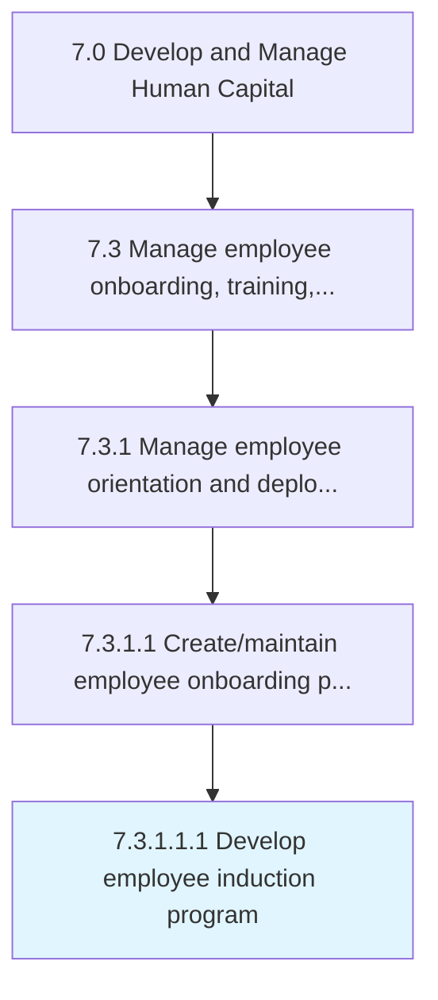

# Develop employee induction program

> Designing a program to systematically introduce newly hired employees to the organizational culture of the company.

## Overview

Sub-Activity 7.3.1.1.1 is an activity within the Develop and Manage Human Capital framework. 

Designing a program to systematically introduce newly hired employees to the organizational culture of the company.

## Process Hierarchy



## Key Statistics

| Metric | Value |
|--------|-------|
| APQC Code | 10477 |
| Hierarchy ID | 7.3.1.1.1 |
| Level | Sub-Activity |
| Parent | [7.3.1.1](../) |
| Sub-Processes | 0 |


## GraphDL Semantic Structure

```
develop.EmployeeInductionProgram
```

| Component | Value | Description |
|-----------|-------|-------------|
| Verb | `develop` | Primary action |
| Object | `employee induction program` | Direct object |


## Related Concepts

- EmployeeInductionProgram


---

*Source: APQC PCF 10477 (7.3.1.1.1) - APQC*
