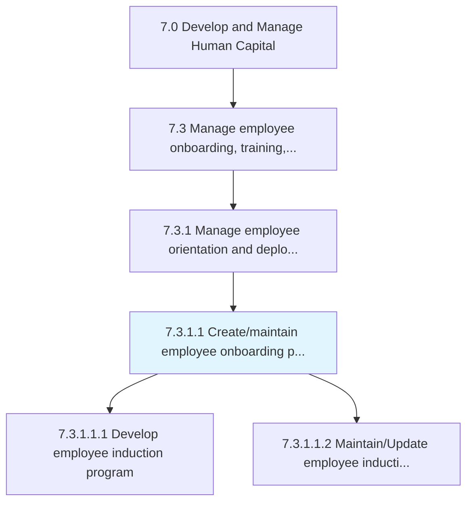
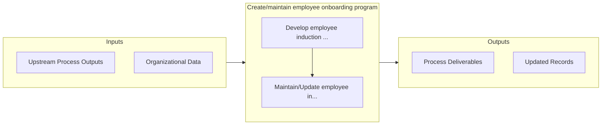

# Create/maintain employee onboarding program

> Creating and maintaining a mechanism through which new employees acquire the necessary knowledge, skills, and behaviors to become effective organizational members and insiders.

## Overview

Activity 7.3.1.1 is an activity within the Develop and Manage Human Capital framework. 

Creating and maintaining a mechanism through which new employees acquire the necessary knowledge, skills, and behaviors to become effective organizational members and insiders. Conduct formal meetings, lectures, videos, printed materials, and/or computer-based orientations to introduce newcomers to their new jobs and the organization.

## Process Hierarchy



## Key Statistics

| Metric | Value |
|--------|-------|
| APQC Code | 10474 |
| Hierarchy ID | 7.3.1.1 |
| Level | Activity |
| Parent | [7.3.1](../) |
| Sub-Processes | 2 |


## GraphDL Semantic Structure

```
create/maintain.EmployeeOnboardingProgram
```

| Component | Value | Description |
|-----------|-------|-------------|
| Verb | `create/maintain` | Primary action |
| Object | `employee onboarding program` | Direct object |


## Process Flow



## Sub-Processes

| Process | Hierarchy ID | Description |
|---------|-------------|-------------|
| [Develop employee induction program](./DevelopEmployeeInductionProgram) | 7.3.1.1.1 | Designing a program to systematically introduce newly hired employees to the organizational culture  |
| [Maintain/Update employee induction program](./MaintainUpdateEmployeeInductionProgram) | 7.3.1.1.2 | Managing the orientation and training of new employees about the organizational culture of the compa |


## Related Concepts

- [EmployeeOnboardingProgram](/concepts/EmployeeOnboardingProgram)
- [EmployeeOnboardingProgram](/concepts/EmployeeOnboardingProgram)


---

*Source: APQC PCF 10474 (7.3.1.1) - APQC*
